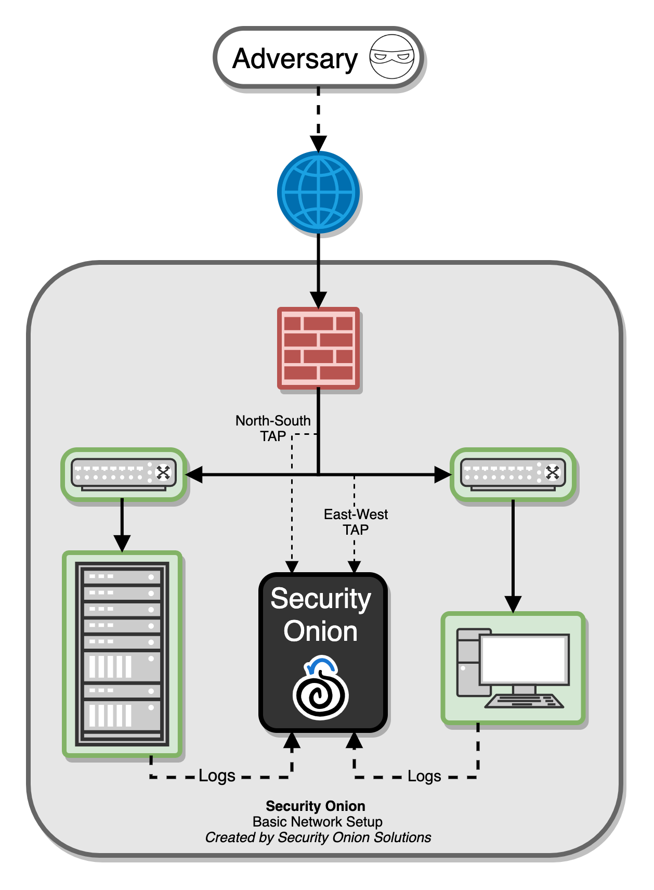
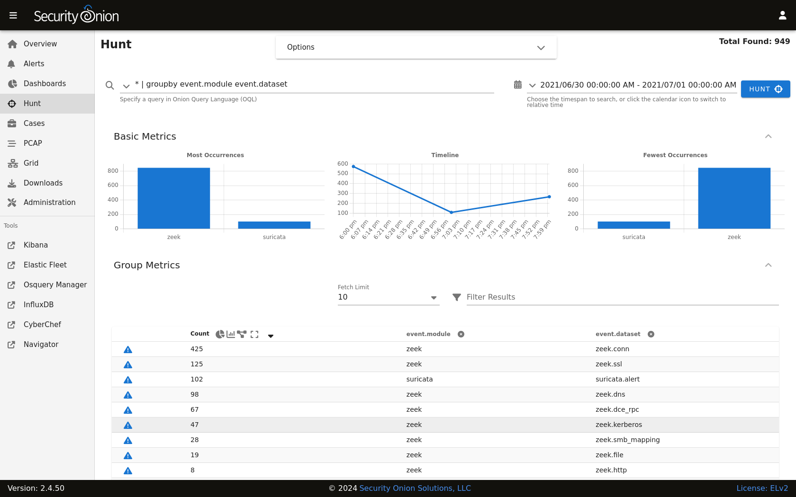
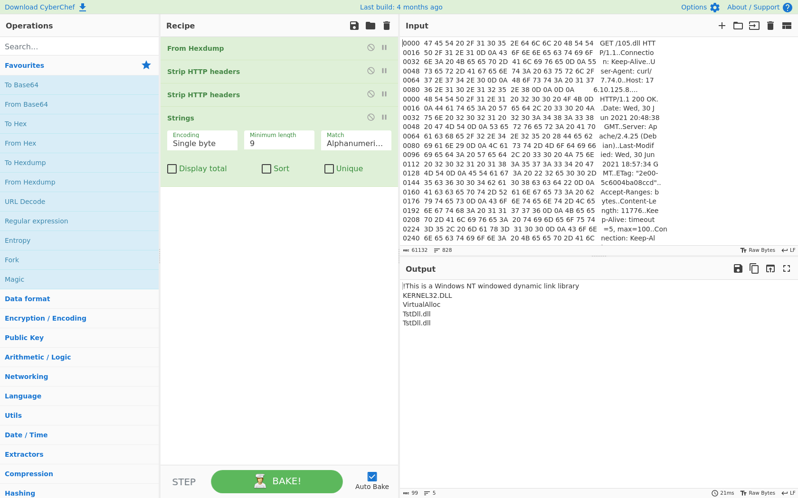
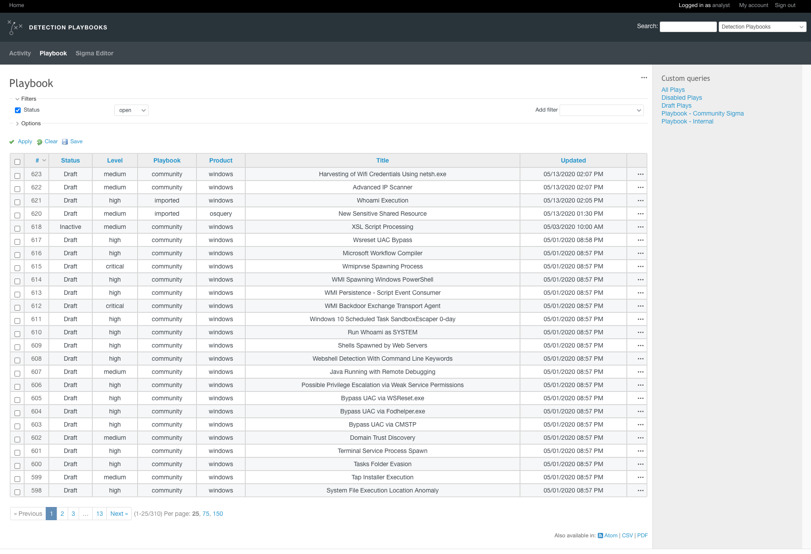

.. _introduction:

Introduction
============

Security Onion is a free and open platform built by defenders for defenders. It includes :ref:`network visibility<network>`, :ref:`host visibility<host>`, :ref:`intrusion detection honeypots<idh>`, :ref:`log management<elasticsearch>`, and :ref:`case management<cases>`. 

For network visibility, we offer signature based detection via :ref:`suricata`, rich protocol metadata and file extraction using your choice of either :ref:`zeek` or :ref:`suricata`, full packet capture via :ref:`stenographer`, and file analysis via :ref:`strelka`. For host visibility, we offer the :ref:`elastic-agent` which provides data collection, live queries via :ref:`osquery<osquery-manager>`, and centralized management using :ref:`elastic-fleet`. :ref:`Intrusion detection honeypots<idh>` based on OpenCanary can be added to your deployment for even more enterprise visibility. All of these logs flow into :ref:`elasticsearch` and we've built our own user interfaces for :ref:`alerts<alerts>`, :ref:`dashboards<dashboards>`, :ref:`threat hunting<hunt>`, :ref:`case management<cases>`, and :ref:`grid management<grid>`. 

In the diagram below, we see Security Onion in a traditional enterprise network with a firewall, workstations, and servers. You can use Security Onion to monitor north/south traffic to detect an adversary entering an environment, establishing command-and-control (C2), or perhaps data exfiltration. You'll probably also want to monitor east/west traffic to detect lateral movement. As more and more of our network traffic becomes encrypted, it's important to fill in those blind spots with additional visibility in the form of endpoint telemetry. Security Onion can consume logs from your servers and workstations so that you can then hunt across all of your network and host logs at the same time.

   
Network Visibility
------------------

From a network visibility standpoint, Security Onion seamlessly weaves together intrusion detection, network metadata, full packet capture, file analysis, and intrusion detection honeypots.

Intrusion Detection
~~~~~~~~~~~~~~~~~~~

Security Onion generates NIDS (Network Intrusion Detection System) alerts by monitoring your network traffic and looking for specific fingerprints and identifiers that match known malicious, anomalous, or otherwise suspicious traffic. This is signature-based detection so you might say that it's similar to antivirus signatures for the network, but it's a bit deeper and more flexible than that. NIDS alerts are generated by :ref:`suricata`.

Network Metadata
~~~~~~~~~~~~~~~~

Unlike signature-based intrusion detection that looks for specific needles in the haystack of data, network metadata provides you with logs of connections and standard protocols like DNS, HTTP, FTP, SMTP, SSH, and SSL. This provides a real depth and visibility into the context of data and events on your network. Security Onion provides network metadata using your choice of either :ref:`zeek` or :ref:`suricata`.

Full Packet Capture
~~~~~~~~~~~~~~~~~~~

Full packet capture is like a video camera for your network, but better because not only can it tell us who came and went, but also exactly where they went and what they brought or took with them (exploit payloads, phishing emails, file exfiltration). It’s a crime scene recorder that can tell us a lot about the victim and the white chalk outline of a compromised host on the ground. There is certainly valuable evidence to be found on the victim’s body, but evidence at the host can be destroyed or manipulated; the camera doesn't lie, is hard to deceive, and can capture a bullet in transit. Full packet capture is recorded by :ref:`stenographer`.

File Analysis
~~~~~~~~~~~~~

As :ref:`zeek` and :ref:`suricata` are monitoring your network traffic, they can extract files transferred across the network. :ref:`strelka` can then analyze those files and provide additional metadata.

Intrusion Detection Honeypot (IDH)
~~~~~~~~~~~~~~~~~~~~~~~~~~~~~~~~~~

We also have an :ref:`idh` node that allows you to build a node that mimics services. Connections to these services automatically generate alerts.

Host Visibility
---------------

In addition to network visibility, Security Onion provides endpoint visibility via the :ref:`elastic-agent` which provides data collection, live queries via :ref:`osquery<osquery-manager>`, and centralized management using :ref:`elastic-fleet`.

For devices like firewalls and routers that don't support the installation of agents, Security Onion can consume standard :ref:`syslog`.

Analysis Tools
--------------

With all of the data sources mentioned above, there is an incredible amount of data available at your fingertips. Fortunately, Security Onion tightly integrates the following tools to help make sense of this data.

Security Onion Console (SOC)
~~~~~~~~~~~~~~~~~~~~~~~~~~~~

:ref:`soc` is the first thing you see when you log into Security Onion. It includes our :ref:`alerts` interface which allows you to see all of your NIDS alerts from :ref:`suricata`.

.. image:: images/50_alerts.png
  :target: _images/50_alerts.png

:ref:`soc` also includes our :ref:`dashboards` interface which gives you a nice overview of not only your NIDS/HIDS alerts but also network metadata logs from :ref:`zeek` or :ref:`suricata` and any other logs that you may be collecting. 

.. image:: images/51_dashboards.png
  :target: _images/51_dashboards.png

:ref:`hunt` is similar to :ref:`dashboards` but its default queries are more focused on threat hunting.

:ref:`cases` is the case management interface. As you are working in :ref:`alerts`, :ref:`dashboards`, or :ref:`hunt`, you may find alerts or logs that are interesting enough to send to :ref:`cases` and create a case. Other analysts can collaborate with you as you work to close that case.

.. image:: images/cases.png
  :target: _images/cases.png

:ref:`soc` also includes an interface for full packet capture (:ref:`pcap`) retrieval.

.. image:: images/53_pcap.png
  :target: _images/53_pcap.png

CyberChef
~~~~~~~~~

:ref:`cyberchef` allows you to decode, decompress, and analyze artifacts. :ref:`alerts`, :ref:`dashboards`, :ref:`hunt`, and :ref:`pcap` all allow you to quickly and easily send data to :ref:`cyberchef` for further analysis.

Playbook
~~~~~~~~

:ref:`playbook` allows you to create a Detection Playbook, which itself consists of individual plays. These plays are fully self-contained and describe the different aspects around the particular detection strategy.

Workflow
--------

All of these analysis tools work together to provide efficient and comprehensive analysis capabilities. For example, here's one potential workflow:

     - Go to the :ref:`alerts` page and review any unacknowledged alerts.
     - Review :ref:`dashboards` for anything that looks suspicious.
     - Once you've found something that you want to investigate, you might want to pivot to :ref:`hunt` to expand your search and look for additional logs relating to the source and destination IP addresses.
     - If any of those alerts or logs look interesting, you might want to pivot to :ref:`pcap` to review the full packet capture for the entire stream.
     - Depending on what you see in the stream, you might want to send it to :ref:`cyberchef` for further analysis and decoding.
     - Escalate alerts and logs to :ref:`cases` and document any observables. Pivot to :ref:`hunt` to cast a wider net for those observables.
     - Develop a play in :ref:`playbook` that will automatically alert on observables moving forward and update your coverage in :ref:`attack-navigator`.
     - If you have the :ref:`elastic-agent` deployed, then you might want to search for additional host logs or run live queries against your endpoints using :ref:`osquery<osquery-manager>`.
     - Finally, return to :ref:`cases` and document the entire investigation and close the case.

Deployment Scenarios
--------------------

Analysts around the world are using Security Onion today for many different :ref:`architectures <architecture>`.  The Security Onion Setup wizard allows you to easily configure the best deployment scenario to suit your needs.

Conclusion
----------

After you install Security Onion, you will have comprehensive network and host visibility for your enterprise. Our analyst tools will enable you to use all of that data to detect intruders more quickly and paint a more complete picture of what they're doing in your environment. Get ready to peel back the layers of your enterprise and make your adversaries cry!
