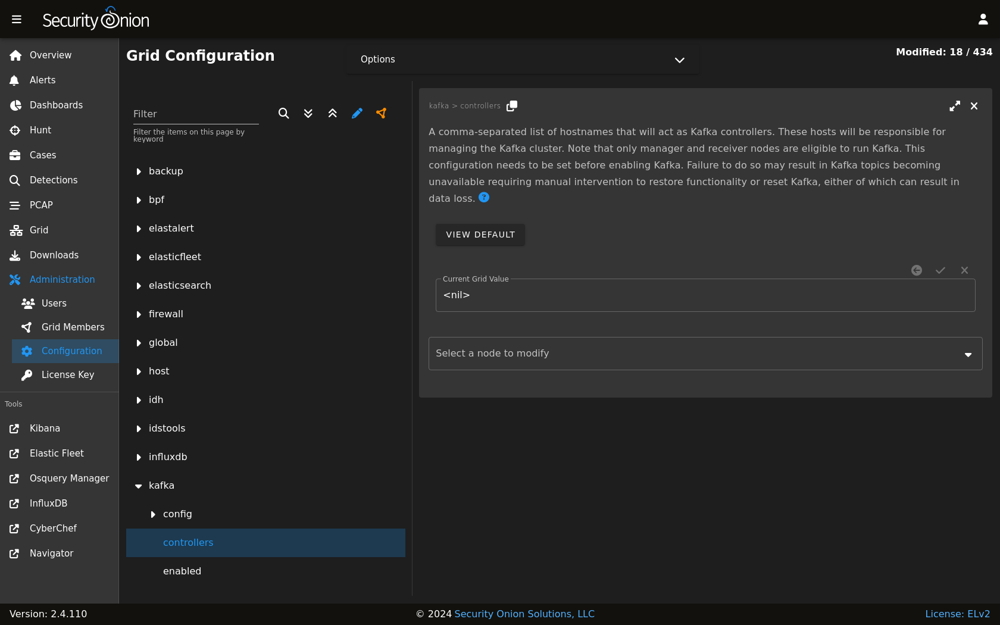

.. _kafka:

Kafka
=====

From https://kafka.apache.org :

    Apache Kafka is an open-source distributed event streaming platform used by thousands of companies for high-performance data pipelines, streaming analytics, data integration, and mission-critical applications.

If you need guaranteed message delivery, then you can enable Kafka which replaces :ref:`redis` and :ref:`logstash` on the Security Onion Manager node and Receiver nodes.

.. note::

    This is an enterprise-level feature of Security Onion. Contact Security Onion Solutions, LLC via our website at https://securityonionsolutions.com for more information about purchasing a Security Onion Pro license to enable this feature.

Guaranteed Message Delivery
---------------------------

By leveraging Kafka, you can ensure that messages sent to the Kafka cluster are written to disk on the partition leader and replicated to other physical brokers before acknowledging receipt to the producer.

For more information, please see https://kafka.apache.org/documentation/#producerconfigs_acks.

High Availability
-----------------

With a properly configured Kafka cluster, data integrity and data availability are maintained even in the event of a Kafka broker or controller failure. In order to start taking advantage of Kafka, we'd recommend three Kafka controllers and a minimum of three Kafka brokers. With this configuration, you can increase your replication factor to ensure that messages are replicated to multiple brokers.

For more information about replication, please see https://kafka.apache.org/documentation/#replication.

Configuration
-------------

.. important::

    Before configuring Kafka, it is recommened you build your grid as you would normally. This includes adding any receiver nodes that will later be repurposed as Kafka brokers or controllers.
    
    Also note that :ref:`Guaranteed Message Delivery <kafka>` which leverages Kafka, requires a valid Security Onion Pro license. See the :ref:`pro` section.

You can modify your Kafka configuration by going to :ref:`administration` --> Configuration --> Kafka.

Controllers
~~~~~~~~~~~

Controllers are responsible for managing the Kafka cluster. This includes electing a leader and managing the cluster metadata. 

Controllers can be relatively lightweight virtual machines or physical machines. A system with 4 CPU cores, 8GB of RAM, and 200GB storage should be sufficient for a single Kafka controller.

Controllers are assigned by adding the hostnames to the ``controllers`` configuration option separated by a comma.

::

    hostname1,hostname2,hostname3

We recommend that you have at least three controllers. This allows for a single controller to fail and the cluster to continue to operate.

For more information about controllers, please see https://kafka.apache.org/documentation/#kraft_voter.

Brokers
~~~~~~~

Brokers are responsible for the storage and replication of messages. With Kafka enabled, the Elastic Agent will begin to act as a producer and write its messages to topics stored on the Kafka broker(s). 

Brokers require much more resources than controllers as they are responsible for managing the data and providing the data to consumers. Sizing brokers depends heavily on expected message volume. A system with 8 CPU cores, 32GB of RAM, and 500GB storage should be sufficient for a single Kafka broker.

.. warning::

   The above hardware recommendations should be used as a minimum. Increasing the number of brokers and the resources available to each broker will increase the overall performance of the Kafka cluster. Additionally, without sufficient storage space on each broker, the cluster may run out of space and stop accepting messages. The brokers ``log.retention.hours`` setting can be configured to delete messages after a certain amount of time to prevent this from happening.

Broker configuration can be modified by going to :ref:`administration` --> Configuration --> Kafka --> config --> broker.

For more information about broker configuration, please see https://kafka.apache.org/documentation/#brokerconfigs.

Enabling Kafka
~~~~~~~~~~~~~~

Once you have the appropriate configuration in place, you can enable Kafka by navigating to :ref:`administration` --> Configuration --> global --> pipeline and setting the value to ``KAFKA``.

There is no need to click on the ``SYNCHRONIZE GRID`` button. Once you have set the global pipeline value to ``KAFKA``, the changes will begin to take effect in the background before finally switching the grid to the new pipeline.

.. note::

    | In order to change the global pipeline you will need to enable the :ref:`administration-advanced-settings` option.

More information
----------------

.. note::

   | For more information about Kafka, please see: https://kafka.apache.org/documentation/#gettingStarted
