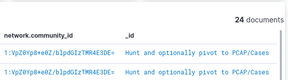
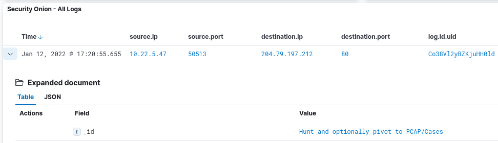

.. _kibana:

Kibana
======

From https://www.elastic.co/kibana:

    Kibana is a free and open user interface that lets you visualize your Elasticsearch data and navigate the Elastic Stack. Do anything from tracking query load to understanding the way requests flow through your apps.

Authentication
--------------

We support Elastic authentication via :ref:`so-elastic-auth`. Elastic authentication is automatically enabled for new installations, so you will need to log into Kibana using the same username and password that you use for :ref:`soc`.

Dashboards
----------

Once you log into Kibana, you should start on the ``Security Onion - Home`` dashboard.

.. image:: images/kibana.png
  :target: _images/kibana.png

Notice the visualization in the upper left is labeled ``Security Onion - Navigation``. This navigation panel contains links to other dashboards and will change depending on what dashboard you're currently looking at. For example, when you're on the ``Security Onion - Home`` dashboard and click the ``Alert`` link, you will go to the ``Security Onion - Alerts`` dashboard and the Navigation panel will then contain links to more specific alert dashboards for :ref:`playbook`, :ref:`suricata`, and :ref:`wazuh`. When you're done looking at alerts, you can click the ``Home`` link in the navigation panel to go back to the main ``Security Onion - Home`` dashboard.

We've included the old 16.04 dashboards in case you performed an in-place upgrade and have any old 16.04 data. These dashboards are named with the ``z16.04`` prefix and will only show old 16.04 data from the old ``*:logstash-*`` indices. The new Security Onion 2 dashboards are all named with the ``Security Onion`` prefix and they should be used for any new data stored in the new ``*:so-*`` indices.

If you ever need to reload dashboards, you can run the following command on your manager:

::

    sudo so-kibana-config-load
    
If that doesn't resolve the issue, then you may need to run the following:

::

    sudo salt-call state.apply kibana.so_savedobjects_defaults -l info queue=True
    
If you try to modify a default dashboard, your change will get overwritten. Instead of modifying, copy the desired dashboard and edit the copy. You may also want to consider setting up Kibana Spaces as this will allow you to make whatever changes you want without them being overwritten. This includes not only dashboards but certain Kibana settings as well. You can read more about Kibana Spaces at https://www.elastic.co/guide/en/kibana/current/xpack-spaces.html.

Pivoting
--------

Kibana uses multiple hyperlinked fields to accelerate investigations and decision-making:

PCAP/Cases
~~~~~~~~~~

The ``_id`` field has a hyperlink which is labeled as ``Hunt and optionally pivot to PCAP/Cases``. Clicking this hyperlink takes you to :ref:`hunt` and searches for that particular record. From :ref:`hunt`, you can then escalate the event to :ref:`cases` or pivot to full packet capture via our :ref:`pcap` interface (assuming it's a network event). You can usually find the ``_id`` field as the rightmost column in the log panels at the bottom of the dashboards. 

You can also find the hyperlinked ``_id`` field by drilling into a row in the log panel.

Indicator Dashboard
~~~~~~~~~~~~~~~~~~~

Several fields are hyperlinked to the Indicator dashboard to allow you to get all the information you can about a particular indicator. Here are just a few:

| ``uid``
| ``source.ip``
| ``source.port``
| ``destination.ip``
| ``destination.port``

Search Results
--------------

Search results in the dashboards and through Discover are limited to the first ``100`` results for a particular query. If you don't feel like this is adequate after narrowing your search, you can adjust the value for ``discover:sampleSize`` in Kibana by navigating to ``Stack Management`` -> ``Advanced Settings`` and changing the value. It may be best to change this value incrementally to see how it affects performance for your deployment.

Timestamps
----------

By default, Kibana will display timestamps in the timezone of your local browser. If you would prefer timestamps in UTC, you can go to ``Management`` --> ``Advanced Settings`` and set ``dateFormat:tz`` to ``UTC``.

Configuration
-------------

Kibana's configuration can be found in ``/opt/so/conf/kibana/``. However, please keep in mind that most configuration is managed with :ref:`salt`, so if you manually make any modifications in ``/opt/so/conf/kibana/``, they may be overwritten at the next salt update.

``/opt/so/conf/kibana/etc/kibana.yml`` can be managed using the ``kibana`` pillar placed in the manager pillar file located under ``/opt/so/saltstack/local/pillar/minions/``. The manager pillar file will end with either ``*_manager.sls``, ``*_managersearch.sls``, ``*_standalone.sls``, or ``*_eval.sls`` depending on the manager type that was chosen during install. 

- An example of a Kibana pillar may look as follows:

::

  kibana:
    config:
      elasticsearch:
        requestTimeout: 120000
      data:
        autocomplete:
          valueSuggestions:
            timeout: 2000
            terminateAfter: 200000
      logging:
        root:
          level: warn

Diagnostic Logging
------------------

Kibana logs to ``/opt/so/log/kibana/kibana.log``. Depending on what you're looking for, you may also need to look at the :ref:`docker` logs for the container:

::

        sudo docker logs so-kibana

If you try to access Kibana and it says ``Kibana server is not ready yet`` even after waiting a few minutes for it to fully initialize, then check ``/opt/so/log/kibana/kibana.log``. You may see something like:

::

    Another Kibana instance appears to be migrating the index. Waiting for that migration to complete. If no other Kibana instance is attempting migrations, you can get past this message by deleting index .kibana_6 and restarting Kibana
    
If that's the case, then you can do the following (replacing ``.kibana_6`` with the actual index name that was mentioned in the log):

::

    curl -k -XDELETE https://localhost:9200/.kibana_6

    sudo so-kibana-restart
    
If you then are able to login to Kibana but your dashboards don't look right, you can reload them as follows:

::

    so-kibana-config-load
    
Features
--------

You can enable or disable specific features by clicking the main menu in the upper left corner, then click ``Stack Management``, then click ``Spaces``, then click ``Default``. For more information, please see https://www.elastic.co/guide/en/kibana/master/xpack-spaces.html#spaces-control-feature-visibility.

More Information
----------------

.. note::

    For more information about Kibana, please see https://www.elastic.co/kibana.
