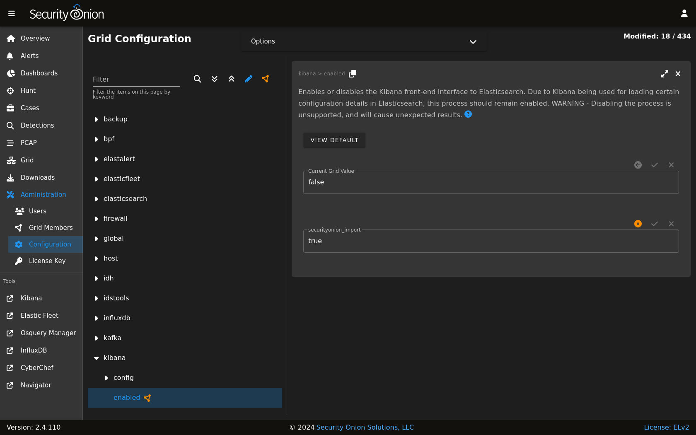

.. _kibana:

Kibana
======

:ref:`soc` includes a link on the sidebar that takes you to Kibana.

Authentication
--------------

Log into Kibana using the same username and password that you use for :ref:`soc`. 

You can add new user accounts to both Kibana and :ref:`soc` at the same time as shown in the :ref:`adding-accounts` section. 

.. warning::

        If you create accounts directly in Kibana (rather than in SOC), then those accounts will only have access to Kibana and not SOC.

Kibana Dashboards
-----------------

We've included a simple set of dashboards in Kibana. These Kibana dashboards are not as comprehensive as those in SOC :ref:`dashboards`.

Once you log into Kibana, you should start on the ``Security Onion - Home`` dashboard. Notice the visualization in the upper left is labeled ``Security Onion - Navigation``. This navigation panel contains links to other dashboards and will change depending on what dashboard you're currently looking at. For example, when you're on the ``Security Onion - Home`` dashboard and click the ``Alert`` link, you will go to the ``Security Onion - Alerts`` dashboard and the Navigation panel will then contain links to more specific alert dashboards for :ref:`suricata`. When you're done looking at alerts, you can click the ``Home`` link in the navigation panel to go back to the main ``Security Onion - Home`` dashboard.

If you ever need to reload Kibana dashboards, you can run the following command on your manager:

::

    sudo so-kibana-config-load
    
If that doesn't resolve the issue, then you may need to run the following:

::

    sudo salt-call state.apply kibana.so_savedobjects_defaults -l info queue=True
    
If you try to modify a default Kibana dashboard, your change will get overwritten. Instead of modifying, copy the desired dashboard and edit the copy. You may also want to consider setting up Kibana Spaces as this will allow you to make whatever changes you want without them being overwritten. This includes not only dashboards but certain Kibana settings as well. You can read more about Kibana Spaces at https://www.elastic.co/guide/en/kibana/current/xpack-spaces.html.

Search Results
--------------

In Kibana, search results are limited to the first ``100`` results for a particular query. If you don't feel like this is adequate after narrowing your search, you can adjust the value for ``discover:sampleSize`` in Kibana by navigating to ``Stack Management`` --> ``Advanced Settings`` and changing the value. It may be best to change this value incrementally to see how it affects performance for your deployment.

Timestamps
----------

By default, Kibana will display timestamps in the timezone of your local browser. If you would prefer timestamps in UTC, you can go to ``Management`` --> ``Advanced Settings`` and set ``dateFormat:tz`` to ``UTC``.

Configuration
-------------

Most Kibana configuration settings are in Kibana itself. However, configuration settings that would traditionally be set in the Kibana configuration file can be configured by going to :ref:`administration` --> Configuration --> kibana.

Diagnostic Logging
------------------

Kibana logs to ``/opt/so/log/kibana/kibana.log``. Depending on what you're looking for, you may also need to look at the :ref:`docker` logs for the container:

::

        sudo docker logs so-kibana

If you try to access Kibana and it says ``Kibana server is not ready yet`` even after waiting a few minutes for it to fully initialize, then check ``/opt/so/log/kibana/kibana.log``. You may see something like:

::

    Another Kibana instance appears to be migrating the index. Waiting for that migration to complete. If no other Kibana instance is attempting migrations, you can get past this message by deleting index .kibana_6 and restarting Kibana
    
If that's the case, then you can do the following (replacing ``.kibana_6`` with the actual index name that was mentioned in the log):

::

    curl -k -XDELETE https://localhost:9200/.kibana_6

    sudo so-kibana-restart
    
If you then are able to login to Kibana but your dashboards don't look right, you can reload them as follows:

::

    so-kibana-config-load
    
Features
--------

You can enable or disable specific features by clicking the main menu in the upper left corner, then click ``Stack Management``, then click ``Spaces``, then click ``Default``. For more information, please see https://www.elastic.co/guide/en/kibana/current/xpack-spaces.html#spaces-control-feature-visibility.

More Information
----------------

.. note::

    For more information about Kibana, please see https://www.elastic.co/kibana.
