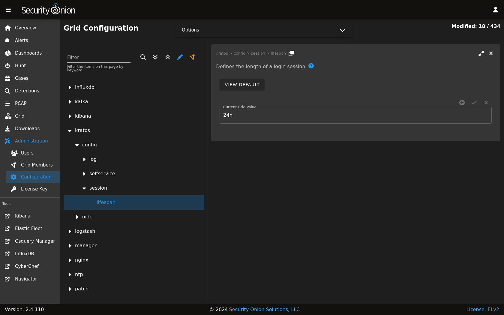

.. _kratos:

Kratos
======

:ref:`soc` authentication is handled by Kratos. You can read more about Kratos at https://github.com/ory/kratos.

Configuration
-------------

You can configure Kratos by going to :ref:`administration` --> Configuration --> kratos.

More Information
----------------

.. note::

    For more information about Kratos, please see https://github.com/ory/kratos.
