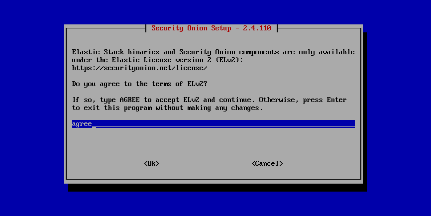

.. _license:

License
=======

Security Onion is a free and open platform. The vast majority of software included in Security Onion is licensed under OSI-approved open source licenses. 

Elastic components and Security Onion components are licensed under the Elastic License 2.0 (ELv2). During installation, you will be prompted to accept the Elastic License:

.. seealso::

   | You can find the full text of the Elastic License 2.0 (ELv2) at:
   | https://securityonion.net/license
   |
   | You can find the Security Onion ELv2 announcement at:
   | https://blog.securityonion.net/2022/08/security-onion-enterprise-features-and.html
