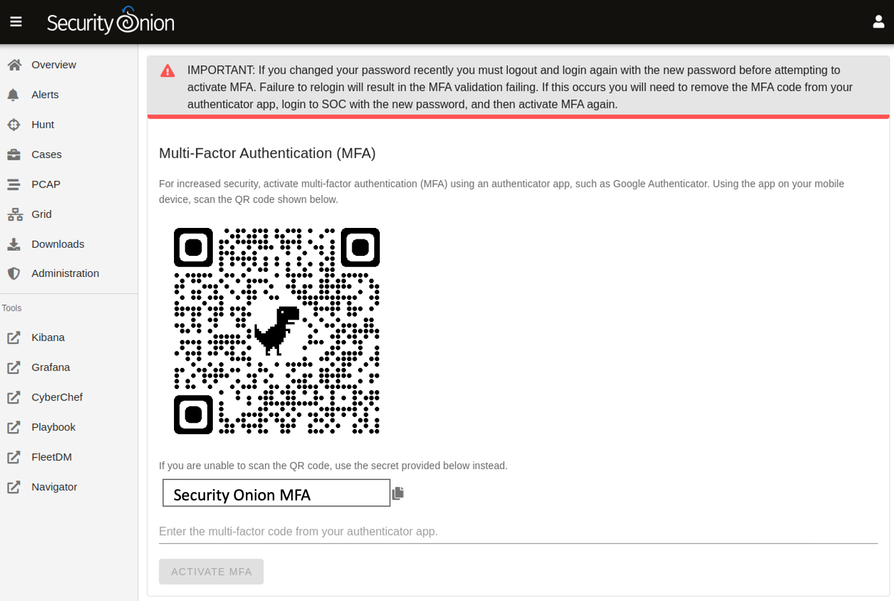

.. _mfa:

MFA
===

Starting in Security Onion 2.3.110, you can enable Multi-Factor Authentication (MFA) to further protect your account. This can be enabled in :ref:`soc` by clicking the user icon in the upper right corner, clicking ``Settings``, and then going to the ``Security`` tab. Activating MFA requires the use of an authenticator app. Currently only Google Authenticator has been tested, however other authenticator apps that implement the time-based one-time password (TOTP) specification could also work.

If you have multiple Security Onion deployments with MFA enabled, they may be listed identically in your authenticator app. If so, you should be able to edit the listing in your authenticator app so that you can distinguish between them.

Note that if a user loses access to the authenticator app, a Security Onion administrator can SSH into the manager node and run the following to change that user's password and temporarily disable MFA:

::

    sudo so-user update username@example.com
