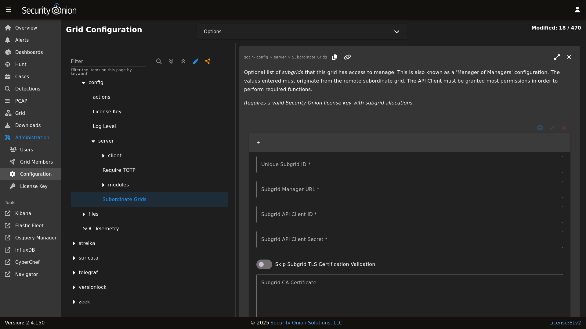

.. _mom:

Manager of Managers (MoM)
=========================

.. note::

    This is an enterprise-level feature of Security Onion. Contact Security Onion Solutions, LLC via our website at https://securityonion.com/pro for more information about purchasing a Security Onion Pro license with the necessary subgrid allocations to use this feature.

Enterprise customers responsible for managing multiple, disconnected grids may benefit from the new Manager of Manager feature introduced with version 2.4.150!

This feature allows the administrator to elect a special grid manager (MoM) to be configured with knowledge of remote grids (subgrids) allowing the MoM to reach out to the subgrid to query and/or modify grid state, events, configuration, etc.

Appropriately privileged users logging into the MoM will be able to interact with those subgrids from a single user interface. A Subgrid selection list will be available in the top-right of the SOC UI. Users can choose which grid they would like to interact with. Additionally, fault states will automatically propagate up to the MoM user interface giving those users the quick updates of new fault states within subgrids, regardless of which subgrid is currently selected. If the subgrid list becomes disabled that will indicate the current screen does not support subgrid interaction.

Users logging into a subgrid SOC user interface will have no knowledge or visibility into other sibling grids or the MoM grid.

Network Requirements
--------------------

The Manager of Managers feature has been designed such that only the MoM grid node requires network access to the subgrid manager nodes. This simplifies network and firewall configuration by ensuring end-user connections are isolated to a single endpoint.

Therefore, users logged into the MoM SOC only need web access to the MoM manager.

Data Isolation
--------------

In a Manager of Managers configuration the data from each subgrid resides at rest within the subgrid only. If a MoM user requests information of a subgrid then that returned data will transit through the MoM node and from there move to the user's web browser.

.. note::

    Manager of Managers currently does not attempt to merge data from multiple grids into a single SOC view.

    The suggested method for accessing data across multiple grids, such as when searching for alerts across all grids, is to utilize cross-cluster search (CCS). Keep in mind that this should be configured such that internal Security Onion indices are excluded from CCS, otherwise there is a risk of data duplication and/or corruption of internal SOC entities such as Cases, Detections, etc.

Subgrid Outages
---------------

The MoM node will expect all subgrids to be reachable. In the event a subgrid is not reachable, or is in a state where it cannot respond successfully to incoming MoM requests, the MoM SOC interface will display an error notifying the logged in users that it cannot complete the request. Subgrid outages could delay retrieving state information from other subgrids.

If a subgrid is expected to remain in a disconnected state for a longer period it is recommended to disable that subgrid in the Configuration screen and then synchronize the MoM grid state. This scenario can occur more frequently with subgrid "kits" that are transported between field locations for forensic collection purposes.

.. note::

    Did you know that Security Onion Solutions offers ATA-compliant Security Onion servers that are specifically made for recurring incident response scenarios and are transportable via commercial airlines? Visit our website at https://securityonion.com/hardware for more information.

Configuration
-------------

.. warning::

    Do not proceed with the configuration step until an appropriate Security Onion Pro license has been applied to each grid. Configuring subgrids on a Security Onion Pro license that does not have sufficient subgrid allocations can cause that license to be exceeded which can disable all other Pro features.

Configuration of Manager of Managers requires two steps:

1. API Client: Creation of an API Client on each subgrid manager via the subgrid's API Client screen.
2. Subgrid Config: Configuration of the subgrids on the MoM Configuration screen

API Client
~~~~~~~~~~

Create a new, dedicated API Client on each subgrid and assign all permissions that the MoM will need to perform the desired functions. For example, if the MoM users will need complete management and visibility (effectively ``superuser`` access) then grant all permissions. However, if the MoM users will only be monitoring the subgrid health then the API Client permissions can be limited to ``read`` permission on specific resources, such as ``grid``, ``nodes``, etc.

The API Client ID and Secret will be needed on the next step, so ensure those are recorded for each of the subgrids.

While on the API Client screen, click the ⤓ icon to download the Certificate Authority (CA) certificate file. This file is in a text format and the contents will be pasted into the subgrid setting in the next step.

Subgrid Config
~~~~~~~~~~~~~~

Once the subgrid API Client credentials are known that subgrid can then be added to the MoM's ``Subordinate Grids`` Configuration screen. 

- As a superuser, navigate to the Configuration screen of the MoM SOC user interface. 
- Find the ``soc > config > server > Subordinate Grids`` setting.
- Click the ``+`` icon to add a new subgrid
- Give the new subgrid a unique ID that accurately describes this subgrid from the MoM's perspective.
- Enter in the subgrid's Manager URL (``base_url``). Note that this URL must be accessible from the MoM grid node.
- Paste or enter the subgrid's API Client credentials
- Paste the subgrid's API Client Certificate Authority (CA) contents into the ``Subgrid CA Certificate`` field.
- If this subgrid is ready, enable it.

Add additional subgrids as your Security Onion Pro license allows, and then click the green checkmark to save the configuration. 

Finally, Synchronize the MoM grid to apply the subgrid configuration.

Licensing
---------

The Manager of Managers feature requires that all involved grids have a valid Security Onion Pro license applied. 

The MoM grid will require a special Pro license with an allocation of subgrids encoded into the license that meets or exceeds the number of configured subgrids. Exceeding the licensed subgrid allocation will cause the MoM SOC to show an "Exceeded" license state which will disable Pro features.

Contact Security Onion Solutions, LLC via our website at https://securityonion.com/pro for more information about purchasing a Security Onion Pro license with the appopriate subgrid allocations.
