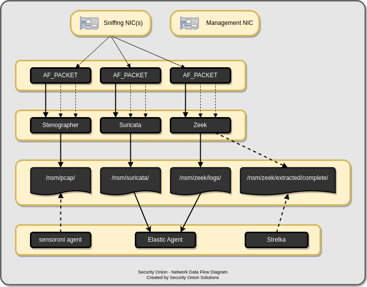

.. _network:

Network Visibility
==================

In the last section, you logged into :ref:`soc` and you may have seen some network-based IDS alerts from Suricata or some protocol metadata logs from Zeek. How did those network logs get generated? This section covers the various processes that Security Onion uses to analyze and log network traffic.

.. toctree::
   :maxdepth: 2

   af-packet
   stenographer
   suricata
   zeek
   strelka
