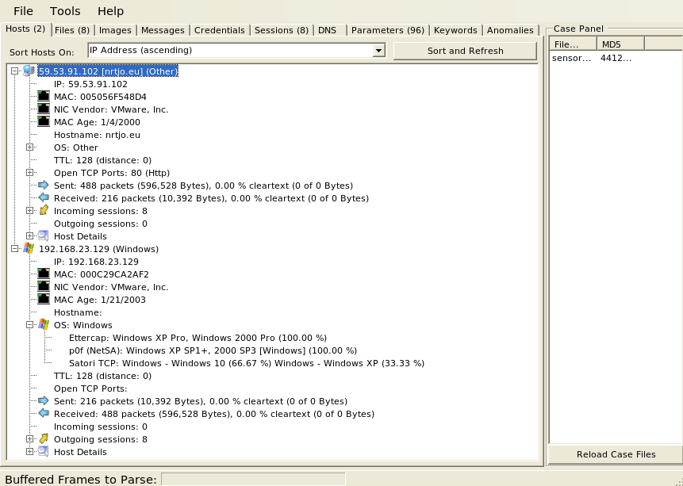

.. _networkminer:

NetworkMiner
============

From https://www.netresec.com/?page=networkminer:

    NetworkMiner is an open source Network Forensic Analysis Tool (NFAT) for Windows (but also works in Linux / Mac OS X / FreeBSD). NetworkMiner can be used as a passive network sniffer/packet capturing tool in order to detect operating systems, sessions, hostnames, open ports etc. without putting any traffic on the network. NetworkMiner can also parse PCAP files for off-line analysis and to regenerate/reassemble transmitted files and certificates from PCAP files.

    NetworkMiner makes it easy to perform advanced Network Traffic Analysis (NTA) by providing extracted artifacts in an intuitive user interface. The way data is presented not only makes the analysis simpler, it also saves valuable time for the analyst or forensic investigator.

Usage
-----
NetworkMiner is a part of our :ref:`desktop` installation. ``so-analyst-install`` automatically registers NetworkMiner as a pcap handler, so if you download a pcap file from the :ref:`pcap` interface, you can simply click on it to open in NetworkMiner.

Screenshot
----------

File Extraction
---------------

Suppose you are looking at an interesting HTTP file download in :ref:`PCAP` and want to extract the file. Click the PCAP download button and then open the pcap file with NetworkMiner. NetworkMiner will automatically attempt to detect and extract any files transferred. You can access these extracted files on the Files tab. If any files are images, they can be viewed on the Images tab.

More Information
----------------

.. note::

    | For more information about NetworkMiner, please see:
    | https://www.netresec.com/?page=networkminer
