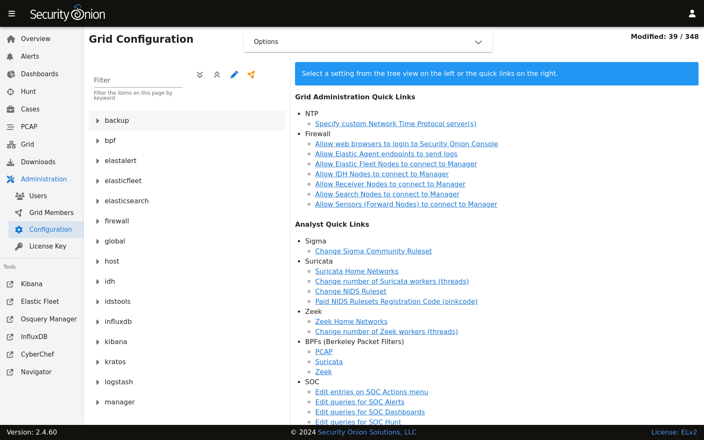

.. _nginx:

nginx
=====

nginx is the main web server for Security Onion.

Configuration
-------------

You can modify nginx configuration by going to :ref:`administration` --> Configuration --> nginx.

Replacing Default Cert
----------------------

To replace the default cert, click the ``Options`` dropdown menu and then enable the ``Show all configurable settings, including advanced settings.`` option. On the left side, go to ``nginx``, and then expand ``ssl``. You can then set ``Replace Default Cert`` to ``true``, and paste your cert and key files.

More Information
----------------

.. note::

    For more information about nginx, please see https://nginx.org/.
