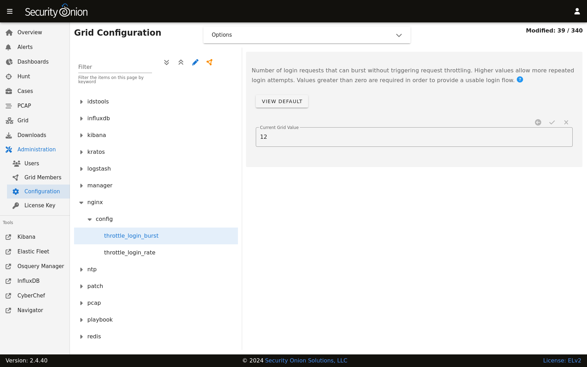

.. _nginx:

nginx
=====

nginx is the main web server for Security Onion.

Configuration
-------------

You can modify nginx configuration by going to :ref:`administration` --> Configuration --> nginx.

Replacing Default Cert
----------------------

If you'd like to replace the default certificate with your own cert, then you can do so as shown below.

.. warning::

        Please be very careful when modifying advanced settings like this!

#. At the top of the page, click the ``Options`` menu and then enable the ``Show all configurable settings, including advanced settings.`` option.
#. On the left side, go to ``nginx``, expand ``ssl``, and then select the ``Replace Default Cert`` setting.
#. On the right side, change the setting to ``true`` and then click the checkmark to save the value.
#. On the left side, select the ``SSL/TLS Cert File`` setting.
#. On the right side, paste your new cert file and then click the checkmark to save it.
#. On the left side, select the ``SSL/TLS Key File`` setting.
#. On the right side, paste your new key file and then click the checkmark to save it.

More Information
----------------

.. note::

    For more information about nginx, please see https://nginx.org/.
