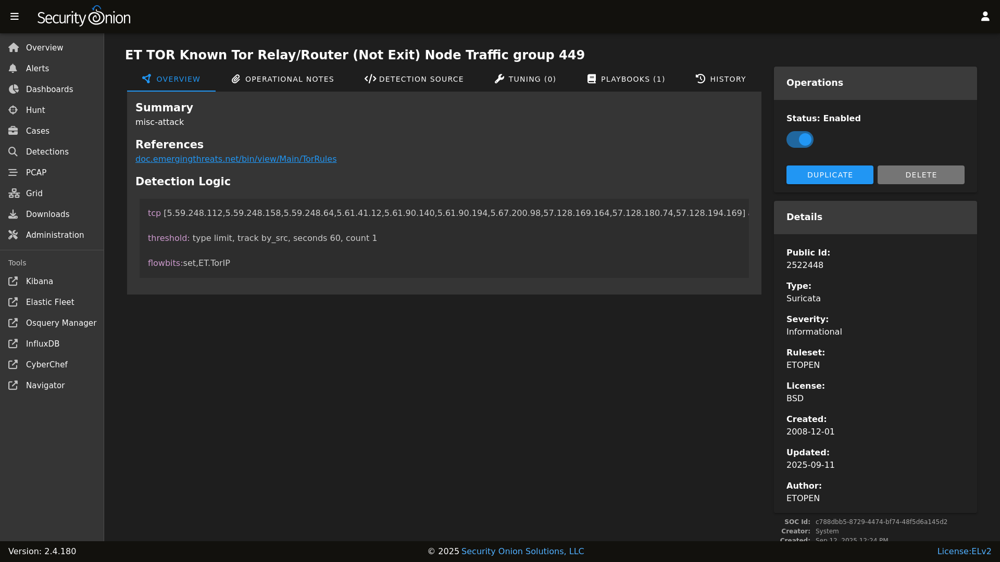
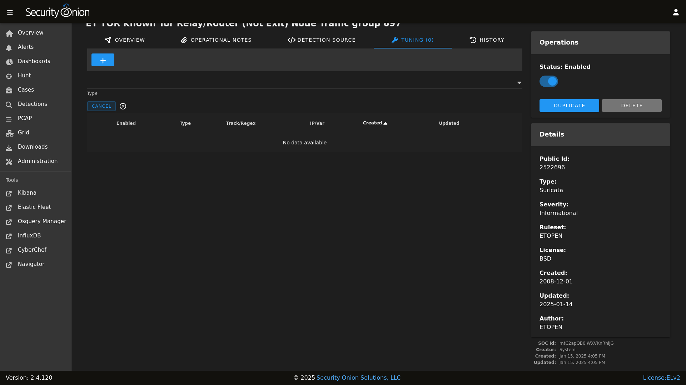
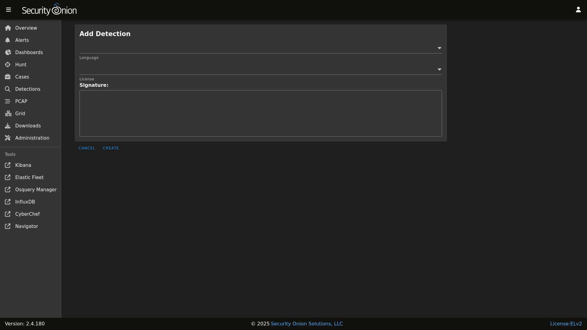

.. _nids:

NIDS
====

NIDS (Network Intrusion Detection System) rules are loaded into :ref:`suricata` to monitor network traffic for suspicious or noteworthy activity. Active NIDS rules generate alerts that can be found in :ref:`alerts`.

Managing Existing NIDS Rules
----------------------------

You can manage existing NIDS rules using :ref:`detections`. There are two ways to do so:

- From the main :ref:`detections` interface, you can search for the desired detection and click the binoculars icon.
- From the :ref:`alerts` interface, you can click an alert and then click the ``Tune Detection`` menu item.

Once you've used one of these methods to reach the detection detail page, you can check the Status field in the upper-right corner and use the slider to enable or disable the detection.

To tune the detection:

- click the TUNING tab
- click the blue + button
- select the type of tuning (Modify, Suppress, or Threshold)
- fill out the requested values
- click the ``CREATE`` button

Enabling and Disabling with Regex
---------------------------------

NIDS rules can be enabled or disabled in :ref:`detections` using regex patterns. Navigate to SOC :ref:`administration` - Configuration and filter for ``regex``, then drill down into soc --> config --> server --> modules --> suricataengine --> disableRegex or enableRegex.

The regex flavor is Google RE2: https://github.com/google/re2/wiki/Syntax

In ETOPEN, categories are prepended to the rule name. For example, the ``ET EXPLOIT PHP-Live-Chat Get Shell Attempt Inbound`` rule is in the ``ET EXPLOIT`` category. So suppose you want to disable the ``ET EXPLOIT`` and ``ET MALWARE`` categories but NOT the ``ET EXPLOIT_KIT`` category. You would use the following regex patterns:

::

        ET EXPLOIT\s
        ET MALWARE\s

The ``\s`` is a shortcut for whitespace and is useful in this situation to make sure we are only matching the specific categories that we want to disable.

If a detection would be matched by both an enable and disable regex, it is enabled. If a detection's status is changed via the :ref:`detections` interface but it is currently matched by a regex pattern, the change initiated from the :ref:`detections` interface is reverted and a message is shown.

Enable and disable operations that are based on regex patterns are actioned during the daily rule update. If you have made a change to the regex patterns and would like to have it implemented more immediately:

- Under Grid Configuration, click the ``SYNCHRONIZE GRID`` button and wait about 5 minutes for it to complete.
- Navigate to :ref:`detections`, click the Options menu, select :ref:`suricata` in the dropdown menu, click the ``FULL UPDATE`` button, and then wait for it to complete.
- Refresh the :ref:`detections` page and you should see the relevant rule statuses have changed.

Note:

   If a disable regex is applied to a setter flowbit rule and that rule is still required, it will be written out to the rules file as enabled, but `noalert`

Adding New NIDS Rules
---------------------

To add a new NIDS rule, go to the main :ref:`detections` page and click the blue + button between Options and the query bar. A form will appear where you will:

- click the Language drop-down and select ``Suricata``
- optionally specify a license
- add the signature
- click the ``CREATE`` button and the detection should deploy to your grid at the next 15-minute cycle

Update Frequency
----------------

By default, Security Onion checks for new NIDS rules every 24 hours. You can change this value as follows:

- Navigate to :ref:`administration` --> Configuration.
- At the top of the page, click the ``Options`` menu and then enable the ``Show advanced settings`` option.
- Navigate to soc --> config --> server --> modules --> suricataengine --> communityRulesImportFrequencySeconds.

Allow External Access to NIDS Rules
-----------------------------------

You can enable external access to NIDS rules managed by :ref:`detections`. This is useful when configuring :ref:`opnsense` or other network devices to pull NIDS rules from your Security Onion deployment. You can do this as follows:

- Navigate to :ref:`administration` --> Configuration.
- At the top of the page, click the ``Options`` menu and then enable the ``Show advanced settings`` option.
- Navigate to nginx --> config --> external_suricata.
- On the right side of the page, change the value to ``true`` and then click the checkmark to save the new setting.
- You can wait for the next grid update or click the ``SYNCHRONIZE GRID`` button under Options.
- Once the grid is fully synchronized, the manager should listen on port 7789 for https connections from hosts defined in the ``external_suricata`` host group.

Configuring Rulesets
--------------------

Security Onion allows you to configure multiple NIDS rulesets. You can manage these rulesets by navigating to :ref:`administration` --> Configuration --> soc --> config --> server --> modules --> suricataengine --> rulesetSources. This setting is also available via the Configuration quicklinks.

There are two configuration profiles:

- **default**: Used for standard (non-Airgap) deployments
- **airgap**: Used for :ref:`airgap` deployments

If your system is in Airgap mode, the airgap configuration profile will automatically be used - otherwise the default is in use. 

Within this configuration, you can enable additional rulesets, add custom rulesets, or disable existing ones. When you save a ruleset configuration change and apply the SOC state, Security Onion will detect the change and automatically sync all configured rulesets within 15 minutes.

OISF-maintained list of Suricata-compatible rulesets: https://github.com/OISF/suricata-intel-index

.. note::

        Each ruleset must have a unique name. Duplicate names will cause sync failures.

Ruleset Configuration Options
~~~~~~~~~~~~~~~~~~~~~~~~~~~~~

Each ruleset source has the following configuration options:

- **Ruleset Name**: Required. The unique name for this ruleset (e.g., "Emerging-Threats", "ABUSECH-SSLBL", "local-rules"). This is the name displayed in the UI.
- **Description**: Optional description of the ruleset.
- **Enabled**: Required. If set to false, existing rules and overrides from this ruleset will be removed.
- **License Key**: Optional. Required for commercial rulesets like ET Pro.
- **Source Type**: Required. Either ``url`` (downloads rules from HTTPS) or ``directory`` (reads rules from local filesystem).
- **Source Path**: Required. The full URL or directory/file path depending on Source Type. See `Supported Source Path Formats`_ below.
- **Exclude Files**: Optional. List of rule file names to exclude, separated by commas (e.g., ``*deleted*, *retired*``).
- **Ruleset License**: Required. The license type for this ruleset (e.g., "BSD", "Commercial", "CC0-1.0").
- **Read Only**: Optional, defaults to false. Prevents changes to the rule itself - rules can still be enabled/disabled/tuned.
- **Delete Unreferenced**: Optional, defaults to false. Deletes rules that are no longer referenced by the ruleset source.

Supported Source Path Formats
~~~~~~~~~~~~~~~~~~~~~~~~~~~~~

For **url** Source Type:

- URL to a ``.rules`` file (e.g., ``https://rules.emergingthreats.net/open/suricata-7.0.3/emerging-all.rules``)
- URL to a ``.tar.gz`` archive (e.g., ``https://rules.emergingthreats.net/open/suricata-7.0.3/emerging-all.rules.tar.gz``)

For **directory** Source Type:

- Directory containing multiple ``.rules`` files (e.g., ``/nsm/rules/custom-local-repos/my-rules/``)
- Directory containing a single ``.rules`` file
- Direct path to a ``.rules`` file (e.g., ``/nsm/rules/custom/myrules.rules``)
- Direct path to a ``.tar.gz`` archive (e.g., ``/nsm/rules/custom/myrules.tar.gz``)

URL Source Options
~~~~~~~~~~~~~~~~~~

When using ``url`` as the Source Type, additional options are available:

- **urlHash**: URL to a hash file (.md5 or .sha256) for verifying the downloaded ruleset.
- **proxyURL**: HTTP/HTTPS/SOCKS5 proxy URL for downloading the ruleset. (e.g., ``https://rules.emergingthreats.net/open/suricata-7.0.3/emerging-all.rules.tar.gz.md5``)
- **proxyUsername**: Proxy authentication username.
- **proxyPassword**: Proxy authentication password.
- **proxyCACert**: Path to CA certificate file for MITM proxy verification.
- **insecureSkipVerify**: Set to true to skip TLS certificate validation (not recommended for production).

Default Rulesets
~~~~~~~~~~~~~~~~

Emerging Threats (ETOPEN/ETPRO)
  Security Onion includes the Emerging Threats Open ruleset by default. To switch to ET Pro (commercial), edit the Emerging-Threats ruleset and enter your license key in the License Key field. Click the green checkmark to save, then apply the SOC state. Leave the License Key empty for ET Open (free) rules.

  - Optimized for :ref:`suricata`
  - ET Open is **free**, ET Pro requires a license fee per sensor

  | For more information, see:
  | https://rules.emergingthreats.net/open/
  | https://www.proofpoint.com/us/threat-insight/et-pro-ruleset

Abuse.ch SSL Blacklist (ABUSECH-SSLBL)
  SSL certificate blacklist from Abuse.ch. Only available in non-Airgap, disabled by default.

  | For more information, see:
  | https://sslbl.abuse.ch/

Local Rules
  A directory-based ruleset source for custom local rules. Rules are read from ``/nsm/rules/custom-local-repos/local-suricata``. This ruleset is enabled by default with Read Only set to false, allowing you to edit rules directly once they are imported.

Suricata Metadata Rulesets
~~~~~~~~~~~~~~~~~~~~~~~~~~

When Suricata is configured as the metadata engine (instead of :ref:`zeek`), two additional rulesets become available:

SO_EXTRACTIONS
  Extraction rules that control which file types Suricata extracts from network traffic for analysis by :ref:`strelka`. This ruleset is imported and **enabled by default** when Suricata is the metadata engine.

SO_FILTERS
  Filter rules that control which metadata Suricata logs. Use these to reduce unnecessary metadata logging. This ruleset is imported but **disabled by default** when Suricata is the metadata engine.

Flowbit Dependency Handling
===========================

Overview
--------

Suricata rules can use **flowbits** to share state between rules. A common pattern is for one rule to detect an initial condition and "set" a flowbit, while other rules check if that flowbit is set before alerting. This creates a dependency between rules.

Security Onion automatically manages these dependencies to ensure your enabled rules function correctly, even when you disable related rules.

How Flowbits Work
-----------------

Flowbits allow rules to communicate within a single network flow:

* **Setter rules** use ``flowbits:set,<name>`` to mark a flow
* **Getter rules** use ``flowbits:isset,<name>`` to check if a flow was marked

For example, a malware detection might work like this:

#. **Rule A** (setter): Detects initial malware handshake, sets ``flowbits:set,malware.detected``
#. **Rule B** (getter): Detects follow-up command, requires ``flowbits:isset,malware.detected``

Rule B will only alert if Rule A has already matched on the same flow. If Rule A is disabled, Rule B can never trigger.

Automatic Dependency Resolution
-------------------------------

When you disable a rule that sets a flowbit needed by other enabled rules, Security Onion automatically handles this:

#. **Your preference is preserved** - The rule remains marked as "disabled" in Elasticsearch & SOC
#. **The rule still runs** - It is included in the active ruleset so dependent rules can function
#. **No alerts are generated** - The ``noalert`` option is automatically added so the disabled rule runs silently

Example
~~~~~~~

Consider these rules:

.. list-table::
   :header-rows: 1
   :widths: 15 40 30 15

   * - SID
     - Rule Name
     - Flowbit
     - Your Setting
   * - 2012236
     - x0Proto Init
     - ``flowbits:set,et.x0proto``
     - **Disabled**
   * - 2012237
     - x0Proto Client Info
     - ``flowbits:isset,et.x0proto``
     - Enabled
   * - 2012238
     - x0Proto Pong
     - ``flowbits:isset,et.x0proto``
     - Enabled

Even though you disabled rule 2012236, it will still run because rules 2012237 and 2012238 depend on it. However:

* Rule 2012236 will **not** generate alerts
* Rules 2012237 and 2012238 will alert normally when their conditions match

In the rules file, you will see a comment explaining the automatic inclusion:

.. code-block:: text

   # AUTO-ENABLED (flowbit: et.x0proto, required by 2 rule(s)): This disabled rule runs with noalert
   alert tcp $EXTERNAL_NET any -> $HOME_NET any (msg:"x0Proto Init"; ... noalert; sid:2012236; ...)

When Disabled Rules Are Excluded
--------------------------------

A disabled setter rule is only auto-enabled if at least one getter rule depends on it. If you disable **all** rules that check a particular flowbit, the setter rule will be excluded from the active ruleset entirely.

Using the example above, if you disable all three rules (2012236, 2012237, and 2012238), then rule 2012236 will not be included in the rules file since no enabled rules need its flowbit.
