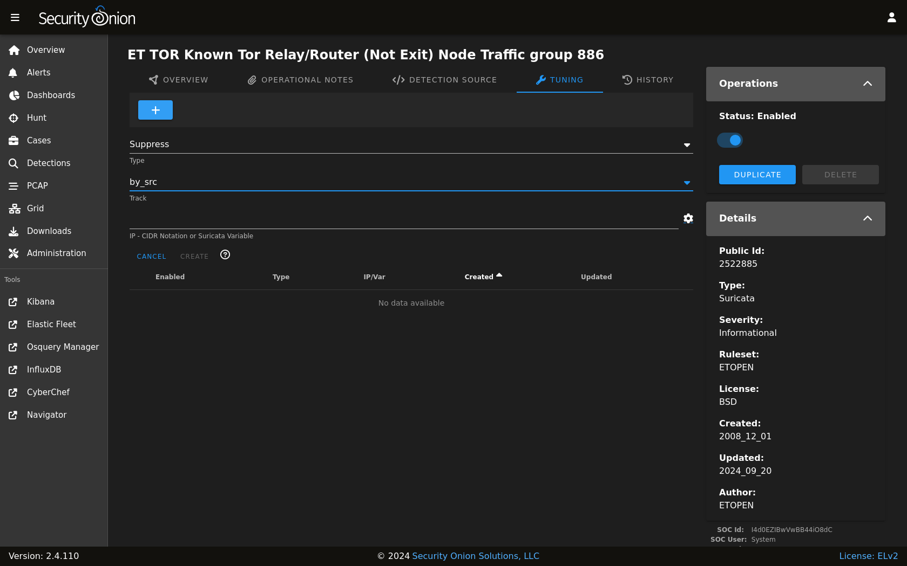

.. _nids:

NIDS
====

NIDS (Network Intrusion Detection System) rules are loaded into :ref:`suricata` to monitor network traffic for suspicious or noteworthy activity. Active NIDS rules generate alerts that can be found in :ref:`alerts`.

Managing Existing NIDS Rules
----------------------------

You can manage existing NIDS rules using :ref:`detections`. There are two ways to do so:

- From the main :ref:`detections` interface, you can search for the desired detection and click the binoculars icon.
- From the :ref:`alerts` interface, you can click an alert and then click the ``Tune Detection`` menu item.

Once you've used one of these methods to reach the detection detail page, you can check the Status field in the upper-right corner and use the slider to enable or disable the detection.

.. image:: images/60_detection_nids.png
  :target: _images/60_detection_nids.png

To tune the detection:

- click the TUNING tab
- click the blue + button
- select the type of tuning (Modify, Suppress, or Threshold)
- fill out the requested values
- click the ``CREATE`` button

Adding New NIDS Rules
---------------------

To add a new NIDS rule, go to the main :ref:`detections` page and click the blue + button between Options and the query bar. A form will appear where you will:

- click the Language drop-down and select ``Suricata``
- optionally specify a license
- add the signature
- click the ``CREATE`` button and the detection should deploy to your grid at the next 15-minute cycle

.. image:: images/58_detection_create.png
  :target: _images/58_detection_create.png

Update Frequency
----------------

By default, Security Onion checks for new NIDS rules every 24 hours. You can change this value as follows:

- Navigate to :ref:`administration` --> Configuration.
- At the top of the page, click the ``Options`` menu and then enable the ``Show all configurable settings, including advanced settings.`` option.
- Navigate to soc --> config --> server --> modules --> suricataengine --> communityRulesImportFrequencySeconds.

Changing to a Different Ruleset
-------------------------------

Security Onion includes the Emerging Threats Open (ETOPEN) ruleset by default. If you would like to change to a different ruleset, you can do this via :ref:`administration` --> Configuration --> idstools --> config --> ruleset.

.. image:: images/config-item-idstools.png
  :target: _images/config-item-idstools.png

Security Onion offers the following choices for NIDS rulesets. The main options are ETOPEN (free) and ETPRO (commercial) but advanced users may choose a Snort ruleset if they understand the caveats as shown below.

ETOPEN
~~~~~~

-  default ruleset included in Security Onion
-  optimized for :ref:`suricata`
-  **free**

| For more information, see:
| https://rules.emergingthreats.net/open/

ETPRO
~~~~~

-  includes ETOPEN and additional rules
-  optimized for :ref:`suricata`
-  rules retrievable as released
-  license fee per sensor (you are responsible for purchasing enough licenses for your entire deployment)

| For more information, see:
| https://www.proofpoint.com/us/threat-insight/et-pro-ruleset  

Snort Community
~~~~~~~~~~~~~~~

-  NOT optimized for :ref:`suricata`
-  community-contributed rules
-  **free**

| For more information, see:
| https://www.snort.org/downloads/#rule-downloads
| https://www.snort.org/faq/what-are-community-rules

Snort Registered
~~~~~~~~~~~~~~~~

-  NOT optimized for :ref:`suricata`
-  Snort SO (Shared Object) rules do NOT work with :ref:`suricata`
-  same rules as Snort Subscriber ruleset, except rules only retrievable after 30 days past release
-  **free**

Since Shared Object rules won't work with :ref:`suricata`, you may want to disable them using a regex like ``'re:soid [0-9]+'``.
  
| For more information, see:
| https://www.snort.org/downloads/#rule-downloads
| https://snort.org/documents/registered-vs-subscriber

Snort Subscriber (Talos)
~~~~~~~~~~~~~~~~~~~~~~~~

-  NOT optimized for :ref:`suricata`
-  Snort SO (Shared Object) rules do NOT work with :ref:`suricata`
-  rules retrievable as released
-  license fee per sensor (you are responsible for purchasing enough licenses for your entire deployment)

Since Shared Object rules won't work with :ref:`suricata`, you may want to disable them using a regex like ``'re:soid [0-9]+'``.

| For more information, see:
| https://www.snort.org/downloads/#rule-downloads
| https://snort.org/documents/registered-vs-subscriber

Other
~~~~~

- not officially managed/supported by Security Onion
- license fee may or may not apply

To add custom rulesets, navigate to :ref:`administration` --> Configuration, enable the ``Show all configurable settings`` option, then search for ``customRulesets``, and drilldown on the left side.

Custom rulesets can be added either via URL or a local file placed on the Manager.

For URLs, the format is:

::

        {"community":true,"license":"GPLv2","ruleset":"snort-community","target-file":"community.rules","url":"https://www.snort.org/downloads/community/community-rules.tar.gz"}

Here's what each option means:

- community: Required, true or false. This disables some management options for the imported rules - they can't be deleted or edited, just tuned, duplicated, and Enabled | Disabled.
- license: Required, the license this ruleset falls under.
- ruleset: Required, the ruleset name or identifier.
- target-file: Required, the name of the file that contains the rules, once it is downloaded. The file extension must be ``.rules``.
- url: Required, the URL that the rules should be downloaded from.

For local files, the format is:

::

        {"community":true,"license":"DRL1.1","file":"/nsm/rules/detect-suricata/custom_file/SOS-Custom_suricata.rules","ruleset":"SOS-Custom"}

file: This is the path for the local rules file, which must be in the ``/nsm/rules/detect-suricata/custom_file/`` directory.

The new settings will be applied within 15 minutes. At that point, you will need to wait for the scheduled rule update to take place (by default, every 24 hours), or you can force the update by navigating to :ref:`detections` --> Options dropdown menu --> Suricata --> Full Update.'
