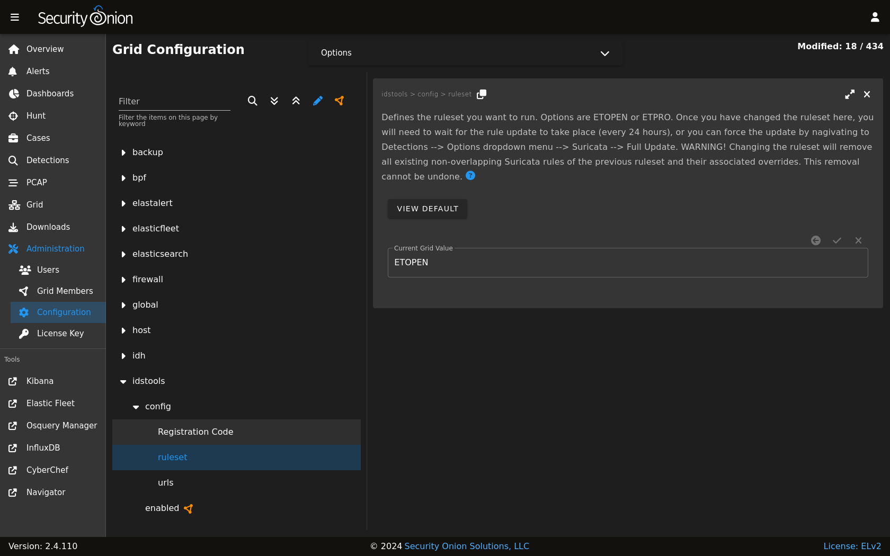

.. _nids:

NIDS
====

NIDS (Network Intrusion Detection System) rules are loaded into :ref:`suricata` to monitor network traffic for suspicious or noteworthy activity.

Rulesets
--------

You can modify your ruleset configuration by going to :ref:`administration` --> Configuration --> idstools.

Security Onion offers the following choices for NIDS rulesets.

ET Open
~~~~~~~

-  default ruleset included in Security Onion
-  optimized for :ref:`suricata`
-  **free**

| For more information, see:
| https://rules.emergingthreats.net/open/

ET Pro (Proofpoint)
~~~~~~~~~~~~~~~~~~~

-  optimized for :ref:`suricata`
-  rules retrievable as released
-  license fee per sensor (you are responsible for purchasing enough licenses for your entire deployment)

| For more information, see:
| https://www.proofpoint.com/us/threat-insight/et-pro-ruleset  

Snort Community
~~~~~~~~~~~~~~~

-  NOT optimized for :ref:`suricata`
-  community-contributed rules
-  **free**

| For more information, see:
| https://www.snort.org/downloads/#rule-downloads
| https://www.snort.org/faq/what-are-community-rules

Snort Registered
~~~~~~~~~~~~~~~~

-  NOT optimized for :ref:`suricata`
-  Snort SO (Shared Object) rules do NOT work with :ref:`suricata`
-  same rules as Snort Subscriber ruleset, except rules only retrievable after 30 days past release
-  **free**

Since Shared Object rules won't work with :ref:`suricata`, you may want to disable them using a regex like ``'re:soid [0-9]+'``.
  
| For more information, see:
| https://www.snort.org/downloads/#rule-downloads
| https://snort.org/documents/registered-vs-subscriber

Snort Subscriber (Talos)
~~~~~~~~~~~~~~~~~~~~~~~~

-  NOT optimized for :ref:`suricata`
-  Snort SO (Shared Object) rules do NOT work with :ref:`suricata`
-  rules retrievable as released
-  license fee per sensor (you are responsible for purchasing enough licenses for your entire deployment)

Since Shared Object rules won't work with :ref:`suricata`, you may want to disable them using a regex like ``'re:soid [0-9]+'``.

| For more information, see:
| https://www.snort.org/downloads/#rule-downloads
| https://snort.org/documents/registered-vs-subscriber

Other
~~~~~

- not officially managed/supported by Security Onion
- license fee may or may not apply

Managing NIDS Rules
-------------------

Once you've decided on a ruleset (either the default ET ruleset included in Security Onion or one of the other options above), you can manage the rules in that ruleset using :ref:`detections`.
