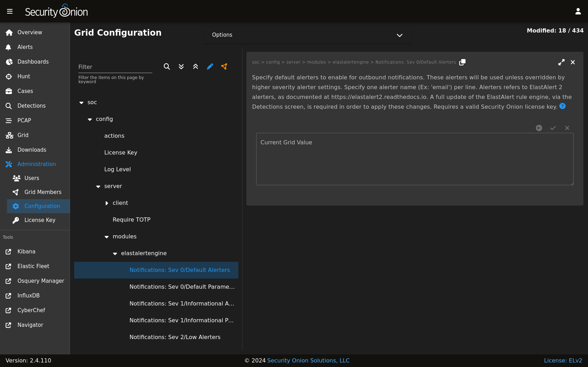
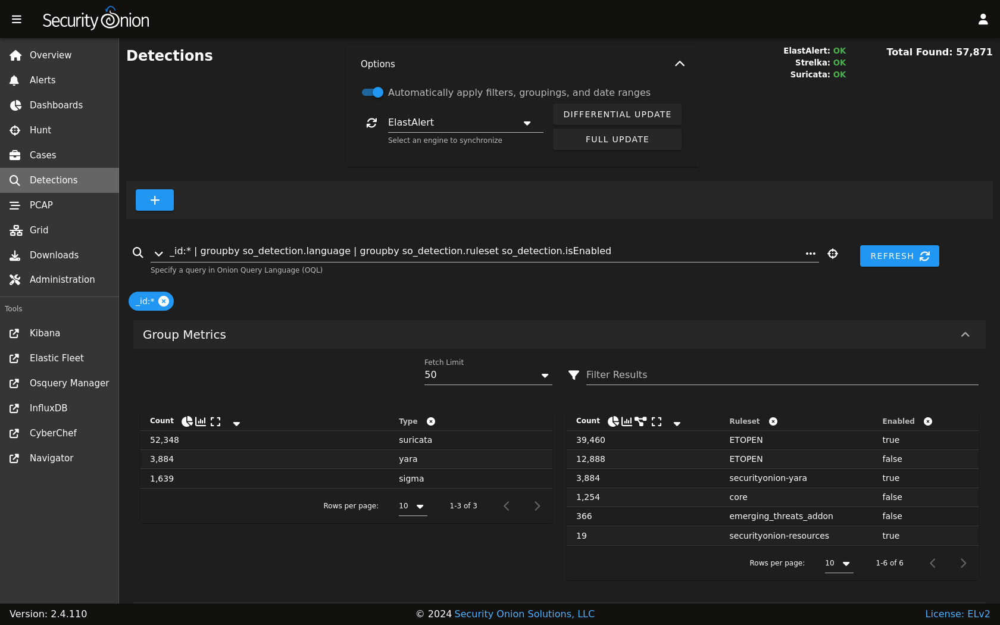

.. _notifications:

Notifications  
=============

.. note::

    This is an enterprise-level feature of Security Onion. Contact Security Onion Solutions, LLC via our website at https://securityonion.com/pro for more information about purchasing a Security Onion Pro license to enable this feature.

The :ref:`detections` module, specifically :ref:`sigma` rules, can be enabled to send outbound notifications upon an alert being created. By default, no outbound notifications are enabled in a Security Onion installation. However, with the Pro license applied to a grid, notifications can be quickly configured via the Configuration screen.

Configuration
-------------

Configuring notifications involves adjusting configuration in two areas:

1. ElastAlert 2 Alerters
2. SOC Detections

ElastAlert 2 Alerters
~~~~~~~~~~~~~~~~~~~~~

:ref:`elastalert` includes a large number of alerters that can reach out to remote systems to deliver notifications. As each alerter supports a unique protocol the alerter requires its own set of supporting parameters in order for the alerter to know how to reach out to the remote endpoint. For example, to send a notification to a Slack channel, a webhook URL must be provided.

Navigate to the :ref:`administration` -> Configuration screen. Next, locate the ``elastalert`` settings.

.. image:: images/config-item-elastalert-alerter.png
  :target: _images/config-item-elastalert-alerter.png

Notice there are special settings for Jira and SMTP notifications. These are unique in that :ref:`elastalert` requires those two alerters to read their credentials from a file. Security Onion has simplified this process by presenting these Configuration fields to enter the optional credential data, and the backend process will take care of generating the required files for :ref:`elastalert`.

The files subtree includes a list of several file settings, which allows for populating the contents of certain files that the alerters can optionally utilize. Most alerters use the files for specifying a custom Certificate Authority, so that :ref:`elastalert` can securely and confidently connect to remote servers that may be using custom SSL/TLS certificates. Again, Security Onion's backend process will handle generating these files from the supplied configuration data provided in the user interface.

Next, the **soc > config > server > modules > elastalertengine > Notifications: Sev 0/Default Parameters** setting is used to customize each alerter's own parameters. As :ref:`elastalert` already provides detailed documentation on the required parameters for each alerter, this documentation will not cover the same information, but instead will focus on two popular alerters: Slack and SMTP.

.. note::

    Reference the alerter parameters at https://elastalert2.readthedocs.io/en/latest/alerts.html#alert-types.

Slack
~~~~~

To have :ref:`sigma` rules send notifications to Slack, add the following line to the **soc > config > server > modules > elastalertengine > Notifications: Sev 0/Default Parameters** configuration setting:

::

    slack_webhook_url: "https://hooks.slack.com/services/YOUR_WEBHOOK_URI"

Email (SMTP)
~~~~~~~~~~~~

To have :ref:`sigma` rules send notifications via email, add the following lines to the **soc > config > server > modules > elastalertengine > Notifications: Sev 0/Default Parameters** configuration setting:

::

    email: youremail@yourcompany.com
    smtp_host: "your_company_smtp_server"
    from_addr: "elastalert@yourcompany.com"

If the SMTP server requires authentication make sure the special **SMTP Username** and **SMTP Password** configuration settings are also specified.

SOC Detections
~~~~~~~~~~~~~~

Once the alerter parameters are configured, as described above, the next step is to configure :ref:`detections` in order to activate one or more notification alerters.

Navigate to the :ref:`administration` -> Configuration screen. Next, locate the ``soc > config > server > modules > elastalertengine`` settings.

In the **Notifications: Sev 0/Default Alerters** configuration setting, add the name of each alerter that should be activated, one alerter name per line. For example, to add both slack and email: 

::

  slack
  email

Important! After activating (or removing) an alerter from this setting, the :ref:`elastalert` engine must be fully updated. This can be done via the :ref:`detections` screen, under the Options dropdown.

Severity-Based Notifications
~~~~~~~~~~~~~~~~~~~~~~~~~~~~

The instructions above setup the default notification settings, for all outbound notifications. However, as of Security Onion 2.4.100, notification settings can be customized for higher level severities. Severities are specified in Sigma :ref:`detections`.

Severity levels progress as follows, starting with the lowest, least significant severity:

0. Unknown Severity
1. Informational Severity
2. Low Severity
3. Medium Severity
4. High Severity
5. Critical Severity

If notification settings are not specified for a particular severity level then it will use whatever settings are specified at the next lower severity. If that severity is also not specified, then it continues looking for lower severity settings.

.. note::

  Higher severity levels do not inherit parameters or alerters from lower severities. Consequently, if ``email`` is specified as the default (Severity 0) alerter, and it's desired to have both ``email`` and ``slack`` notifications sent with **High/Sev 4** severity or above, then both ``email`` and ``slack`` will need to be specified for the ``Notifications: Sev 4/Default Alerters`` setting, one per line. This same principle applies to the parameters, which are also not inherited. In order to inherit default parameters across all severities, the parameters can be specified in the ``elastalert > Custom Configuration Parameters`` setting.

User-Defined Notifications
~~~~~~~~~~~~~~~~~~~~~~~~~~

As of Security Onion 2.4.100, individual Sigma detections can be tagged to change the detection's alerting behavior. The tags are set inside the detection source. Tag details are defined below:

- ``so.notification``: When this tag is present inside of a Sigma tag list, the detection will only perform outbound notifications. It will not add an alert to the SOC Alerts screen.
- ``so.alerters.customAlerters``: When this tag is present inside of a Sigma tag list, the detection will perform notifications for an alternate set of ElastAlert 2 alerters. More information on how to choose these alerters is provided below.
- ``so.params.customAlertersParams``: When this tag is present inside of a Sigma tag list, and when the above tag is also included, then an alternate set of custom parameters will be applied to the ElastAlert 2 alerters.

To customize the alerters and parameters to use when these tags are specified in a Sigma detection, navigate to the Configuration screen. Find the ``soc > config > server > modules > elastalertengine > additionalUserDefinedNotifications > customAlerters`` setting and add the custom alerters, one per line, similar to what is done for the Severity-Based notifications above. Similarly, find the sibling setting to define custom alerter parameters: ``soc > config > server > modules > elastalertengine > additionalUserDefinedNotifications > customAlertersParams``.

.. note::

  User-Defined alerters will override severity-based alerters, provided the user-defined alerters are properly configured. If the Sigma tags specify custom alerters but the corresponding setting does not exist in the Configuration then the severity-based notifications will continue to be used.

To create additional user-defined alerter configurations, enabled Advanced mode and navigate to the same ``customAlerters`` and ``customAlertersParams`` settings mentioned above. With Advanced mode enabled there will be a "Create Duplicate" button that allows for duplicating these settings. Follow the on-screen instructions to create the duplicate settings. Then, to make use of these new settings, in the Sigma tag list replace the ``so.alerters.customAlerters`` tag suffix with the name (case-sensitive) of the duplicated setting. For example, if the duplicated settings are named ``SysAdminAlerters`` and ``SysAdminParams`` then the two tags to specify in the Sigma detection source are ``so.alerters.SysAdminAlerters`` and ``so.params.SysAdminParams``. Only one user-defined alerters and parameters setting will be used if multiple tags match the ``so.alerters.`` and ``so.params.`` prefixes. In other words, attempting to specify multiple user-defined alerters within a single Sigma detection will result in an ambiguous outcome.