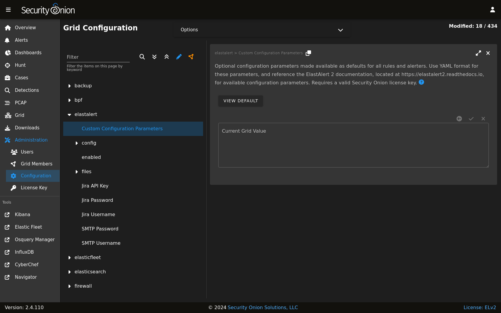

.. _notifications:

Notifications  
=============

.. note::

    This is an enterprise-level feature of Security Onion. Contact Security Onion Solutions, LLC via our website at https://securityonionsolutions.com for more information about purchasing a Security Onion Pro license to enable this feature.

The :ref:`detections` module, specifically :ref:`sigma` rules, can be enabled to send outbound notifications upon an alert being created. By default, no outbound notifications are enabled in a Security Onion installation. However, with the Pro license applied to a grid, notifications can be quickly configured via the Configuration screen.

Configuration
-------------

Configuring notifications involves adjusting configuration in two areas:

1. ElastAlert 2 Alerters
2. SOC Detections

ElastAlert 2 Alerters
~~~~~~~~~~~~~~~~~~~~~

:ref:`elastalert` includes a large number of alerters that can reach out to remote systems to deliver notifications. As each alerter supports a unique protocol the alerter requires its own set of supporting parameters in order for the alerter to know how to reach out to the remote endpoint. For example, to send a notification to a Slack channel, a webhook URL must be provided.

Navigate to the :ref:`administration` -> Configuration screen. Next, locate the ``elastalert`` settings.

Notice there are special settings for Jira and SMTP notifications. These are unique in that :ref:`elastalert` requires those two alerters to read their credentials from a file. Security Onion has simplified this process by presenting these Configuration fields to enter the optional credential data, and the backend process will take care of generating the required files for :ref:`elastalert`.

The files subtree includes a list of several file settings, which allows for populating the contents of certain files that the alerters can optionally utilize. Most alerters use the files for specifying a custom Certificate Authority, so that :ref:`elastalert` can securely and confidently connect to remote servers that may be using custom SSL/TLS certificates. Again, Security Onion's backend process will handle generating these files from the supplied configuration data provided in the user interface.

Next, the **Alerter Parameters** setting is used to customize each alerter's own parameters. As :ref:`elastalert` already provides detailed documentation on the required parameters for each alerter, this documentation will not cover the same information, but instead will focus on two popular alerters: Slack and SMTP.

.. note::

    Reference the alerter parameters at https://elastalert2.readthedocs.io/en/latest/alerts.html#alert-types.

Slack
~~~~~

To have :ref:`sigma` rules send notifications to Slack, add the following line to the **Alerter Parameters** configuration setting:

::

    slack_webhook_url: "https://hooks.slack.com/services/YOUR_WEBHOOK_URI"

Email (SMTP)
~~~~~~~~~~~~

To have :ref:`sigma` rules send notifications via email, add the following lines to the **Alerter Parameters** configuration setting:

::

    email: youremail@yourcompany.com
    smtp_host: "your_company_smtp_server"
    from_addr: "elastalert@yourcompany.com"

If the SMTP server requires authentication make sure the special **SMTP Username** and **SMTP Password** configuration settings are also specified.

SOC Detections
~~~~~~~~~~~~~~

Once the alerter parameters are configured, as described above, the next step is to configure :ref:`detections` in order to activate one or more notification alerters.

Navigate to the :ref:`administration` -> Configuration screen. Next, locate the ``soc -> config -> server -> modules -> elastalertengine`` settings.

In the **Additional Alerters** configuration setting, add the name of each alerter that should be activated, one alerter name per line. 

::

  slack
  email

.. image:: images/config-item-soc-additionalAlerters.png
  :target: _images/config-item-soc-additionalAlerters.png

Important! After activating (or removing) an alerter from this setting, the :ref:`elastalert` engine must be fully updated. This can be done via the :ref:`detections` screen, under the Options dropdown.

.. image:: images/58_detections_options.png
  :target: _images/58_detections_options.png
