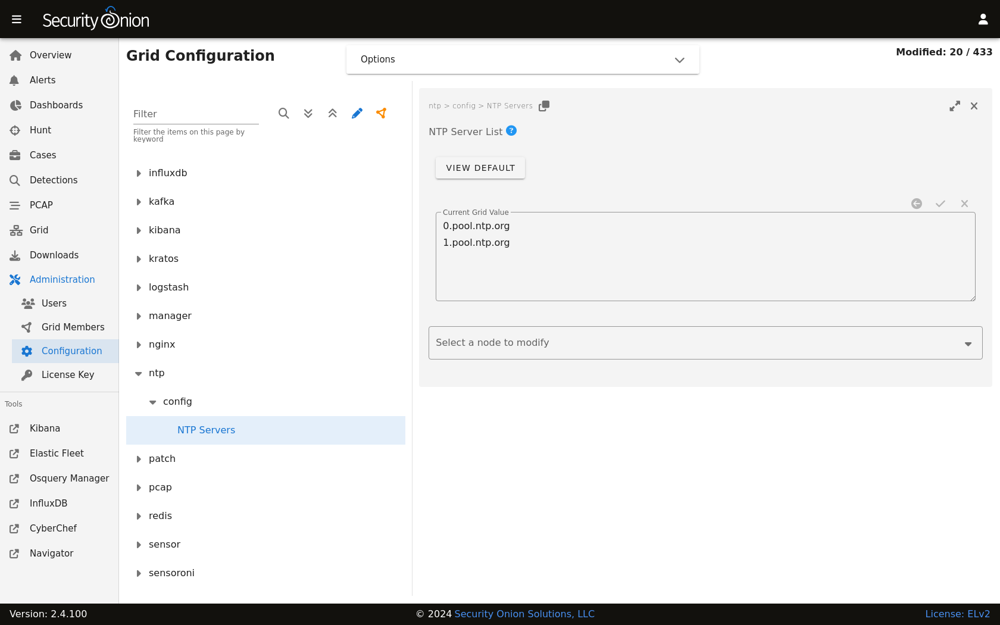

.. _ntp:

NTP
===

Depending on how you installed, the underlying operating system may be configured to pull time updates from the NTP Pool Project and perhaps others as a fallback. You may want to change this default NTP config to your preferred NTP provider by going to :ref:`administration` --> Configuration --> ntp.

