.. _oidc:

OpenID Connect (OIDC)
=====================

Starting with Security Onion version 2.4.30, SOC supports single sign-on (SSO) authentication via OpenID Connect (OIDC) to one of several OIDC-compatible identity providers. For example, users can login to Security Onion using an Active Directory user, a GitHub user, a Google account, an Auth0 account, etc. Only one OIDC provider can be active at a time.

.. note::

    This is an enterprise-level feature of Security Onion. Contact Security Onion Solutions, LLC via our website at https://securityonion.com/pro for more information about purchasing a Security Onion Pro license to enable this feature.

.. warning::

    Integrating Security Onion into an organization's global identity management platform is generally not recommended. If an attacker compromises the identity management platform, which is typically a high priority target, then that attacker could use compromised SSO credentials to access Security Onion and potentially undermine the benefits provided by Security Onion. This integration is made available for those who understand these risks and have appropriate mitigations in place.

Configuration
-------------

OIDC configuration can be complex and we recommend taking advantage of the official Security Onion support team. Note that purchases of a Security Onion license include some level of support. This will help avoid time-consuming problems that can occur when configuring OIDC.

The first step in configuration OIDC is to determine which provider the grid will use, and collecting the required configuration inputs necessary for that specific provider. 

Next, in Security Onion Console, while logged in as an administrator, navigate to the Administration -> Configuration screen and enter ``oidc`` into the filter field. Then click the *Expand All* icon.

Review the following instructions for the applicable provider.

Microsoft Entra ID (Azure Active Directory)
^^^^^^^^^^^^^^^^^^^^^^^^^^^^^^^^^^^^^^^^^^^

Locate the ``provider`` setting in the SOC configuration screen. Specify the value ``microsoft`` for this setting.

In a separate browser tab, login to the Microsoft Azure account you plan to use for the integration. Navigate to the Microsoft Entra ID service and find the ``Tenant ID``, which will resemble a UUID similar to ``abcdef12-1234-abcd-5678-a1b2c3d4e5f6``. 

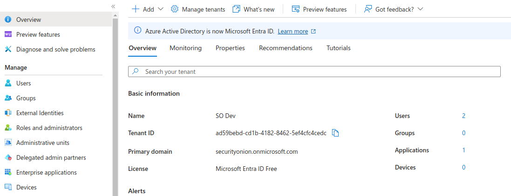

Locate the ``microsoft_tenant`` setting in the SOC configuration screen back on the SOC browser tab. Specify the UUID value for this setting.

Back in the Azure tab, under the desired Azure Tenant, register a new App named ``Security Onion``. Most organizations will only desire organization accounts to have access to Security Onion so be sure to choose the correct account type option. Failure to choose this correctly could expose your Security Onion installation to users outside of your organization. Specify the web Redirect URI using the URL that the analysts will use to access SOC after finalizing their login to Azure. This is typically going to resemble the following pattern: ``https://<my-soc-base-url>/auth/self-service/methods/oidc/callback/SSO``. Click *Register*, and on the resulting screen find the application ID for this new app registration. It will also resemble a UUID.

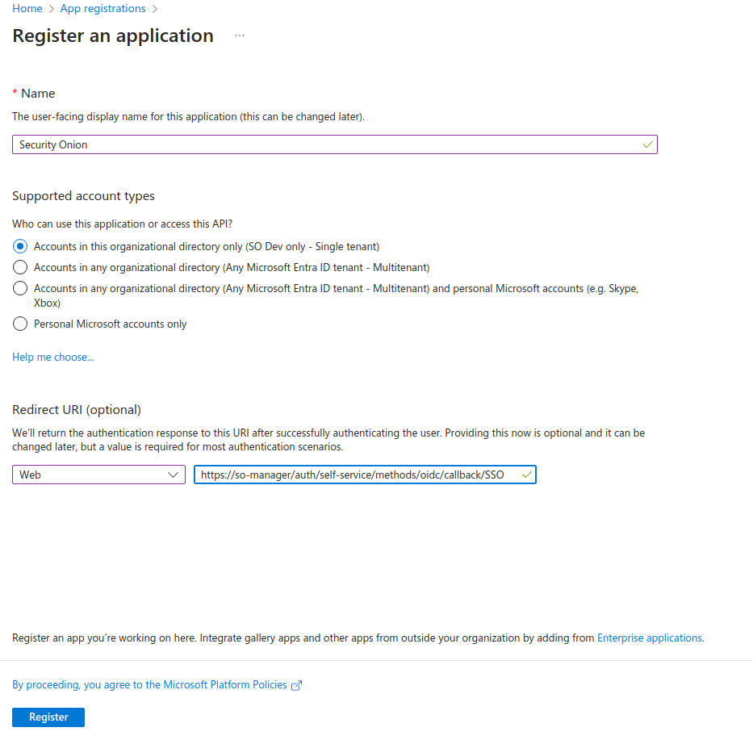

Locate the ``client_id`` setting in the SOC configuration screen back on the SOC browser tab. Specify the above application ID for this setting.

Add a new client secret to the app registration created above. Specify the secret name as ``so-oidc`` and choose the expiration that makes the most sense for your organization. If you choose to use a short or medium term expiration, a good practice is to make it very short, so that it forces your rotation processes to be well-known and documented. Choosing a medium expiration of two years will likely cause more trouble when the secret expires and the knowledge of how to resolve it is lost among the administrative team. Copy the generated secret to your clipboard. You will only have this one chance to copy the secret. Returning to this secret later will not provide access to the original secret.

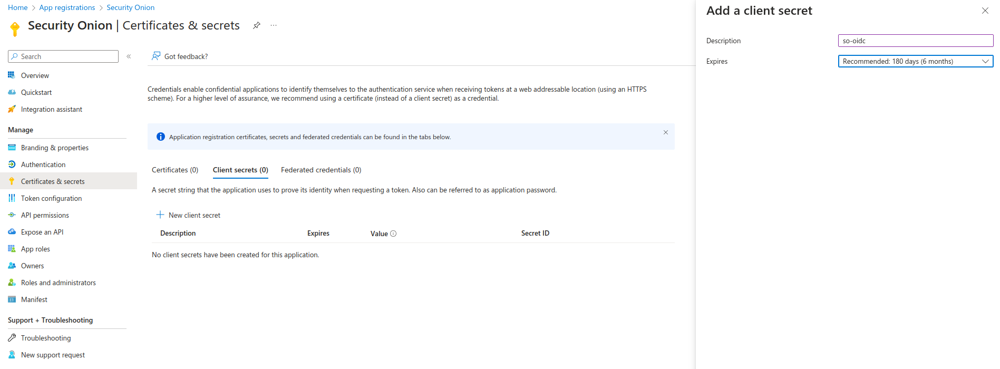

Locate the ``client_secret`` setting in the SOC configuration screen back on the SOC browser tab. Specify the above client secret for this setting.

Next, skip to the *Enabling OIDC* section to enable the newly configured OIDC authentication.

Active Directory (Self-hosted)
^^^^^^^^^^^^^^^^^^^^^^^^^^^^^^^

Contact the Security Onion Solutions support team to determine the specific configuration changes required to integrate your Security Onion grid with your organization's Active Directory installation. They will review your current Windows Server version, assist with TLS certificate configurations applicable to your organization, and walk you through the steps needed to complete the integration.

Google
^^^^^^

Locate the ``provider`` setting in the SOC configuration screen. Specify the value ``google`` for this setting.

In a separate browser tab, login to the Google Cloud Console and select or create a project under your Google organization containing the workspace users you plan to use for the integration. Navigate to the Credentials screen and add a new OAuth 2.0 Client ID named ``Security Onion``, of type ``Web``. Specify the web Redirect URI using the URL that the analysts will use to access SOC after finalizing their login to Azure. This is typically going to resemble the following pattern: ``https://<my-soc-base-url>/auth/self-service/methods/oidc/callback/SSO``. 

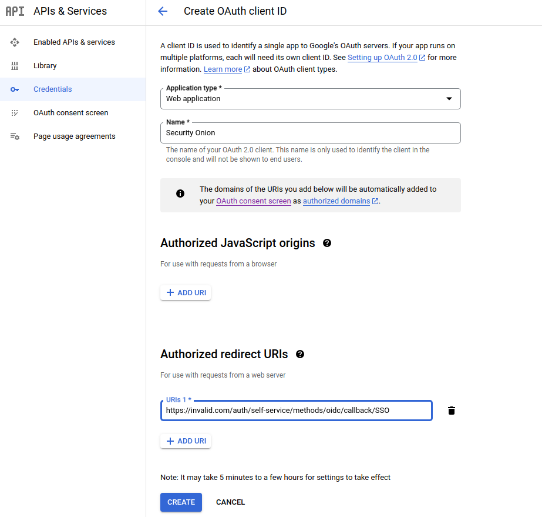

When the client ID is added a popup will appear with the new Client ID and Secret. These values must be entered into the SOC configuration screen.

Locate the ``client_id`` setting in the SOC configuration screen back on the SOC browser tab. Specify the above client ID for this setting.

Locate the ``client_secret`` setting in the SOC configuration screen back on the SOC browser tab. Specify the above client secret for this setting.

Next, skip to the *Enabling OIDC* section to enable the newly configured OIDC authentication.

GitHub
^^^^^^

Locate the ``provider`` setting in the SOC configuration screen. Specify the value ``github`` for this setting.

In a separate browser tab, login to the GitHub account you plan to use for the integration. Navigate to the Organization Settings and then Developer Settings -> OAuth Apps. Click the *New Org OAuth App* button. Enter ``Security Onion`` for the Application name, the login URL to your SOC grid for the Homepage URL, and optional description, and then the authorization callback URL, which will resemble the following pattern: ``https://<my-soc-base-url>/auth/self-service/methods/oidc/callback/SSO``. Click *Register Application*.

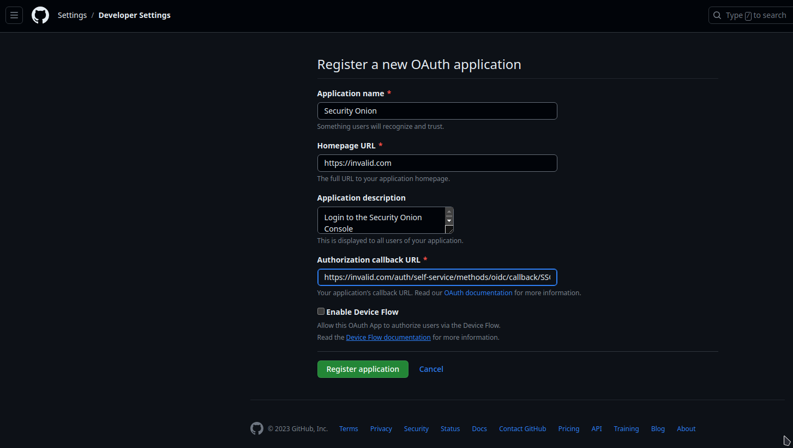

Once the app is created a new screen will show the newly create OAuth application settings, including the generated client ID and secret. 

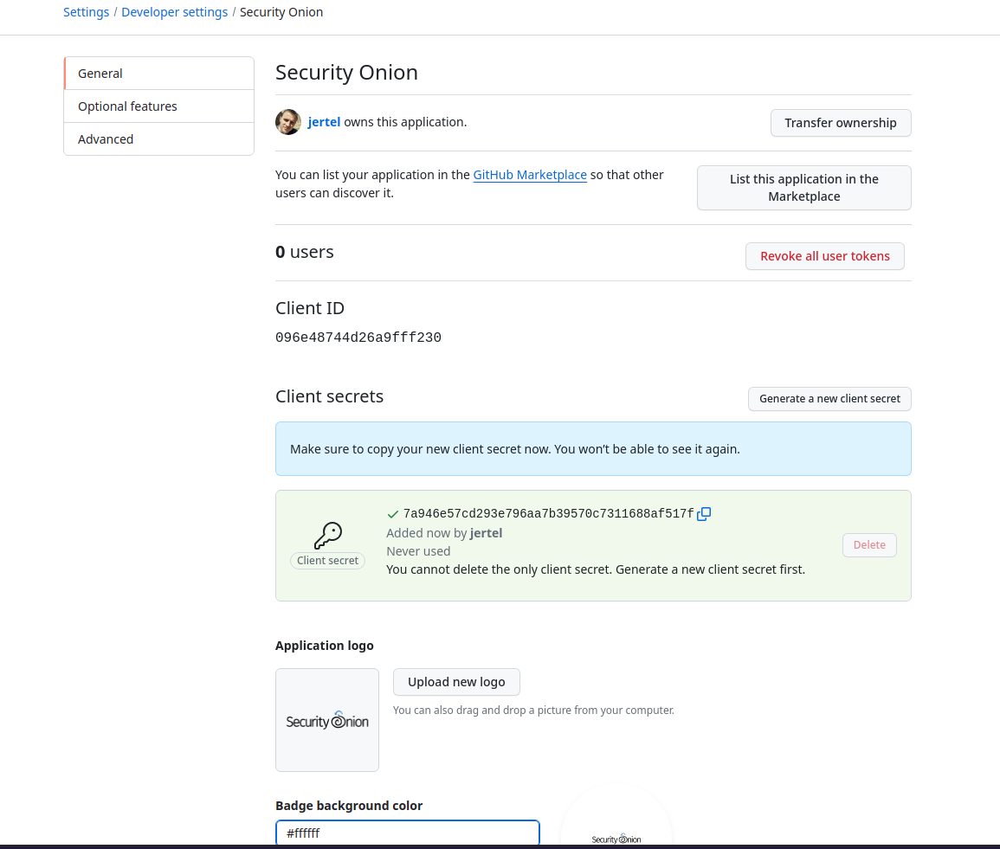

Be sure to copy the secret before refreshing or navigating away from this screen. These two values must be entered into the SOC configuration screen.

Locate the ``client_id`` setting in the SOC configuration screen back on the SOC browser tab. Specify the above client ID for this setting.

Locate the ``client_secret`` setting in the SOC configuration screen back on the SOC browser tab. Specify the above client secret for this setting.

Next, skip to the *Enabling OIDC* section to enable the newly configured OIDC authentication.

Auth0
^^^^^

Locate the ``provider`` setting in the SOC configuration screen. Specify the value ``auth0`` for this setting.

In a separate browser tab, login to the Auth0 account you plan to use for the integration. Create a new application named ``Security Onion``. After it's created, navigate to the Settings tab. Scroll down to the Application URIs section and enter ``https://<my-soc-base-url>`` for the Application Login URI and Logout URL, and then enter the callback URL, which wiill resemble the following pattern: ``https://<my-soc-base-url>/auth/self-service/methods/oidc/callback/SSO``. Click *Save Changes*.

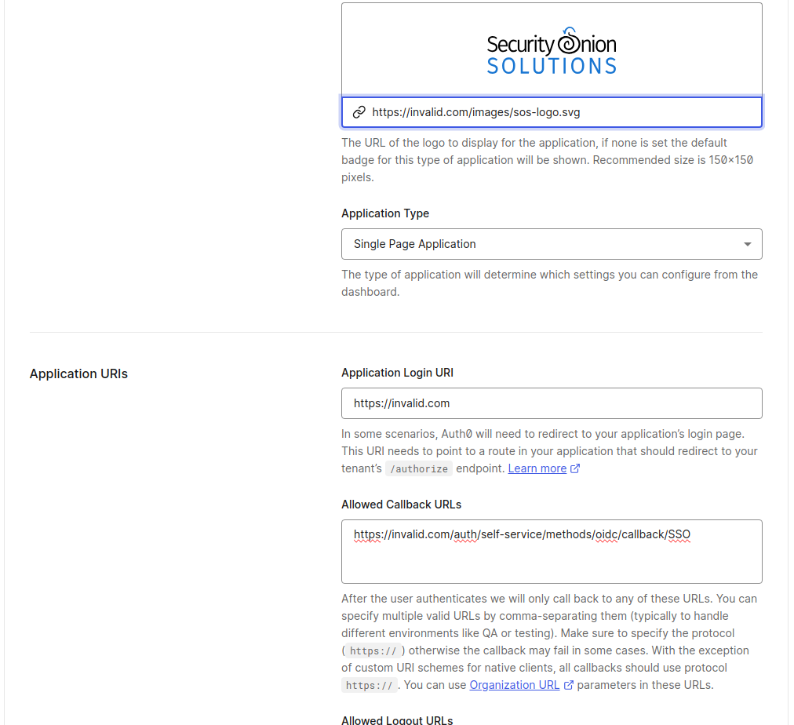

Scroll back to the top of the Auth0 Settings page where the Client ID and Secret are shown. 

.. image:: images/oidc/auth0_app.png
  :target: _images/auth0_app.png

Be sure to copy the secret before refreshing or navigating away from this screen. These two values must be entered into the SOC configuration screen.

Locate the ``client_id`` setting in the SOC configuration screen back on the SOC browser tab. Specify the above client ID for this setting.

Locate the ``client_secret`` setting in the SOC configuration screen back on the SOC browser tab. Specify the above client secret for this setting.

Back in the Auth0 tab, scroll down to the Advance Settings section, and click on *Endpoints*. Copy the OAuth Authorization URL, but without the ``/authorize`` path. Locate the ``issuer_url`` setting in the SOC configuration screen back on the SOC browser tab. Paste the copied URL into this setting. It should resemble the following: ``https://dev-xyz123abc456.us.auth0.com``

Next, skip to the *Enabling OIDC* section to enable the newly configured OIDC authentication.

Enabling OIDC
^^^^^^^^^^^^^

Finally, enable OIDC by locating the ``enabled`` setting in the SOC configuration and specify the value of ``true`` for this setting. 

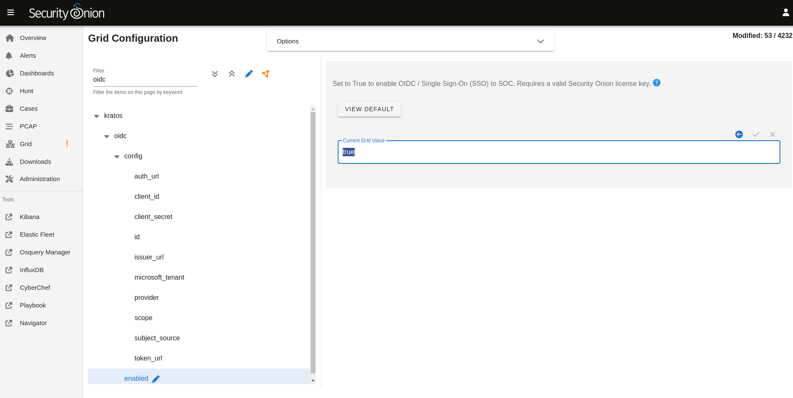

.. note::

    Do not enable OIDC until all required configuration settings have been entered and double-checked for accuracy. Once enabled the backend system will automatically synchronize the settings across the grid, typically within 15 minutes. If some settings are incorrect or missing the backend authentication services could be left in an error state and make it impossible to fix via the Configuration screen, as the SOC UI may no longer be accessible. If this occurs an SSH session will be required to access the underlying configuration files on the manager node. Contact support for assistance if needed.

.. warning::

    Once OIDC is enabled, any user of the selected external identity provider will be able to login to SOC, provided they have network access to do so. However, once logged in the new user will have no assigned roles and cannot view or modify sensitive SOC data. See the *Roles* section below for more information.

Initial Login
-------------

Upon the first login via OIDC the user will likely be returned back to the login screen. However, clicking on the *Continue with <SSO>* the second time will take the newly linked user to the SOC interface. This additional login click is only required once.

Roles
-----

When a new OIDC user logs into SOC, that user will not be assigned any roles. This greatly limits what functions the user will be capable of performing within SOC. For example, new users will be unable to see any alerts, hunt for events, view dashboard data, view or create cases, manage the grid, or view other users. Attempting to view those role-protected screens will result in an error message.

An administrator will need to login to SOC and assign roles to OIDC users via the Adminstration -> Users screen. This is a one time operation, per user. 

Managing OIDC Users
-------------------

Users created via an OIDC login should not have their credentials managed within SOC. When an administrator views an OIDC user in the Administration -> Users screen, they will notice a message appears near Access Control panel, and cautions them against changing authentication settings for that user. 

.. note::

    Authentication relates to obtaining access to a system, whereas authorization relates to permissions a user has within the system. While *authentication* settings of OIDC users should not be managed within SOC, *authorization* settings can be managed within SOC for OIDC users. See the *Roles* section above for more information about granting roles to OIDC users.

OIDC Self Service
-----------------

Users will continue to have access to their own Security Settings via the User Settings -> Security screen. A user could set a local SOC password via this screen, which would allow logins to SOC for that user without using SSO. After setting a local password, a user could then unlink the SSO account, which would disallow the user from logging in via SSO but still allow the user to login via the local password.

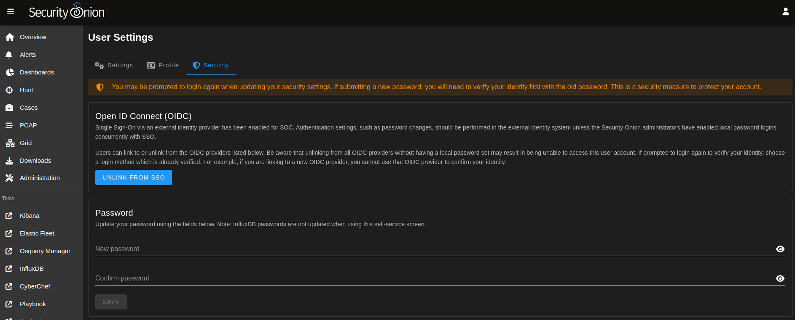

Conversely, locally logged in users that have not logged in via SSO yet can link to their SSO user.

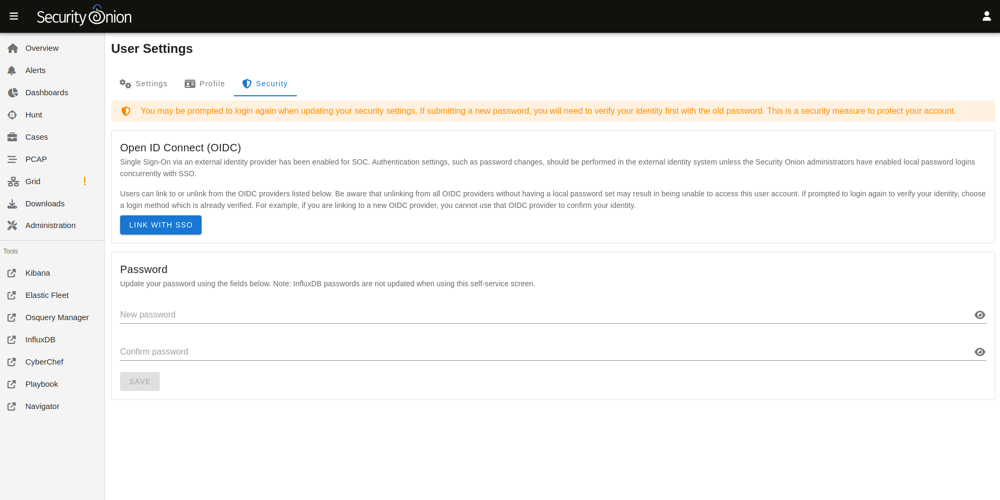

Administrators may choose to disable password logins when using SSO, to ensure all logins must go through the external OIDC provider. On the SOC Configuration screen, enter ``password.enabled`` into the filter to locate that Advanced setting (ensure the *Show all configurable settings* toggle is enabled).

Similarly, the TOTP MFA and Passwordless options can also be disabled, if there is a desire to prevent users from altering all local authentication methods. Search for ``totp.enabled`` and ``webauthn.enabled``, respectively, to disable those authentication methods.

When all local authentication methods have been disabled, users will have no security settings to modify in their self-service screen:

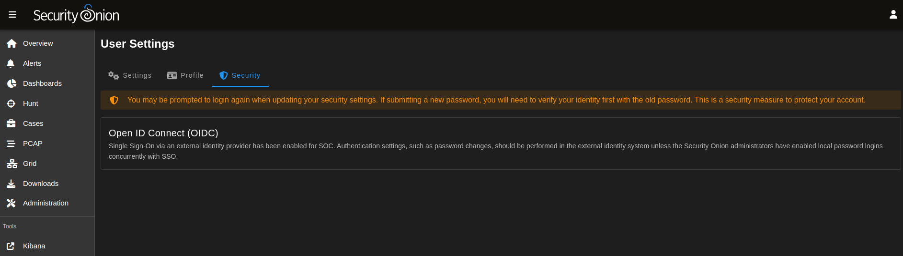

External Tools
--------------

Tools included with Security Onion, but provided by other vendors, will not utilize SOC single sign-on. This includes tools such as InfluxDB, Kibana and other Elastic-provided tools. If users need to access these tools the password authentication method must be enabled and a local password setup. The users can then login to those tools using their SSO email address and the local SOC password.
