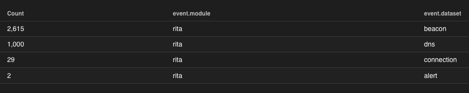
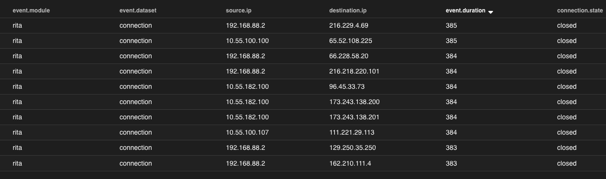
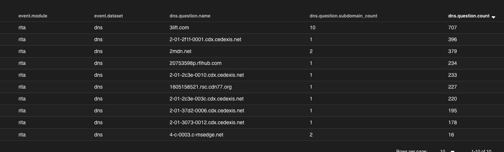
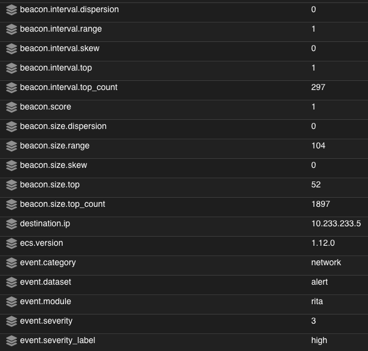
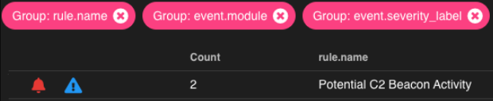

.. _other-supported-logs:

Other Supported Logs
====================

We include :ref:`elasticsearch` ingest parsers for several log types that don't have :ref:`filebeat` modules.

Example: pfSense
----------------

Security Onion includes :ref:`elasticsearch` ingest parsers for pfSense firewall logs. Simply run :ref:`so-allow` as described in the :ref:`syslog` section and then configure your pfSense firewall to send syslog to the IP address of your Security Onion box. If you are using pfSense 2.6.0 or higher, make sure that ``Log Message Format`` is set to ``BSD (RFC 3164, default)``. You should then be able to see your firewall logs using the ``Firewall`` query in :ref:`hunt`.

Example: RITA
-------------

Starting in Security Onion 2.3.120, we include :ref:`elasticsearch` ingest parsers for :ref:`rita` logs. To enable this support, add the following in the relevant :ref:`salt` minion pillar and then restart :ref:`filebeat` on the minion(s):

::

   rita:
     enabled: True

This will enable the following :ref:`filebeat` inputs:

``/nsm/rita/beacons.csv``

``/nsm/rita/exploded-dns.csv``

``/nsm/rita/long-connections.csv``  

``/nsm/rita/open-connections.csv``  

If you are installing :ref:`filebeat` on a non-Security Onion node or your filenames differ, you will need to copy the :ref:`filebeat` configuration from ``/opt/so/saltstack/default/salt/filebeat/etc/filebeat.yml`` to ``/opt/so/saltstack/local/salt/filebeat/etc/filebeat.yml`` (or modify on the non-Security Onion node in the native Filebeat configuration file) and emulate the path/filename accordingly.

Once ingested into Security Onion, you should be able to search for :ref:`rita` logs in :ref:`hunt` using ``event.module:rita | groupby event.dataset``.

Summary
~~~~~~~

 
Connections
~~~~~~~~~~~

 
DNS
~~~

Beacon
~~~~~~

Alert
~~~~~

If the value for ``beacon.score`` in a ``beacon`` record equals ``1``, an alert will be generated and viewable in :ref:`alerts`.

