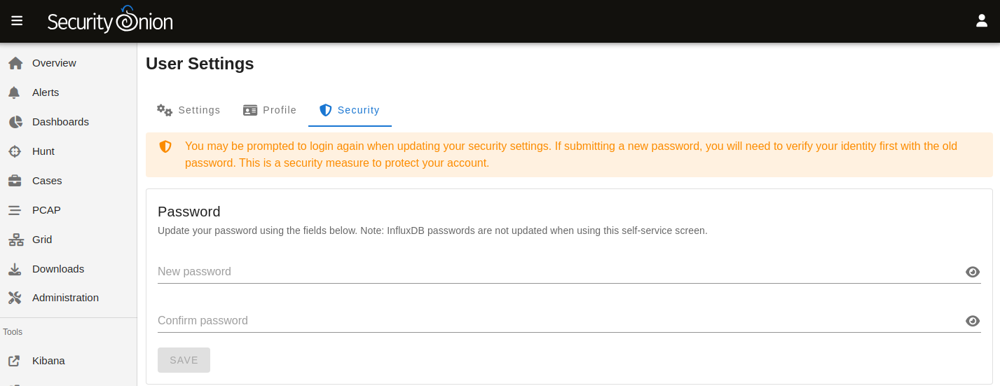

.. _passwords:

Passwords
=========

OS user account
---------------

When you first install Security Onion, you create a standard OS user account for yourself.  If you need to change your OS user password, you can use the ``passwd`` command:

::

    passwd
    
OS root account
---------------

Your default user account should have sudo permissions. Command-line utilities that require administrative access can be prefixed with ``sudo``. For example, the ``so-status`` command requires administrative access so you can run it with ``sudo`` as follows:

::

    sudo so-status

Security Onion Console (SOC)
----------------------------

Log into :ref:`soc` using the username and password you created in the Setup wizard.

You can change your password in :ref:`soc` by clicking the user icon in the upper right corner, clicking ``Settings``, and then going to the ``Security`` tab:

If you've forgotten your SOC password, you can reset it using the ``so-user`` command:

::

    sudo so-user update username@example.com
    
