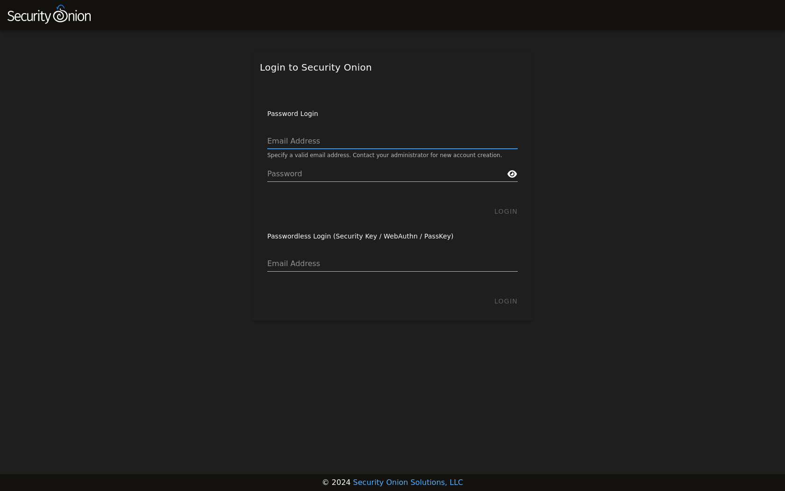

.. _passwords:

Passwords
=========

OS user account
---------------

When you first install Security Onion, you create a standard OS user account for yourself.  If you need to change your OS user password, you can use the ``passwd`` command:

::

    passwd
    
OS root account
---------------

Your default user account should have sudo permissions. Command-line utilities that require administrative access can be prefixed with ``sudo``. For example, the :ref:`so-status` command requires administrative access so you can run it with ``sudo`` as follows:

::

    sudo so-status

Password Logins to SOC
----------------------

Log into :ref:`soc` using the username and password you created in the Setup wizard.

You can change your password in :ref:`soc` by clicking the user icon in the upper right corner, clicking ``Settings``, and then going to the ``Security`` tab:

.. image:: images/password.png
  :target: _images/password.png

If you've forgotten your SOC password, an administrator can change it using the :ref:`administration` interface.

Passwordless Logins to SOC
--------------------------

Once logged in to SOC using the username and password method, users can optionally enable passwordless logins, provided the setting is enabled. The login screen will show a separate section for passwordless logins, if it is enabled. Note that it is enabled by default on new installations.

Activate passwordless login for your :ref:`soc` user by clicking the user icon in the upper right corner, clicking ``Settings``, and then going to the ``Security`` tab. Scroll down to the ``Security Keys`` section and follow the provided instructions.

Similarly, disable passwordless logins by returning to the ``Security`` tab and clicking the delete icon next to any previously-created Security Key.

.. note::

  While it is possible to use TOTP MFA as a second authentication factor in combination with passwordless logins, it is not possible to use a second security key as a second authentication factor with passwordless logins.

.. important::

   The webauthn specification requires that the web server be accessed via a hostname. Therefore, IP addresses cannot be used to access SOC when utilizing webauthn. Also, the server's TLS certificate must not have any errors. Consequently, self-signed certificates will only be permitted provided the certificate authority (CA) has also been imported into analyst's browsers and/or operating systems, and marked as trusted.
