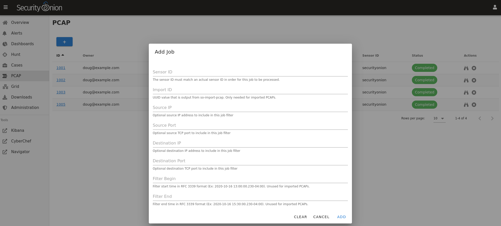
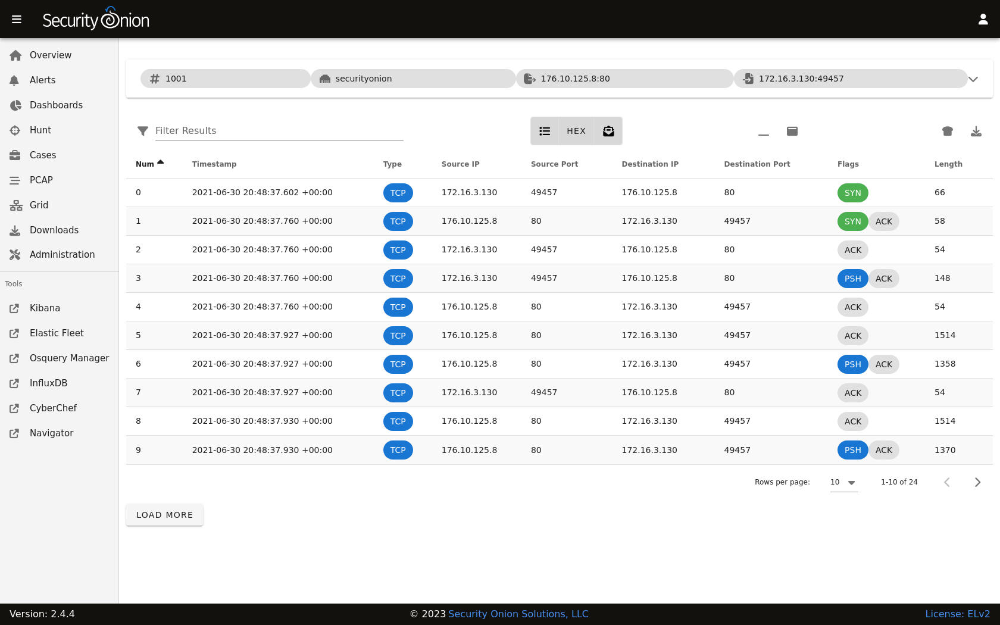
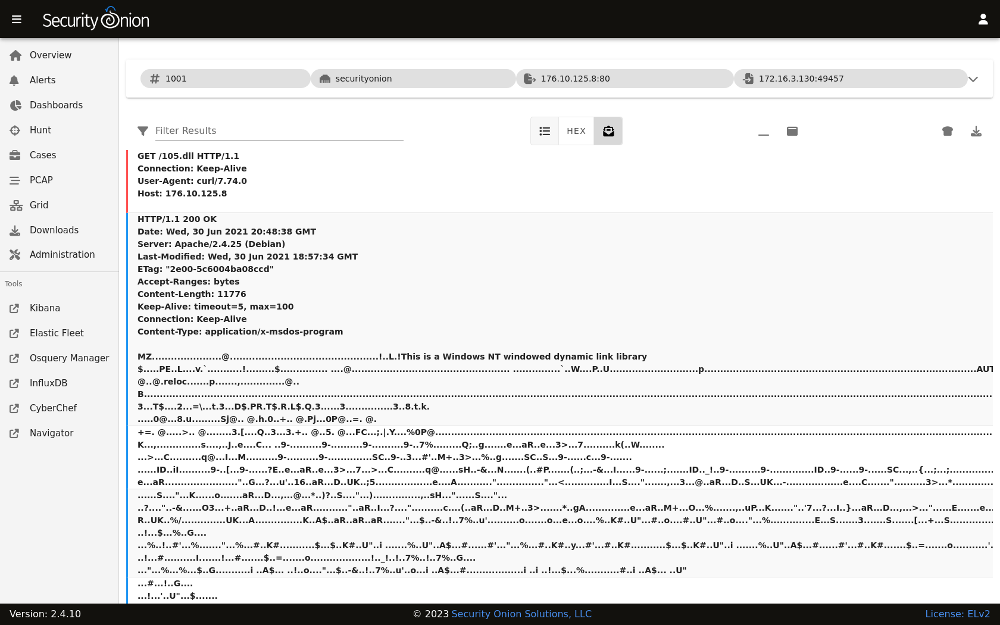
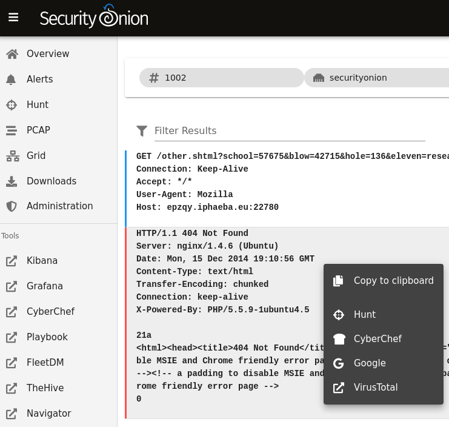
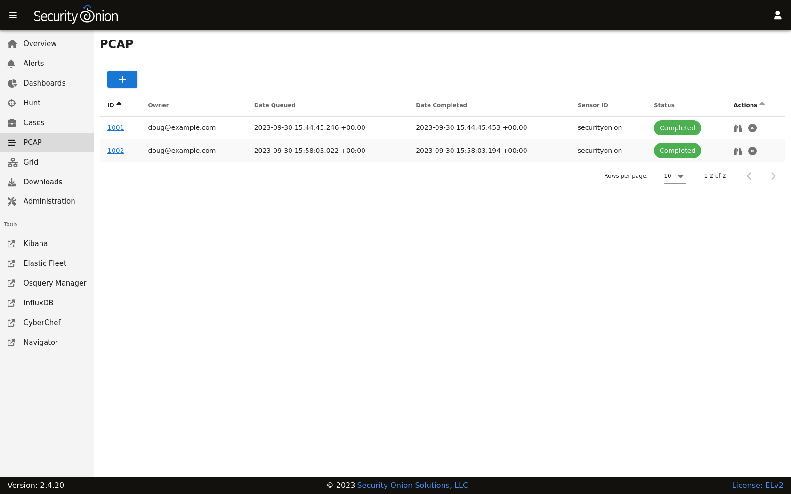

.. _pcap:

PCAP
====

:ref:`soc` includes a PCAP interface which allows you to access your full packet capture that was written to disk by :ref:`stenographer`. 

In most cases, you'll pivot to PCAP from a particular event in :ref:`alerts`, :ref:`dashboards`, or :ref:`hunt` by choosing the PCAP action on the action menu. 

.. image:: images/soc-events-table.png
  :target: _images/soc-events-table.png

Alternatively, you can go directly to the PCAP interface, click the blue + button, and then put in your search criteria to search for a particular stream. 

Security Onion will then locate the stream and render a high level overview of the packets.

If there are many packets in the stream, you can use the ``LOAD MORE`` button, ``Rows per page`` setting, and arrows to navigate through the list of packets. 

You can drill into individual rows to see the actual payload data. There are buttons at the top of the table that control what data is displayed in the individual rows. By disabling ``Show all packet data`` and ``HEX``, we can get an ASCII transcript.

You can select text with your mouse and then use the context menu to send that selected text to :ref:`cyberchef`, Google, or other destinations defined in the actions list.

You can send all of the visible packet data to :ref:`cyberchef` by clicking the CyberChef icon on the right side of the table header. Please note that this only sends packet data that is currently being displayed, so if you are looking at a large stream you may need to use the ``LOAD MORE`` button to display all packets in the stream.

Finally, you can download the full pcap file by clicking the download button on the far right side of the table header. If you are using :ref:`desktop`, then the pcap will automatically open in :ref:`networkminer`. Alternatively, you could open the pcap in :ref:`wireshark`.

Once you've viewed one or more PCAPs, you will see them listed on the main PCAP page.

When you are done with a PCAP, you may want to delete it using the ``X`` button on the far right. This deletes the cached PCAP file saved at ``/nsm/soc/jobs/``.

Troubleshooting
---------------

If you have trouble retrieving PCAP, here are some things to check:

- Verify that full packet capture is enabled via either :ref:`stenographer` or :ref:`suricata`.
- Check to see if you have any :ref:`bpf` configuration that may cause :ref:`stenographer` or :ref:`suricata` to ignore the traffic.
- Check :ref:`grid` and verify that all services are running properly.
- Check :ref:`influxdb` and verify that PCAP Retention is long enough to include the stream you're looking for.
- Make sure that there is plenty of free space on ``/nsm`` to carve the stream and write the output to disk.
