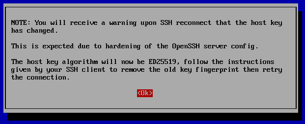

.. _post-installation:

After Installation
==================

SSH Key Change
--------------

Depending on what kind of installation you did, you may have seen a warning at the end of Setup about SSH key changes.

For more information, see the :ref:`ssh` section.

Adjust firewall rules
---------------------

Depending on what kind of installation you did, the Setup wizard may have already walked you through adding firewall rules to allow your analyst IP address(es). If you need to make other adjustments to firewall rules, you can do so by going to :ref:`administration` --> Configuration --> firewall.

Services
--------

-  Verify services are running by running the :ref:`so-status` command:

::

	sudo so-status

Alternatively, once you've logged into :ref:`soc`, you can simply check the :ref:`grid` page.

Data Retention
--------------

-  Review the :ref:`curator` and :ref:`elasticsearch` sections to see if you need to change any of the default index retention settings.

Other
-----

-  Full-time analysts may want to connect using a dedicated :ref:`analyst-vm`.

-  Any IDS/NSM system needs to be tuned for the network it’s monitoring. Please see the :ref:`tuning` section. 

-  Configure the OS to use your preferred :ref:`ntp` server.
