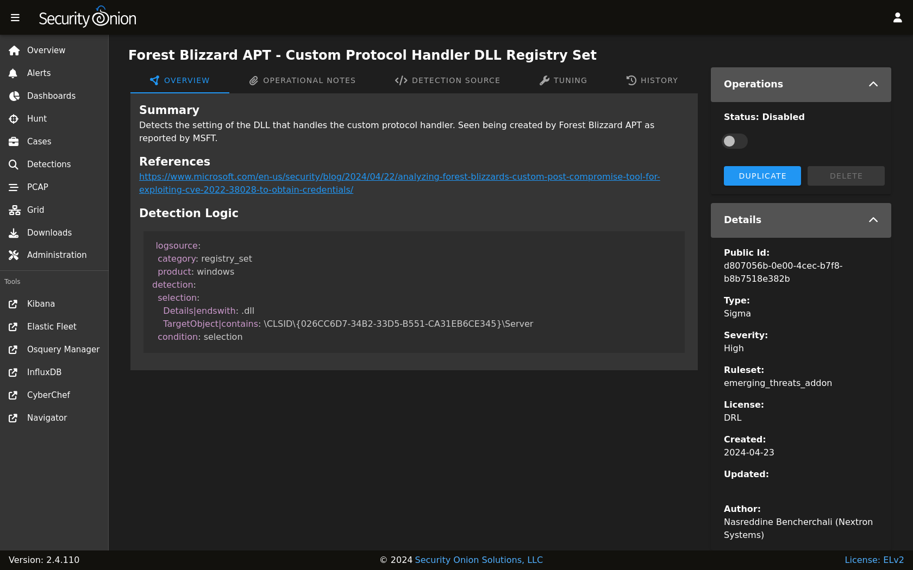
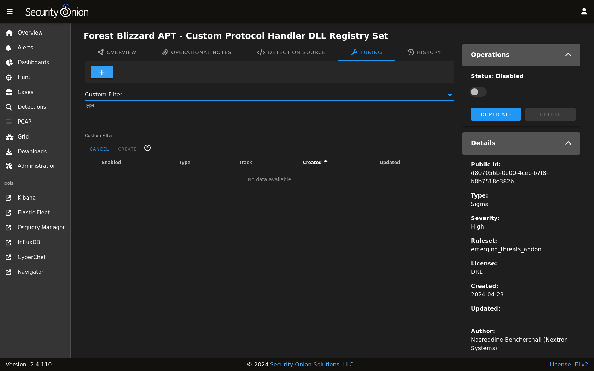

.. _sigma:

Sigma
=====

Sigma rules are loaded into :ref:`elastalert` to monitor incoming logs for suspicious or noteworthy activity. Active sigma rules generate alerts that can then be found in :ref:`alerts`.

From https://github.com/SigmaHQ/sigma:

    Sigma is a generic and open signature format that allows you to describe relevant log events in a straightforward manner. The rule format is very flexible, easy to write and applicable to any type of log file. The main purpose of this project is to provide a structured form in which researchers or analysts can describe their once developed detection methods and make them shareable with others. Sigma is for log files what Snort is for network traffic and YARA is for files.

Managing Existing Sigma Rules
-----------------------------

You can manage existing Sigma rules via :ref:`detections`. There are two ways to do so:

- From the main :ref:`detections` interface, you can search for the desired detection and click the binoculars icon.
- From the :ref:`alerts` interface, you can click an alert and then click the ``Tune Detection`` menu item.

Once you've used one of these methods to reach the detection detail page, you can check the Status field in the upper-right corner and use the slider to enable or disable the detection.

To tune the detection:

- click the TUNING tab
- click the blue + button
- select the type of tuning (Custom Filter)
- enter your custom filter in the Custom Filter field
- click the ``CREATE`` button to create and enable the Override

Custom Filters are Sigma Search Identifiers and will be applied like so: ``"($ORIGINAL_CONDITION) and not 1 of sofilter*"``

For example, suppose that you have an :ref:`idh` node installed with the HTTP webserver enabled. Your nightly vulnerablity scan is connecting to it and generating an alert from the ``Security Onion IDH - HTTP Access`` detection. To filter out connection attempts from this scanner, you would add the following Custom Filter to this detection:

::

        sofilter:
          src_ip|cidr: 192.168.55.45/32

Once you save this filter, it is enabled by default for this detection. Clicking on the ``Detection Source`` tab and then on ``Convert`` will show you what the new EQL query looks like, which should include a filter for the IP address.

For more information on Sigma rule syntax, please see the Sigma documentation at https://sigmahq.io/docs/basics/rules.html#detection.

Adding New Sigma Rules
----------------------

To add a new Sigma rule, go to the main :ref:`detections` page and click the blue + button between Options and the query bar. A form will appear where you will:

- click the Language drop-down and select ``Sigma``
- optionally specify a license
- add the signature
- click the ``CREATE`` button and the detection should deploy to your grid at the next 15-minute cycle

.. image:: images/58_detection_create.png
  :target: _images/58_detection_create.png

Sigma Configuration
-------------------

- Navigate to :ref:`administration` --> Configuration.
- At the top of the page, click the ``Options`` menu and then enable the ``Show advanced settings`` option.
- Navigate to soc --> config --> server --> modules --> elastalertengine.

Once you've reached this location, here are some common settings.

Sigma Update Frequency
~~~~~~~~~~~~~~~~~~~~~~

By default, Security Onion checks for new Sigma rules every 24 hours. You can change this value at elastalertengine --> communityRulesImportFrequencySeconds.

Sigma Packages
~~~~~~~~~~~~~~

You can choose from different Sigma packages:

https://github.com/SigmaHQ/sigma/blob/master/Releases.md

You can modify this setting via elastalertengine --> sigmaRulePackages.

Custom Sigma Repositories
~~~~~~~~~~~~~~~~~~~~~~~~~

You can configure Security Onion to pull Sigma rules from custom git repos via elastalertengine --> rulesRepos --> default. 

Repos can be accessed via https or from the local filesystem. For example:

::

        file:///nsm/rules/detect-sigma/repos/my-custom-rep

