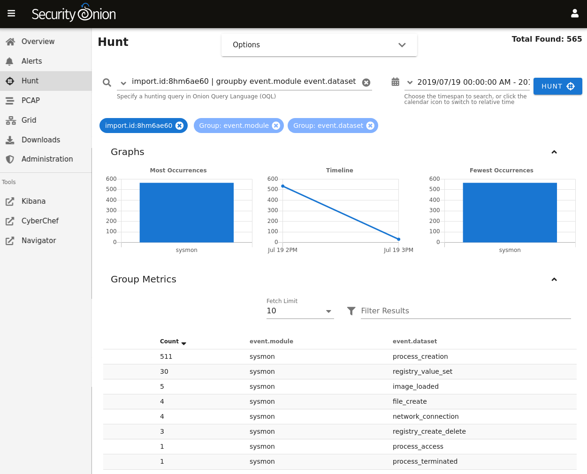

.. _so-import-evtx:

so-import-evtx
==============

``so-import-evtx`` will import one or more evtx files into Security Onion.

Usage
-----

Run ``sudo so-import-evtx`` and supply the full path to at least one evtx file. For example, to import a single evtx file named ``import.evtx``:

::

    sudo so-import-evtx /full/path/to/import.evtx

To import multiple evtx files:

::

    sudo so-import-evtx /full/path/to/import2.evtx /full/path/to/import2.evtx

so-import-evtx then provides a hyperlink for you to view all logs in :ref:`soc`. You can also find logs in :ref:`kibana`.

