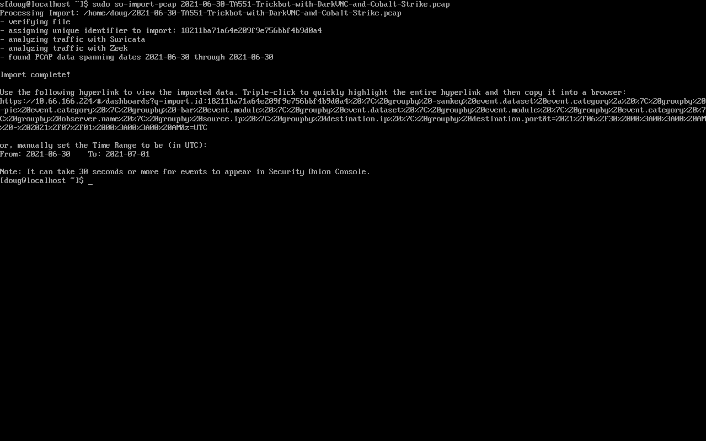

.. _so-import-pcap:

so-import-pcap
==============

``so-import-pcap`` will import one or more pcaps into Security Onion and preserve original timestamps. It will do the following:

-  generate IDS alerts using :ref:`suricata`
-  generate network metadata using :ref:`zeek`
-  store IDS alerts and network metadata in :ref:`elasticsearch` with original timestamps
-  store pcaps where :ref:`soc` can find them
-  provide a hyperlink for you to view all alerts and logs in :ref:`soc`

In addition to viewing alerts and logs in :ref:`soc`, you can also find logs in :ref:`kibana`.

Screenshot
----------

Configuration
-------------
      
so-import-pcap requires you to run through Setup and choose a configuration that supports so-import-pcap. This includes Import Node and other nodes that include sensor services like Eval and Standalone. The quickest and easiest option is to choose Import Node which gives you the minimal services necessary to import a pcap.

Usage
-----

Once Setup completes, you can then run ``sudo so-import-pcap`` and supply the full path to at least one pcap file. For example, to import a single pcap named ``import.pcap``:

::

    sudo so-import-pcap /full/path/to/import.pcap

To import multiple pcaps:

::

    sudo so-import-pcap /full/path/to/import1.pcap /full/path/to/import2.pcap

Please note that if you import multiple pcaps at one time, so-import-pcap currently only provides a hyperlink for the last pcap in the list. If you need a hyperlink for each pcap, then you can run one pcap file per so-import-pcap and use a for-loop to iterate over your collection of pcap files.

so-import-pcap calculates the MD5 hash of the imported pcap and creates a directory in ``/nsm/import/`` for that hash. This is where so-import-pcap stores the alerts and logs generated by the traffic in the pcap. If you try to import that same pcap again, it will tell you that it has already imported that pcap. If for some reason you really do need to import that pcap again, you can remove that pcap's directory in ``/nsm/import/`` and then try again.

Examples
--------

If you don't already have some pcap files to import, see :ref:`pcaps` for a list of sites where you can download sample pcaps.

Our Quick Malware Analysis series at https://blog.securityonion.net/search/label/quick%20malware%20analysis uses so-import-pcap to import pcaps from https://www.malware-traffic-analysis.net/ and other sites. Following along with these blog posts in your own so-import-pcap VM is a great way to practice your skills!
