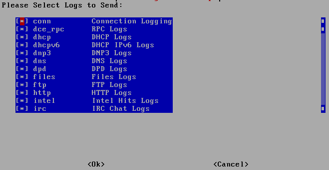

.. _so-zeek-logs:

so-zeek-logs
============

If you want to specify what :ref:`zeek` logs are ingested, you can use ``so-zeek-logs``. It will show you a list of all :ref:`zeek` logs and you can specify which of those logs are ingested. Once you've made your selection, it will modify the :ref:`elastic-agent` configuration for you.

