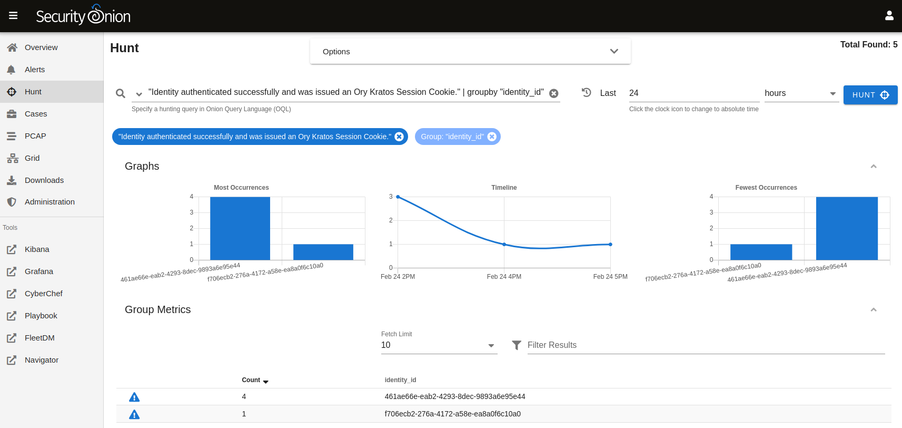

.. _soc-logs:

SOC Logs
========

Standard :ref:`soc` logs can be found at ``/opt/so/log/soc/``.

SOC Auth Logs
-------------

SOC auth is handled by Kratos and logs can be found at ``/opt/so/log/kratos/``. To look for successful SOC logins, you can run the following:

::

        sudo zgrep "Identity authenticated successfully and was issued an Ory Kratos Session Cookie" /opt/so/log/kratos/*

Starting in Security Onion 2.3.110, those logs should be ingested into :ref:`elasticsearch` and available for searching in :ref:`dashboards`, :ref:`hunt`, and :ref:`kibana`.

Starting in Security Onion 2.3.120, :ref:`hunt` will include the following query in the drop-down query menu:

::

        event.module:kratos AND event.dataset:audit AND msg:authenticated | groupby http_request.headers.x-real-ip identity_id
        
identity_id
~~~~~~~~~~~

Once you see the auth logs, you will notice that the login is logged as ``identity_id``. You can find your desired ``identity_id`` as follows, replacing USERNAME@DOMAIN.COM with your desired SOC username:

::

        echo "select * from identities;" | sudo sqlite3 /opt/so/conf/kratos/db/db.sqlite |grep USERNAME@DOMAIN.COM | cut -d\| -f1
