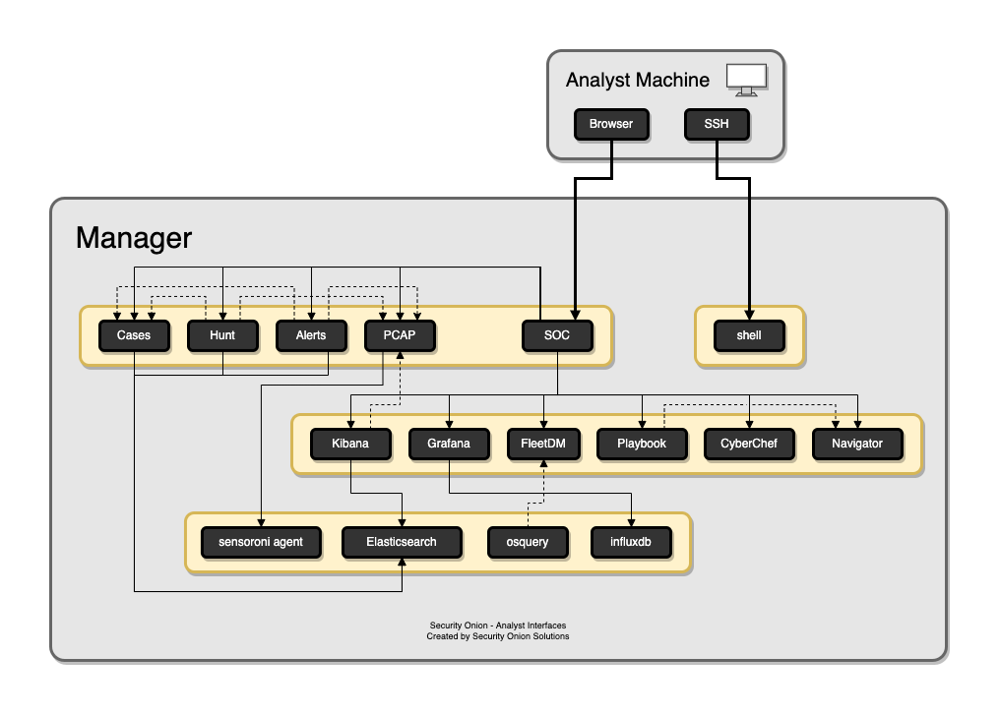
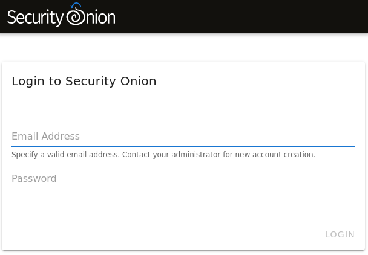
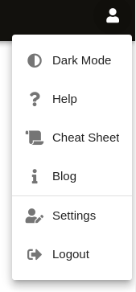
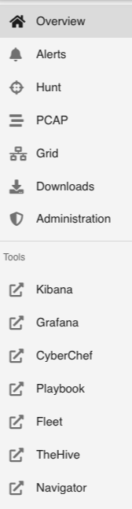

.. _soc:

Security Onion Console (SOC)
============================

Once you've run :ref:`so-allow` and allowed your IP address, you can then connect to Security Onion Console (SOC) with your web browser. We recommend chromium or chromium-based browsers such as Google Chrome. Other browsers may work, but chromium-based browsers provide the best compatibility. 

Depending on the options you chose in the installer, connect to the IP address or hostname of your Security Onion installation. Then login using the email address and password that you specified in the installer. 

Once logged in, you'll notice the user menu in the upper right corner:

On the left side of the page, you'll see links for analyst tools like :ref:`alerts`, :ref:`hunt`, :ref:`pcap`, :ref:`kibana`, :ref:`cyberchef`, :ref:`playbook`, :ref:`hive`, and :ref:`attack-navigator`. While :ref:`alerts`, :ref:`hunt`, and :ref:`pcap` are native to SOC itself, the remaining tools are external and will spawn separate browser tabs:

.. tip::

   SOC gives you access to a variety of tools and they all complement each other very well. For example, here's one potential workflow:

     - Check :ref:`grafana` to make sure your system is healthy.
     - Go to the :ref:`alerts` page and review unacknowledged alerts.
     - Once you've found an alert that you want to investigate, you might want to expand your search and look for additional logs relating to the source and destination IP addresses, so pivot to :ref:`hunt` for more information. If any of those additional logs look interesting, you might then want to pivot to :ref:`pcap` to look at the full packet capture for that stream.
     - Send alert to :ref:`hive` and document any indicators of compromise (IOCs) found in the previous step.
     - Go to :ref:`fleet` and perform a wider search for those IOCs across all :ref:`osquery` endpoints.
     - Use :ref:`cyberchef` to further analyze and decode additional host artifacts.
     - Develop a play in :ref:`playbook` that will automatically alert on IOCs moving forward and update your coverage in :ref:`attack-navigator`.
     - Finally, return to :ref:`hive` and document the entire investigation and close the case.
 
**SOC Customization**

You can customize the main SOC Overview page that you see when you first log into SOC. The content of this page is stored in the ``motd.md`` file, which uses the common Markdown (.md) format. You can learn more about Markdown format at `<https://markdownguide.org>`_. To customize the Overview page content, copy ``motd.md`` as follows and then edit ``/opt/so/saltstack/local/salt/soc/files/soc/motd.md`` using your favorite text editor:

::

	sudo cp /opt/so/saltstack/default/salt/soc/files/soc/motd.md /opt/so/saltstack/local/salt/soc/files/soc/

You can also customize the links on the left side. To do so, copy ``tools.json`` as follows and then edit ``/opt/so/saltstack/local/salt/soc/files/soc/tools.json`` using your favorite text editor:

::

	sudo cp /opt/so/saltstack/default/salt/soc/files/soc/tools.json /opt/so/saltstack/local/salt/soc/files/soc/

Another possible SOC customization is the session timeout. The default timeout for user login sessions is 24 hours. This is a fixed timespan and will expire regardless of whether the user is active or idle in SOC. This can be adjusted by adding a pillar value to the manager node's pillar sls. For example, on an eval node, edit ``/opt/so/saltstack/local/pillar/minions/eval_eval.sls`` and add a new ``kratos.sessiontimeout`` value:

::

	kratos:
	  kratoskey: 'abcdef1234567890'
	  sessiontimeout: 720h

Once all customizations are complete, you can then restart SOC to make the changes take effect:

::

	sudo so-soc-restart

**Auth Logs**

If you need to see SOC auth logs, you can run the following:

::

	sudo zgrep "Identity authenticated successfully and was issued an Ory Kratos Session Cookie" /opt/so/log/kratos/*

Once you see the auth logs, you will notice that Kratos logs using ``identity_id``. You can find your desired ``identity_id`` as follows, replacing USERNAME@DOMAIN.COM with your desired SOC username:

::

	echo "select * from identities;" | sudo sqlite3 /opt/so/conf/kratos/db/db.sqlite |grep USERNAME@DOMAIN.COM | cut -d\| -f1

.. toctree::
   :maxdepth: 2

   alerts
   hunt
   pcap
   grid
   downloads
   administration
   kibana
   grafana
   cyberchef
   playbook
   fleet
   hive
   attack-navigator
