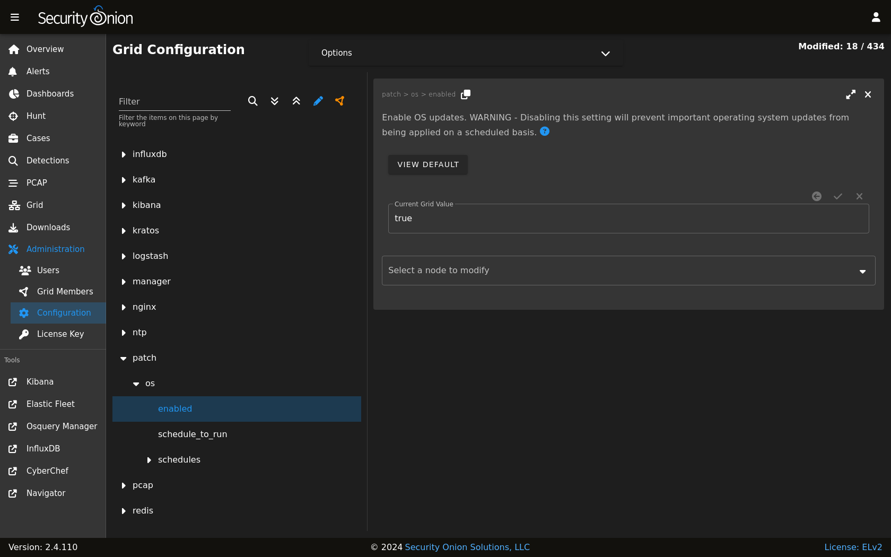

.. _soup:

soup
====

``soup`` stands for ``Security Onion UPdater`` and you can use it to update your Security Onion deployment.  

SSH
---

.. warning::

        If you run ``soup`` via an :ref:`ssh` session and that :ref:`ssh` session terminates, then any processes running in that session would terminate. You should avoid leaving ``soup`` unattended especially if the machine you are SSHing from is configured to sleep after a period of time. You might also consider using something like screen or tmux so that if your :ref:`ssh` session terminates, the processes will continue running on the server.

Production Deployments
----------------------

.. warning::

	If you have a production deployment, we recommend that you test the upgrade process on a test deployment if possible before deploying to production.

Updating
--------

To update your Security Onion deployment, run the ``soup`` command with sudo:

::

	sudo soup

If necessary, ``soup`` will update itself and then ask you to run ``soup`` again. Once ``soup`` is fully updated, it will then check for other updates. This includes Security Onion version updates, Security Onion hotfixes, and operating system (OS) updates.

After running ``soup`` or rebooting a Security Onion node, it may take a few minutes for services to display an ``OK`` status on the :ref:`grid` screen. This may be due to the intial on-boot :ref:`salt` highstate running. If services do not appear to be fully up and running within 15 minutes, try running the following command:

::

	sudo so-checkin

Security Onion Version Updates
------------------------------

When we release a new version of Security Onion, we update the :ref:`release-notes` section and publish a blog post to https://blog.securityonion.net. You'll want to review these for any relevant information about the individual updates. 

If ``soup`` finds a full version update, then it will update the Security Onion version in ``/etc/soversion``, all :ref:`salt` code, and all :ref:`docker` images.

``soup`` automatically keeps the previous version of :ref:`docker` images. These older unused :ref:`docker` images will be automatically removed at the next version update. If you need to remove these older :ref:`docker` images immediately, first verify that the upgrade completed successfully and that everything is working properly. You could then remove the older images individually or all at once using a command like:

::

	sudo docker system prune -a

However, please note that this an aggressive option and you should exercise caution if you have any non-standard :ref:`docker` images or configuration. You may want to test it on a test system first.

Security Onion Hotfixes
-----------------------

``soup`` checks for Security Onion hotfixes. Hotfixes typically include updates to the :ref:`salt` code and small configuration changes that do not warrant a full version update. This does not include Docker images since that would require a full version update. 

After applying a hotfix, you may notice that the Security Onion version in ``/etc/soversion`` stays the same. The application of the hotfix is tracked on the manager in the ``/etc/sohotfix`` file.

OS Updates
----------

In addition to Security Onion docker image updates, ``soup`` also checks for missing OS updates and asks if you want to install them.

Automatic OS Updates
~~~~~~~~~~~~~~~~~~~~

You can configure automatic OS updates by going to :ref:`administration` --> Configuration --> patch.

Holding OS Updates
~~~~~~~~~~~~~~~~~~

Starting in Security Onion 2.4.120, there is a new setting that you can use if there are certain packages that you would like to prevent from being upgraded automatically. This is commonly referred to as "locking" or "holding" packages. The most frequent use case is holding the kernel to prevent frequent system reboots. To hold a package, add the package name to the ``hold`` list in :ref:`administration` --> Configuration --> versionlock --> hold.

Local Configurations
--------------------

``soup`` will check for local configurations in ``/opt/so/saltstack/local/`` that may cause issues and flag them with the message ``Potentially breaking changes found in the following files``. Please examine the output of ``soup`` and review any local configurations for possible issues.

Detections
----------

Starting in Security Onion 2.4.70, there is a new :ref:`detections` interface. To prepare for migration to :ref:`detections`, ``soup`` will do the following:

- Playbook Plays will be backed up to ``/nsm/backup/detections-migration/`` and any active Elastalert rules will be backed up and removed.
- Suricata tuning configurations will be backed to ``/nsm/backup/detections-migration/`` and any thresholds will be migrated over to :ref:`detections`.

Log
---

If ``soup`` displays any errors, you can check ``/root/soup.log`` for additional clues.

Airgap
------

When you run ``soup`` on an :ref:`airgap` install, it will ask for the location of the upgrade media. You can do one of the following:

- burn the latest ISO image to a DVD and insert it in the DVD drive
- flash the ISO image to a USB drive and insert that USB drive
- simply copy the ISO file itself to the airgapped manager

You can also specify the path on the command line using the ``-f`` option. For example (change this to reflect the actual path to the ISO image):

::

	sudo soup -y -f /home/YourUser/securityonion-2.4.XYZ-YYYYMMDD.iso
	
Elastic
-------

If ``soup`` updated to a new version of the Elastic stack, then you'll want to go to :ref:`elastic-fleet` and:

- drill into each of your active agent policies, check the Agent Binary Download setting, and adjust if necessary for your deployment
- check for any integrations that need to be upgraded
- check for any agents that need to be upgraded (grid node agents should automatically upgrade so you should just need to look for any additional endpoint agents that you've deployed)

Kibana
------

After ``soup`` completes, if :ref:`kibana` says ``Kibana server is not ready yet`` even after waiting a few minutes for it to fully initialize, then take a look at the Diagnostic Logging section of the :ref:`kibana` page.

If Kibana loads but the dashboards display errors that they didn't before the upgrade, first shift-reload your browser to make sure there are no cache issues. If that doesn't resolve the issue, then you may need to reload the dashboards on your manager:

::

	sudo rm /opt/so/state/kibana_*.txt
	sudo salt-call state.apply kibana.so_savedobjects_defaults -l info queue=True

Automation
----------

``soup`` can be automated as follows:

::

	sudo soup -y

This will make ``soup`` proceed unattended, automatically answering ``yes`` to any prompt.  If you have an airgap installation, you can specify the path to the ISO image using the ``-f`` option as follows:

::

	sudo soup -y -f /home/user/securityonion.iso
	
Errors
------

Data failed to compile
~~~~~~~~~~~~~~~~~~~~~~

Occasionally, ``soup`` may output a ``Data failed to compile`` error that says something like ``Rendering SLS failed: Jinja variable 'None' has no attribute``. In most cases, this error corrects itself on the next :ref:`salt` run.

Pillars and sls files
~~~~~~~~~~~~~~~~~~~~~

``soup`` will check :ref:`salt` pillars to make sure they can be rendered. If not, it will output a message like this:

::

	There is an issue rendering the manager's pillars. Please correct the issues in the sls files mentioned below before running SOUP again.

This usually means that somebody has modified the :ref:`salt` sls files and introduced a typo. 

Downloading images
~~~~~~~~~~~~~~~~~~

As ``soup`` is downloading container images, it may encounter errors if there are Internet connection issues or if the disk runs out of free space. Once you've resolved the underlying condition, you can manually refresh your container images using ``so-docker-refresh``.

Docker Registry
~~~~~~~~~~~~~~~

If you see errors relating to ``so-dockerregistry`` (:ref:`docker` Registry), then please take a look at the following discussions to see if your symptoms match and if their solutions may help you:

https://github.com/Security-Onion-Solutions/securityonion/discussions/12078

https://github.com/Security-Onion-Solutions/securityonion/discussions/12635

Highstate already running
~~~~~~~~~~~~~~~~~~~~~~~~~

Here are some other errors that you may see when running ``soup``:

::

    local:
        Data failed to compile:
    ----------
        Rendering SLS 'base:common' failed: Jinja variable 'list object' has no attribute 'values'
        
and/or

::

    There is a problem downloading the so-xyz:2.4.0 image. Details: 
    gpg: Signature made Thu 18 Feb 2021 02:26:10 PM UTC using RSA key ID FE507013 gpg: BAD signature from "Security Onion Solutions, LLC <info@securityonionsolutions.com>"
    
If you see these errors, it most likely means that a salt highstate process was already running when ``soup`` began. You can wait a few minutes and then try ``soup`` again. Alternatively, you can run ``sudo so-checkin`` and wait for it to complete before running ``soup`` again.

Distributed deployments
-----------------------

If you have a distributed deployment with a manager node and separate sensor nodes and/or search nodes, you **only** need to run ``soup`` on the manager. Once ``soup`` has completed, other nodes should update themselves at the next :ref:`salt` highstate (typically within 15 minutes).

.. warning::

    Just because the update completed on the manager does NOT mean the upgrade is complete on other nodes in the grid. Do not manually restart anything until you know that all the search nodes and heavy nodes are updated.

    Each minion is on a random 15 minute check-in period and things like network bandwidth can be a factor in how long the actual upgrade takes. If you have a heavy node on a slow link, it is going to take a while to get the containers to it. Depending on what changes happened between the versions, :ref:`elasticsearch` might not be able to talk to said heavy node until the update is complete.

    If it looks like you're missing data after the upgrade, please avoid restarting services and instead make sure at least one search node has completed its upgrade. The best way to do this is to run ``sudo so-checkin`` from a search node and make sure there are no errors. Typically if it works on one node it will work on the rest. Forward nodes are less complex and will update as they check in so you can monitor those from the :ref:`grid` section of :ref:`soc`.
    
When you run ``soup`` on the manager, it does the following:

- Checks to see if it is running on a manager.
- Checks to see if the grid is in :ref:`airgap` mode. If so, it will then ask for the location of the ISO or mount point.
- Checks to see if we're running the latest version of ``soup``. If not, it will put the latest in the correct place and ask you to re-run ``soup``.
- Compares the installed version with what is available on github or the ISO image.
- Checks to see if :ref:`salt` needs to be updated (more on this later).
- Downloads the new :ref:`docker` images or, if airgap, copies them from the ISO image.
- Stops the :ref:`salt` master and minion and restarts it in a restricted mode. This mode only allows the manager to connect to it so that we make sure the manager is done before any of the minions are updated.
- Updates :ref:`salt` if necessary. This will cause the master and minion services to restart but still in restricted mode.
- Makes any changes to pillars that are needed such as adding new settings or renaming values. This varies from release to release.
- If the grid is in :ref:`airgap` mode, then it copies the latest ET Open rules and yara rules to the manager.
- The new :ref:`salt` code is put into place on the manager.
- Runs a highstate on the manager which is the actual upgrade where it will use the new :ref:`salt` code and :ref:`docker` containers.
- Unlocks the :ref:`salt` master service and allows minions to connect again.
- Issues a command to all minions to update :ref:`salt` if necessary. This is important to note as it takes time to to update the :ref:`salt` minion on all minions. If the minion doesn't respond for whatever reason, it will not be upgraded at this time. This is not an issue because the first thing that gets checked when a minion talks to the master is if :ref:`salt` needs to be updated and will apply the update if it does.
- Nodes connect back to the manager and actually perform the upgrade to the new version.

