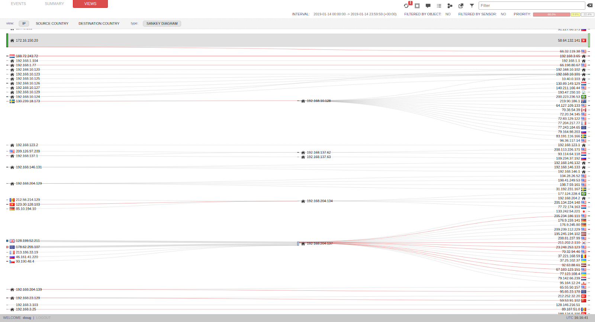

Squert
======

From http://www.squertproject.org/:

    Squert is a web application that is used to query and view event
    data stored in a Sguil database (typically IDS alert data). Squert
    is a visual tool that attempts to provide additional context to
    events through the use of metadata, time series representations and
    weighted and logically grouped result sets. The hope is that these
    views will prompt questions that otherwise may not have been asked.

| Squert was originally developed by Paul Halliday:
| http://www.squertproject.org/
|
| Security Onion maintains its own fork of Squert:
| https://blog.securityonion.net/2016/09/squert-development.html
|
| Squert is a PHP web interface to the `Sguil <Sguil>`__ database and works best with Chromium/Chrome browsers.

Screenshot
----------

Authentication
--------------

If prompted for username and password, simply enter your normal Sguil/Squert/Kibana username and password.

Data Types
----------

Squert gives you access to the following data types:

-  `NIDS <NIDS>`__ alerts
-  `HIDS <Wazuh>`__ alerts

Time Interval
-------------

The default view shows alerts from today. To show older alerts, click ``INTERVAL``, then click the 2 right arrows, set your custom date, and click Squert's refresh button (two circular arrows).

Time Zone
---------

-  click the time interval (labeled ``INTERVAL``)
-  on the right side, click the two arrows pointing right
-  de-select ``UTC``
-  set your timezone offset (labeled ``TZ OFFSET``)
-  click the ``save TZ`` button

Timeplot
--------

| The timeplot at the top of the ``EVENTS`` page, represents events as they occur each day.
| In summary, the timeplot:

-  plots the raw number of events on a per minute basis.
-  uses the X-axis as the hour of the day and the Y-axis is the number of events minute.
-  treats each region equivalent to one hour.
-  plots and underlines the number of events in each region for that hour.

Toggle Options
--------------

| ``queue only``
| Default is ``on``.

This option refers to only showing events that are of a status of ``0``, or uncategorized and still residing in the active queue. If you would like to see all events, change it to ``off``.

| ``grouping``
| Default is ``on``.

This option refers to the grouping of the same type of event within a particular timeframe. If you would like to see the events as un-grouped, change this option to ``off``.

Alerts
------

The alert pane consists of several columns, explained below:

| ``QUEUE`` - refers to the number of grouped events in the queue
| ``SC`` - number of distinct source IPs for the given alert
| ``DC`` - number of distinct destination IPs for the given alert
| ``ACTIVITY`` - number of events for a given alert on a per hour basis
| ``LAST EVENT`` - time event last occurred
| ``SIGNATURE`` - event IDS signature
| ``ID`` - event signature ID
| ``PROTO`` - protocol relative/recognized within/in regard to event
| ``% TOTAL`` - percentage of event grouping vs. entire event count

Pivoting to Full Packet Capture
-------------------------------

Squert can pivot to `CapMe <CapMe>`__ for full packet capture. To do this, drill into an event and click on the Event ID.

Pivoting to Kibana
------------------

Squert can pivot to `Kibana <Kibana>`__ to query Bro logs, Wazuh logs, syslog, etc. To do this, click an IP address, port, or signature, and then click ``Kibana``.

Adding your own pivots
----------------------

You can also add your own pivots as follows:

-  In the upper right corner of Squert, click the Filters button.
-  Set the type to URL.
-  Click the + button.
-  Click your New entry.
-  Fill out the alias, name, notes, and URL fields as applicable.
-  Click the Update button.
-  Close the Filters and URLs window.
-  To test, drill into an event and click an IP address. A context menu will appear and display your new link. Click the new link and verify that it opens a new browser tab going to the site you specified and passing the IP address that you clicked on.

Prepared Statements
-------------------

Squert uses prepared statements.  If you start seeing ``Prepared statement needs to be re-prepared`` in ``/var/log/apache2/error.log``, please see the `<MySQLTuning#table-definition-cache>`__ section.
