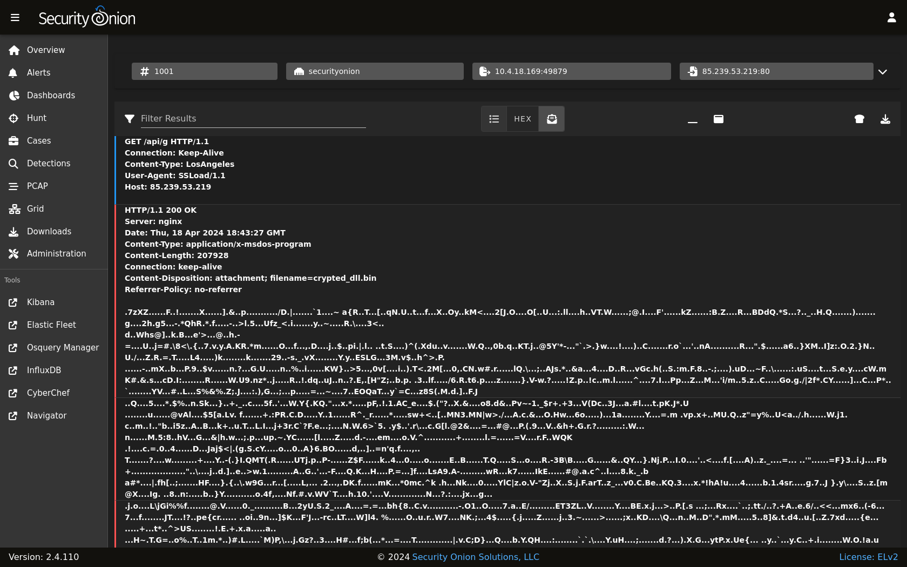
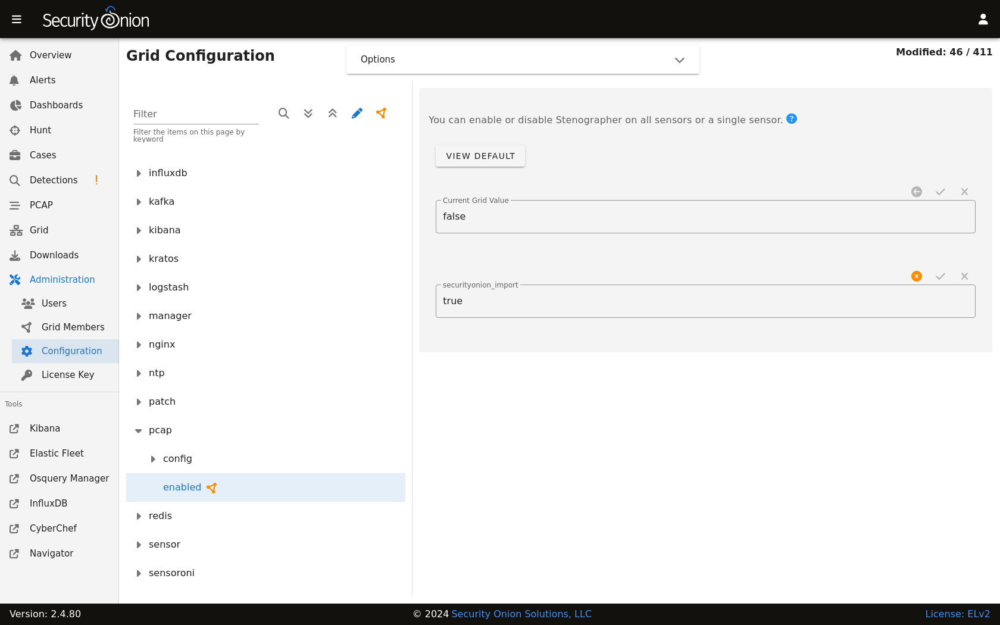

.. _stenographer:

Stenographer
============

Stenographer is one of the tools that Security Onion uses to write network traffic to disk. From https://github.com/google/stenographer:

    Stenographer is a full-packet-capture utility for buffering packets to disk for intrusion detection and incident response purposes. It provides a high-performance implementation of NIC-to-disk packet writing, handles deleting those files as disk fills up, and provides methods for reading back specific sets of packets quickly and easily.

Stenographer uses :ref:`af-packet` for packet acquisition. It's important to note that Stenographer is totally independent from :ref:`suricata` and :ref:`zeek`. This means that Stenographer has no impact on your :ref:`nids` alerts and protocol metadata.

For new installations in either ``Eval`` or ``Standalone`` mode, full packet capture is written to disk by :ref:`suricata`. For other deployments, full packet capture is written to disk by Stenographer but you can optionally switch this to :ref:`suricata`. For more information, please see the :ref:`suricata` section.

Output
------

Stenographer writes full packet capture to ``/nsm/pcap/``. It will automatically start purging old data once the partition reaches the DiskFreePercentage setting as shown below.

Analysis
--------

You can access full packet capture via the :ref:`pcap` interface:

:ref:`alerts`, :ref:`dashboards`, :ref:`hunt`, and :ref:`kibana` allow you to easily pivot to the :ref:`pcap` interface.

Command Line
------------

You can also access packet capture from the command line of the box where the pcap is stored using a Stenographer query as defined at https://github.com/google/stenographer#querying. In the following examples, replace "YourStenoQueryHere" with your actual Stenographer query.

The first option is using docker to run ``stenoread``. If the query succeeds, you can then find the resulting pcap file in ``/nsm/pcaptmp/`` in the host filesystem:

::

    sudo docker exec -it so-steno stenoread "YourStenoQueryHere" -w /tmp/new.pcap

We've included a wrapper script called ``so-pcap-export`` to make this a little easier. For example:

::

    sudo so-pcap-export "YourStenoQueryHere" output
    
If the query succeeds, you can then find the resulting ``output.pcap`` file in ``/nsm/pcapout/`` in the host filesystem.

Configuration
-------------

You can configure Stenographer by going to :ref:`administration` --> Configuration --> pcap. 

Disk Free Percentage
--------------------

An important configuration item to be aware of is steno's DiskFreePercentage setting. From https://github.com/google/stenographer/blob/master/INSTALL.md#threads:

        DiskFreePercentage: The amount of space to keep free in the packets directory. `stenographer` will delete files in this thread's packets directory when free disk space decreases below this percentage.

You can find this setting at :ref:`administration` --> Configuration --> pcap --> config --> diskfreepercentage. 

If you have a distributed deployment with dedicated forward nodes, then the default value of 10 should be reasonable since Stenographer should be the main consumer of disk space in the /nsm partition. However, if you have systems that run both Stenographer and :ref:`elasticsearch` at the same time (like eval and standalone installations), then you'll want to make sure that this value is no lower than 21 so that you avoid :ref:`elasticsearch` hitting its watermark setting at 80% disk usage. If you have an older standalone installation, then you may need to manually change this value to 21.

Maximum Files
-------------

By default, Stenographer limits the number of files in the pcap directory to ``30000`` to avoid limitations with the ext3 filesystem. However, if you're using the ext4 or xfs filesystems, then it is safe to increase this value. So if you have a large amount of storage and find that you only have 3 weeks worth of PCAP on disk while still having plenty of free space, then you may want to increase this default setting. To do so, you can go to :ref:`administration` --> Configuration --> pcap --> config --> maxdirectoryfiles and set the value to something appropriate for your system.

Diagnostic Logging
------------------

Diagnostic logging for Stenographer can be found at ``/opt/so/log/stenographer/``. Depending on what you're looking for, you may also need to look at the :ref:`docker` logs for the container:

::

	sudo docker logs so-steno

Disabling
---------

Since Stenographer is totally independent from :ref:`suricata` and :ref:`zeek`, you can disable it without impacting your NIDS alerts or protocol metadata. If you decide to disable Stenographer, you can do so by going to :ref:`administration` --> Configuration --> pcap --> enabled.

VLAN Tags
---------

.. warning::

   | Please note that Stenographer should correctly record traffic on a VLAN but won't log the actual VLAN tags due to the way that :ref:`af-packet` works:
   | https://github.com/google/stenographer/issues/211

More Information
----------------

.. note::

    For more information about stenographer, please see https://github.com/google/stenographer.
