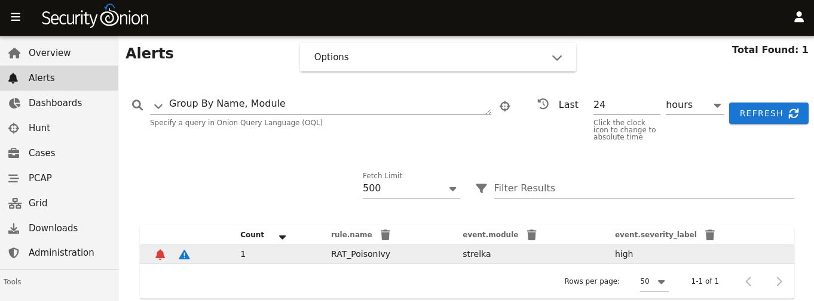
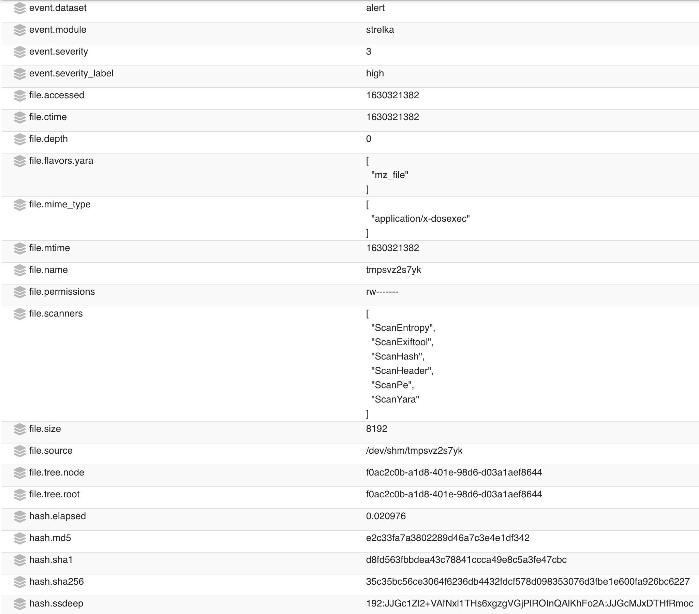
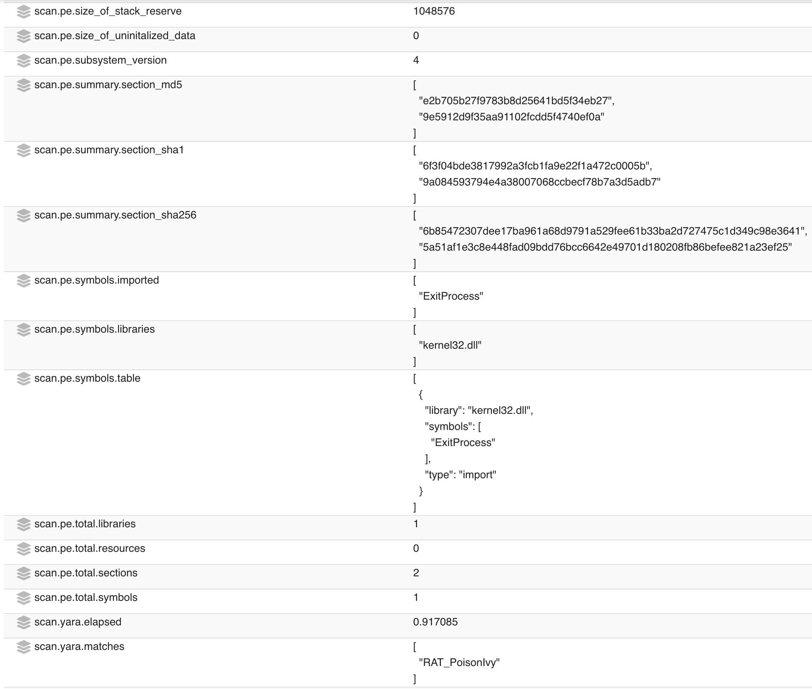
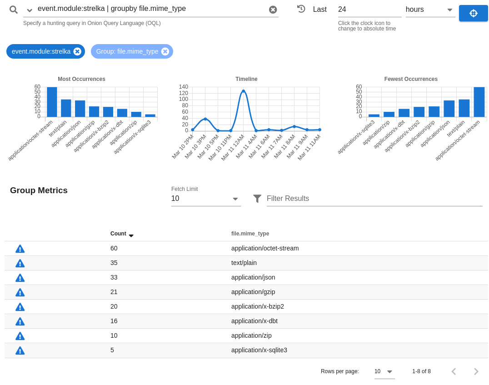

.. _strelka:

Strelka
=======

From https://github.com/target/strelka:

    Strelka is a real-time file scanning system used for threat hunting, threat detection, and incident response. Based on the design established by Lockheed Martin's Laika BOSS and similar projects (see: related projects), Strelka's purpose is to perform file extraction and metadata collection at huge scale.

Depending on what options you choose in Setup, it may ask if you want to use :ref:`zeek` or :ref:`suricata` for metadata. Whichever engine you choose for metadata will then extract files from network traffic. Strelka then analyzes those files and they end up in ``/nsm/strelka/processed/``.

Alerts
------

Strelka scans files using YARA rules. If it detects a match, then it will generate an alert that can be found in :ref:`alerts`, :ref:`dashboards`, :ref:`hunt`, or :ref:`kibana`. Here is an example of Strelka detecting Poison Ivy RAT:

Drilling into that alert, we find more information about the file and the YARA rule:

.. image:: images/strelka-alert-3.png
  :target: _images/strelka-alert-3.png

You can read more about YARA rules in the :ref:`local-rules` section.

Logs
----

Even if Strelka doesn't detect a YARA match, it will still log metadata about the file. You can find Strelka logs in :ref:`hunt` and :ref:`kibana`. Here's an example of Strelka logs in :ref:`hunt`:

Configuration
-------------

Strelka reads its configuration from ``/opt/so/conf/strelka/``. However, please keep in mind that if you make any changes to this directory they may be overwritten since the configuration is managed with :ref:`salt`.

Diagnostic Logging
------------------

Strelka diagnostic logs are in ``/nsm/strelka/log/``. Depending on what you’re looking for, you may also need to look at the :ref:`docker` logs for the containers:

::

        sudo docker logs so-strelka-backend
        sudo docker logs so-strelka-coordinator
        sudo docker logs so-strelka-filestream
        sudo docker logs so-strelka-frontend
        sudo docker logs so-strelka-manager

More Information
----------------

.. seealso::

    For more information about Strelka, please see https://github.com/target/strelka.
