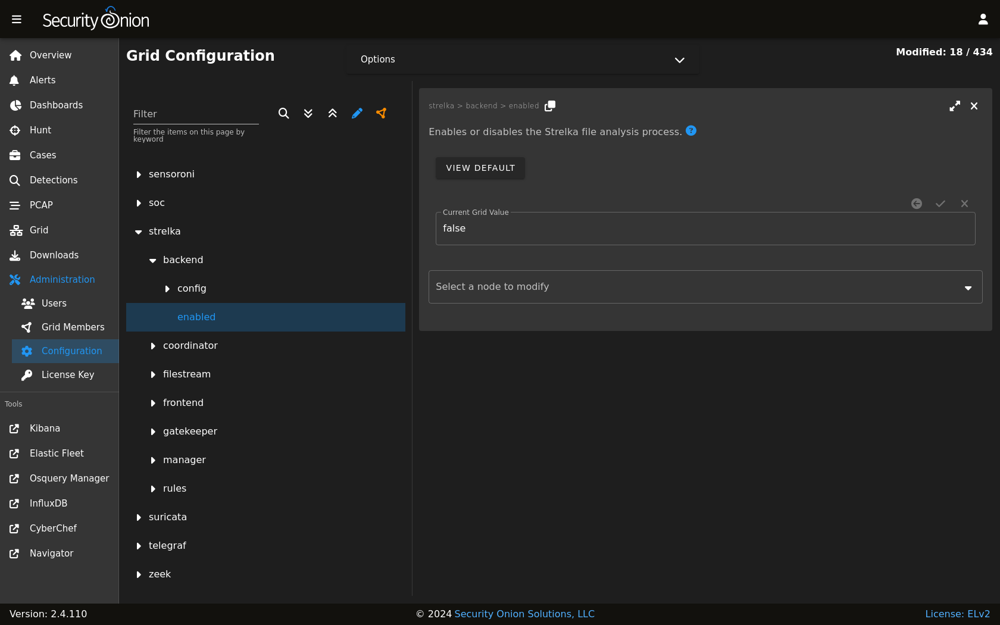

.. _strelka:

Strelka
=======

From https://github.com/target/strelka:

    Strelka is a real-time file scanning system used for threat hunting, threat detection, and incident response. Based on the design established by Lockheed Martin's Laika BOSS and similar projects (see: related projects), Strelka's purpose is to perform file extraction and metadata collection at huge scale.

If you are monitoring network traffic, then either :ref:`zeek` or :ref:`suricata` should be extracting certain files detected in unencrypted network traffic. Strelka then analyzes those files and they end up in ``/nsm/strelka/processed/``.

Security Onion checks file hashes before sending to Strelka to avoid analyzing the same file multiple times in a 48 hour period.

Alerts
------

Strelka scans files using YARA rules. If it detects a match, then it will generate an alert that can be found in :ref:`alerts`, :ref:`dashboards`, or :ref:`hunt`. You can read more about YARA rules in the :ref:`local-rules` section.

Logs
----

Even if Strelka doesn't detect a YARA match, it will still log metadata about the file. You can find Strelka logs in :ref:`dashboards` and :ref:`hunt`.

Configuration
-------------

You can configure Strelka by going to :ref:`administration` --> Configuration --> strelka.

Diagnostic Logging
------------------

Strelka diagnostic logs are in ``/nsm/strelka/log/``. Depending on what you’re looking for, you may also need to look at the :ref:`docker` logs for the containers:

::

        sudo docker logs so-strelka-backend
        sudo docker logs so-strelka-coordinator
        sudo docker logs so-strelka-filestream
        sudo docker logs so-strelka-frontend
        sudo docker logs so-strelka-manager

More Information
----------------

.. note::

    For more information about Strelka, please see https://github.com/target/strelka.
