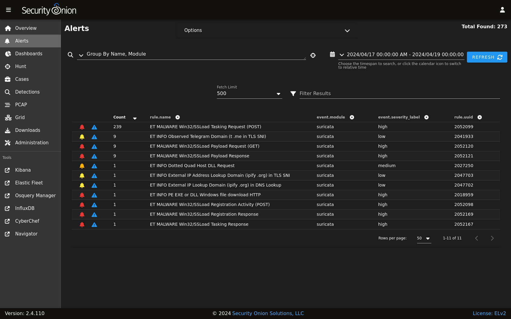

.. _suricata:

Suricata
========

From https://suricata.io:

    Suricata is a free and open source, mature, fast and robust network threat detection engine. Suricata inspects the network traffic using
    a powerful and extensive rules and signature language, and has powerful Lua scripting support for detection of complex threats.

Suricata NIDS alerts can be found in :ref:`alerts`, :ref:`dashboards`, :ref:`hunt`, and :ref:`kibana`. Here's an example of Suricata NIDS alerts in :ref:`alerts`:

  
If enabled, Suricata metadata (protocol logs) can be found in :ref:`dashboards`, :ref:`hunt`, and :ref:`kibana`.

Community ID
------------

Security Onion enables Suricata's built-in support for :ref:`community-id`.

Configuration
-------------

You can configure Suricata by going to :ref:`administration` --> Configuration --> suricata.

.. image:: images/config-item-suricata.png
  :target: _images/config-item-suricata.png

If you would like to configure/manage IDS rules, please see the :ref:`rules` and :ref:`managing-alerts` sections.

HOME_NET
--------

The HOME_NET variable defines the networks that are considered home networks (those networks that you are monitoring and defending). The default value is RFC1918 private address space (10.0.0.0/8, 192.168.0.0/16, and 172.16.0.0/12). You can modify this default value by going to :ref:`administration` --> Configuration --> suricata --> config --> vars --> address-groups --> HOME_NET.

EXTERNAL_NET
------------

By default, EXTERNAL_NET is set to ``any`` (which includes ``HOME_NET``) to detect lateral movement inside your environment. You can modify this default value by going to :ref:`administration` --> Configuration --> suricata --> config --> vars --> address-groups --> EXTERNAL_NET.

Performance
-----------

If Suricata is experiencing packet loss, then you may need to do one or more of the following: tune the ruleset (see the :ref:`managing-alerts` section), apply a :ref:`bpf`, adjust ``max-pending-packets`` in the Suricata configuration, or adjust :ref:`af-packet` workers in :ref:`administration` --> Configuration --> suricata --> config --> af-packet --> threads.

.. note::

    | For other tuning considerations, please see:
    | https://suricata.readthedocs.io/en/latest/performance/tuning-considerations.html

If you have multiple physical CPUs, you’ll most likely want to pin sniffing processes to a CPU in the same Non-Uniform Memory Access (NUMA) domain that your sniffing NIC is bound to.  Accessing a CPU in the same NUMA domain is faster than across a NUMA domain.  

.. note::

    | For more information about determining NUMA domains using ``lscpu`` and ``lstopo``, please see:
    | https://github.com/brokenscripts/cpu_pinning
    
Thresholding
------------

To edit the thresholding configuration, please see the :ref:`managing-alerts` section.

Metadata
--------

By default, Security Onion uses :ref:`zeek` to record protocol metadata. If you don't need all of the protocol coverage that :ref:`zeek` provides, then you can switch to Suricata metadata to save some CPU cycles. If you choose to do this, then here are some of the kinds of metadata you can expect to see in :ref:`dashboards` or :ref:`hunt`:

-  Connections

-  DHCP

-  DNS

-  Files

-  FTP

-  HTTP

-  SSL

If you later find that some of that metadata is unnecessary, you can filter out the unnecessary metadata by writing rules. We have included some examples at https://github.com/Security-Onion-Solutions/securityonion/blob/dev/salt/idstools/sorules/filters.rules.

To change your grid's metadata engine from :ref:`zeek` to Suricata, go to :ref:`administration` --> Configuration --> global --> mdengine and change the value from ``ZEEK`` to ``SURICATA``:

.. image:: images/config-item-global.png
  :target: _images/config-item-global.png

File Extraction
---------------

If you choose Suricata for metadata, it will extract files from network traffic and :ref:`strelka` will then analyze those extracted files. If you would like to extract additional file types, then you can add file types as shown at https://github.com/Security-Onion-Solutions/securityonion/blob/dev/salt/idstools/sorules/extraction.rules.

PCAP
----

Starting in Security Onion 2.4.60, you now have the option of switching full packet capture from :ref:`stenographer` to Suricata.

.. warning::

        This Suricata PCAP feature is in BETA! We recommend that you test this feature thoroughly in a test environment.

If you would like to experiment with Suricata PCAP, then you can go to :ref:`administration` --> Configuration --> Global and select the ``pcapengine`` setting. That setting should default to ``STENO`` but you can change it to either ``TRANSITION`` or ``SURICATA``. If you don't need your old :ref:`stenographer` PCAP at all, then you can immediately set ``pcapengine`` to ``SURICATA`` and manually delete the contents of the :ref:`stenographer` PCAP and index directories. However, most folks will probably want to use the ``TRANSITION`` option as it will keep :ref:`stenographer` running but not capturing traffic so that you can retrieve older :ref:`stenographer` PCAP as well as new Suricata PCAP. :ref:`stenographer` will then start purging its old PCAP as Suricata uses more space. Once your old :ref:`stenographer` PCAP has fully aged off, you can change the ``pcapengine`` setting to ``SURICATA`` to fully disable :ref:`stenographer`. 

Differences between Suricata and Stenographer for PCAP
~~~~~~~~~~~~~~~~~~~~~~~~~~~~~~~~~~~~~~~~~~~~~~~~~~~~~~

- :ref:`stenographer` indexes PCAP which allows instant retreival of PCAP sessions from disk. When a Suricata PCAP is requested, a process searches the PCAP files and retrieves the appropriate packets for the flow.
- Since :ref:`stenographer` indexes PCAP, it stores the PCAP in a special format. Suricata writes standard PCAP files which can be copied off to another system and then opened with any standard libpcap tool.
- Suricata can compress PCAP using lz4 compression.
- Suricata supports conditional PCAP if you only want to write PCAP when certain conditions are met.
- Suricata has the ability to stop capturing PCAP once a flow reaches a specific stream depth. Security Onion sets this stream depth to 1MB by default. This means that once the PCAP flow reaches 1MB, Suricata will stop recording packets for that flow.
- Currently, there is NO SUPPORT for a PCAP specific :ref:`bpf` for Suricata. If you apply a :ref:`bpf` to Suricata, it will apply to not only PCAP but also standard NIDS alerts and metadata if enabled.

Conditional PCAP
~~~~~~~~~~~~~~~~

If you switch to Suricata PCAP, it will write all traffic to PCAP by default. If you would like to limit Suricata to only writing PCAP when certain conditions are met, you can go to :ref:`administration` --> Configuration --> Suricata -> pcap -> conditional and change it to to either ``alerts`` or ``tag``:

- all: Capture all packets seen by Suricata (default).
- alerts: Capture only packets associated with a NIDS alert.
- tag: Capture packets based on a rule that is tagged.

PCAP Configuration Options
~~~~~~~~~~~~~~~~~~~~~~~~~~

- compression: Set to ``none`` to disable compression. Set to ``lz4`` to enable lz4 compression but note that this requires more CPU cycles.
- lz4-level: Specify the level of lz4 compression. ``0`` for no compression. ``16`` for maximum compression.
- maxsize: Max size in GB to use for PCAP stored on the sensor.
- filesize: File size for the PCAP files that get written.
- use-stream-depth: Set to ``no`` to ignore the stream depth and capture the entire flow. Set this to ``yes`` to truncate the flow based on the stream depth. 

Disabling
---------

Suricata can be disabled by going to :ref:`administration` --> Configuration --> suricata --> enabled.

Diagnostic Logging
------------------

If you need to troubleshoot Suricata, check ``/opt/so/log/suricata/suricata.log``. Depending on what you’re looking for, you may also need to look at the :ref:`docker` logs for the container:

::

	sudo docker logs so-suricata

Troubleshooting Alerts
----------------------

If you're not seeing the Suricata alerts that you expect to see, here are some things that you can check:

- If you have metadata enabled, check to see if you have metadata for the connections. Depending on your configuration, this could be Suricata metadata or :ref:`zeek` metadata.

- If you have metadata enabled but aren't seeing any metadata, then something may be preventing the process from seeing the traffic. Check to see if you have any :ref:`bpf` configuration that may cause the process to ignore the traffic. If you're sniffing traffic from the network, verify that the traffic is reaching the NIC using tcpdump. If importing a pcap file, verify that file contains the traffic you expect and that the Suricata process can read the file and any parent directories.

- Check your HOME_NET configuration to make sure it includes the networks that you're watching traffic for.

- Check to see if you have a full NIDS ruleset with rules that should specifically alert on the traffic and that those rules are enabled.

- Check to see if you have any threshold or suppression configuration that might be preventing alerts.

- Check the Suricata log for additional clues.

- Check the :ref:`elastic-agent`, :ref:`logstash`, and :ref:`elasticsearch` logs for any pipeline issues that may be preventing the alerts from being written to :ref:`elasticsearch`.

- Try installing a simple import node (perhaps in a VM) following the steps in the :ref:`first-time-users` section and see if you get alerts there. If so, compare the working system to the non-working system and determine where the differences are.

Stats
-----

For detailed Suricata statistics, check ``/opt/so/log/suricata/stats.log``.

Testing Rules
-------------

To test a new rule, use the following utility on a node that runs Suricata (ie Forward or Import).

::

	sudo so-suricata-testrule <Filename> /path/to/pcap/test.pcap

The file should contain the new rule that you would like to test. The pcap should contain network data that will trigger the rule.

VLAN Tags
---------

If your network traffic has VLAN tags, then Suricata will log them. :ref:`dashboards` has a VLAN dashboard which will show this data.

More Information
----------------

.. note::

    For more information about Suricata, please see https://suricata.io.
