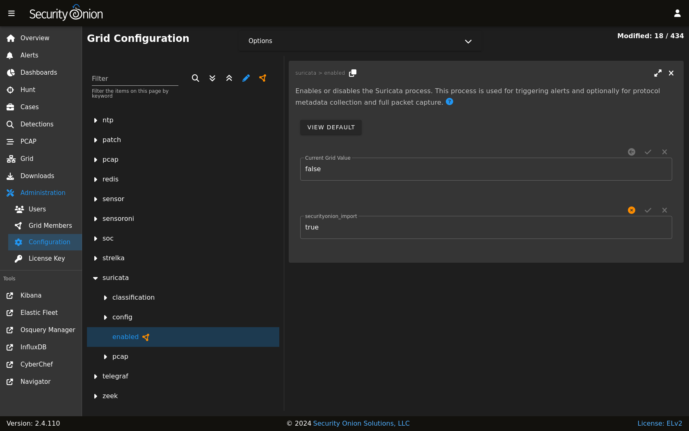
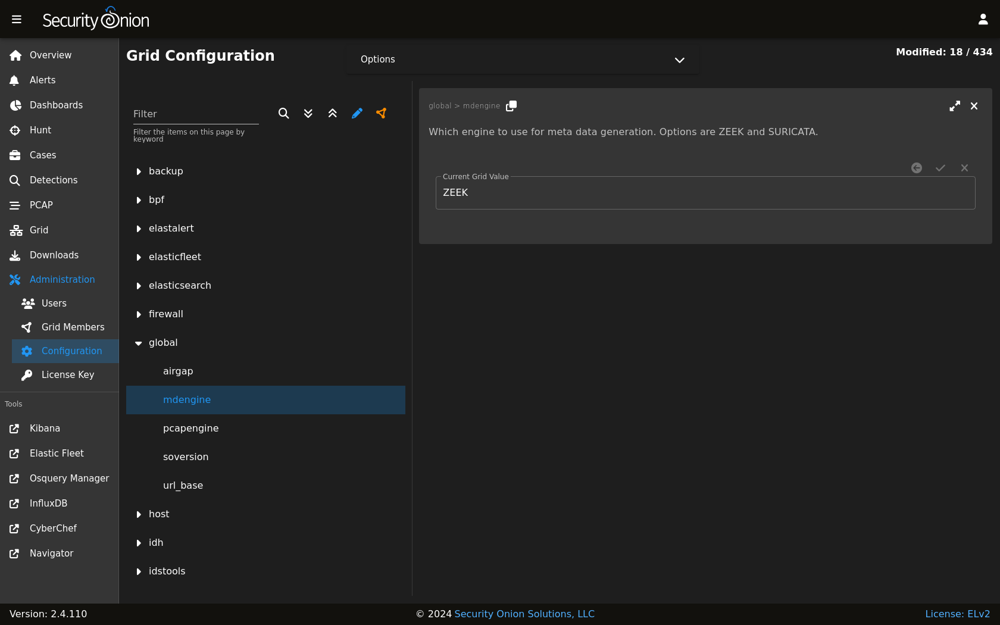

.. _suricata:

Suricata
========

From https://suricata.io:

    Suricata is a free and open source, mature, fast and robust network threat detection engine. Suricata inspects the network traffic using
    a powerful and extensive rules and signature language, and has powerful Lua scripting support for detection of complex threats.

Suricata :ref:`nids` alerts can be found in :ref:`alerts`, :ref:`dashboards`, :ref:`hunt`, and :ref:`kibana`. 

Here's an example of Suricata :ref:`nids` alerts in :ref:`alerts`:

.. image:: images/50_alerts.png
  :target: _images/50_alerts.png
  
If enabled, Suricata metadata (protocol logs) can be found in :ref:`dashboards`, :ref:`hunt`, and :ref:`kibana`.

Community ID
------------

Security Onion enables Suricata's built-in support for :ref:`community-id`.

VLAN Tags
---------

If your network traffic has VLAN tags, then Suricata will log them. :ref:`dashboards` has a VLAN dashboard which will show this data.

Configuration
-------------

You can configure Suricata by going to :ref:`administration` --> Configuration --> suricata.

If you would like to configure :ref:`nids` rules, take a look at the :ref:`detections` interface.

HOME_NET
--------

The HOME_NET variable defines the networks that are considered home networks (those networks that you are monitoring and defending). The default value is RFC1918 private address space (10.0.0.0/8, 192.168.0.0/16, and 172.16.0.0/12). You can modify this default value by going to :ref:`administration` --> Configuration --> suricata --> config --> vars --> address-groups --> HOME_NET.

EXTERNAL_NET
------------

By default, EXTERNAL_NET is set to ``any`` (which includes ``HOME_NET``) to detect lateral movement inside your environment. You can modify this default value by going to :ref:`administration` --> Configuration --> suricata --> config --> vars --> address-groups --> EXTERNAL_NET.

Stats
-----

For Suricata statistics, see :ref:`grid`, :ref:`influxdb`, and ``/opt/so/log/suricata/stats.log``.

Performance
-----------

If :ref:`grid` shows that Suricata is experiencing packet loss, then you may need to do one or more of the following:

- tune the :ref:`nids` ruleset
- apply a :ref:`bpf`
- adjust ``max-pending-packets`` in :ref:`administration` --> Configuration --> suricata --> config --> max-pending-packets.
- adjust :ref:`af-packet` workers in :ref:`administration` --> Configuration --> suricata --> config --> af-packet --> threads.

.. note::

    | For other tuning considerations, please see:
    | https://suricata.readthedocs.io/en/latest/performance/tuning-considerations.html

If you have multiple physical CPUs, you’ll most likely want to pin sniffing processes to a CPU in the same Non-Uniform Memory Access (NUMA) domain that your sniffing NIC is bound to.  Accessing a CPU in the same NUMA domain is faster than across a NUMA domain.  

.. note::

    | For more information about determining NUMA domains using ``lscpu`` and ``lstopo``, please see:
    | https://github.com/brokenscripts/cpu_pinning
    
Metadata
--------

By default, Security Onion uses :ref:`zeek` to record protocol metadata. If you don't need all of the protocol coverage that :ref:`zeek` provides, then you can switch to Suricata metadata to save some CPU cycles. If you choose to do this, then here are some of the kinds of metadata you can expect to see in :ref:`dashboards` or :ref:`hunt`:

-  Connections
-  DHCP
-  DNS
-  Files
-  FTP
-  HTTP
-  SSL

If you later find that some of that metadata is unnecessary, you can filter out the unnecessary metadata by writing rules. We have included some examples at https://raw.githubusercontent.com/Security-Onion-Solutions/securityonion/2.4/main/salt/idstools/rules/filters.rules.

To change your grid's metadata engine from :ref:`zeek` to Suricata, go to :ref:`administration` --> Configuration --> global --> mdengine and change the value from ``ZEEK`` to ``SURICATA``:

File Extraction
---------------

If you choose Suricata for metadata, it will extract files from network traffic and :ref:`strelka` will then analyze those extracted files. If you would like to extract additional file types, then you can add file types as shown at https://raw.githubusercontent.com/Security-Onion-Solutions/securityonion/2.4/main/salt/idstools/rules/extraction.rules.

PCAP
----

For most modes, full packet capture is written to disk by :ref:`stenographer` but you can optionally switch this to Suricata.

.. warning::

        This Suricata PCAP feature is in BETA! We recommend that you test this feature thoroughly in a test environment.

If you would like to experiment with Suricata PCAP, then you can go to :ref:`administration` --> Configuration --> Global and select the ``pcapengine`` setting. That setting should default to ``STENO`` but you can change it to either ``TRANSITION`` or ``SURICATA``. If you don't need your old :ref:`stenographer` PCAP at all, then you can immediately set ``pcapengine`` to ``SURICATA`` and manually delete the contents of the :ref:`stenographer` PCAP and index directories. However, most folks will probably want to use the ``TRANSITION`` option as it will keep :ref:`stenographer` running but not capturing traffic so that you can retrieve older :ref:`stenographer` PCAP as well as new Suricata PCAP. :ref:`stenographer` will then start purging its old PCAP as Suricata uses more space. Once your old :ref:`stenographer` PCAP has fully aged off, you can change the ``pcapengine`` setting to ``SURICATA`` to fully disable :ref:`stenographer`. 

Differences between Suricata and Stenographer for PCAP
~~~~~~~~~~~~~~~~~~~~~~~~~~~~~~~~~~~~~~~~~~~~~~~~~~~~~~

- :ref:`stenographer` indexes PCAP which allows instant retrieval of PCAP sessions from disk. When a Suricata PCAP is requested, a process searches the PCAP files and retrieves the appropriate packets for the flow.
- Since :ref:`stenographer` indexes PCAP, it stores the PCAP in a special format. Suricata writes standard PCAP files which can be copied off to another system and then opened with any standard libpcap tool.
- Suricata can optionally compress PCAP using lz4 compression.
- Suricata supports conditional PCAP if you only want to write PCAP when certain conditions are met.
- Suricata has the ability to stop capturing PCAP once a flow reaches a specific stream depth. Security Onion sets this stream depth to 1MB by default. This means that once the PCAP flow reaches 1MB, Suricata will stop recording packets for that flow.
- Currently, there is NO SUPPORT for a PCAP specific :ref:`bpf` for Suricata. If you apply a :ref:`bpf` to Suricata, it will apply to not only PCAP but also standard :ref:`nids` alerts and metadata if enabled.

Conditional PCAP
~~~~~~~~~~~~~~~~

If you switch to Suricata PCAP, it will write all network traffic to PCAP by default. If you would like to limit Suricata to only writing PCAP when certain conditions are met, you can go to :ref:`administration` --> Configuration --> Suricata -> pcap -> conditional and change it to to either ``alerts`` or ``tag``:

- all: Capture all packets seen by Suricata (default).
- alerts: Capture only packets associated with a :ref:`nids` alert.
- tag: Capture packets based on a rule that is tagged.

PCAP Configuration Options
~~~~~~~~~~~~~~~~~~~~~~~~~~

Here are some other PCAP configuration options that can be found at :ref:`administration` --> Configuration --> Suricata -> pcap. Some settings are considered advanced settings so you will only see them if you enable the ``Show all configurable settings, including advanced settings.`` option.

- compression: Set to ``none`` to disable compression. Set to ``lz4`` to enable lz4 compression but note that this requires more CPU cycles.
- lz4-level: lz4 compression level of PCAP files. Set to ``0`` for no compression. Set to ``16`` for maximum compression.
- maxsize: Maximum size in GB for total disk usage of all PCAP files written by Suricata. If you originally installed version 2.4.60 or newer, then this value should have been set based on a percentage of your disk space. If you originally installed a version older than 2.4.60, then this value should have been set to ``25`` by default. You may need to adjust this value based on your disk space and desired pcap retention.
- filesize: Maximum file size for individual PCAP files written by Suricata. Increasing this number could improve write performance at the expense of pcap retrieval time.
- use-stream-depth: Set to ``no`` to ignore the stream depth and capture the entire flow. Set to ``yes`` to truncate the flow based on the stream depth. 

Diagnostic Logging
------------------

If you need to troubleshoot Suricata, check ``/opt/so/log/suricata/suricata.log``. Depending on what you’re looking for, you may also need to look at the :ref:`docker` logs for the container:

::

	sudo docker logs so-suricata

Testing
-------

The first and easiest way to test Suricata is to access http://testmynids.org/uid/index.html from a machine that is being monitored by your Security Onion deployment. You can do so via the command line using ``curl``:

::

   curl testmynids.org/uid/index.html

If everything is working correctly, you should see a corresponding alert (``GPL ATTACK_RESPONSE id check returned root``) in :ref:`alerts`. You should also be able to find the alert in :ref:`dashboards` or :ref:`hunt`.

If you do not see this alert, try checking to see if the rule is enabled by going to :ref:`detections` and searching for the SID of the rule which is ``2100498``. One way to search for this rule is to specify it in the URL as follows:

`</detections?q=2100498>`_

Another way to test Suricata is with a utility called ``tmNIDS``. You can run the tool in interactive mode like this:

::

   curl -sSL https://raw.githubusercontent.com/0xtf/testmynids.org/master/tmNIDS -o /tmp/tmNIDS && chmod +x /tmp/tmNIDS && /tmp/tmNIDS

Finally, you can also test Suricata alerting by replaying some test pcap files via :ref:`so-test`.

Troubleshooting Alerts
----------------------

If you're not seeing the Suricata alerts that you expect to see, here are some things that you can check:

- If you have metadata enabled, check to see if you have metadata for the connections. Depending on your configuration, this could be Suricata metadata or :ref:`zeek` metadata.

- If you have metadata enabled but aren't seeing any metadata, then something may be preventing the process from seeing the traffic. Check to see if you have any :ref:`bpf` configuration that may cause the process to ignore the traffic. If you're sniffing traffic from the network, verify that the traffic is reaching the NIC using tcpdump. If importing a pcap file, verify that file contains the traffic you expect and that the Suricata process can read the file and any parent directories.

- Check your HOME_NET configuration to make sure it includes the networks that you're watching traffic for.

- Check to see if you have a full :ref:`nids` ruleset with rules that should specifically alert on the traffic and that those rules are enabled.

- Check to see if you have any threshold or suppression configuration that might be preventing alerts.

- Check the Suricata log for additional clues.

- Check the :ref:`elastic-agent`, :ref:`logstash`, and :ref:`elasticsearch` logs for any pipeline issues that may be preventing the alerts from being written to :ref:`elasticsearch`.

- Try installing a simple import node (perhaps in a VM) following the steps in the :ref:`first-time-users` section and see if you get alerts there. If so, compare the working system to the non-working system and determine where the differences are.

Testing Rules
-------------

To test a new rule, use the following utility on a node that runs Suricata (ie Forward or Import).

::

	sudo so-suricata-testrule <Filename> /path/to/pcap/test.pcap

The file should contain the new rule that you would like to test. The pcap should contain network data that will trigger the rule.

Disabling
---------

If you need to disable Suricata, you can do so via :ref:`administration` --> Configuration --> suricata --> enabled.

More Information
----------------

.. note::

    For more information about Suricata, please see https://suricata.io.
