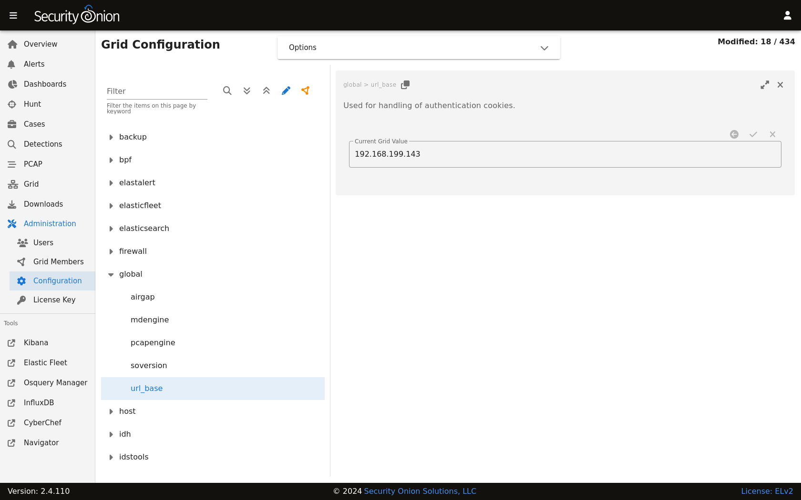

.. _url-base:

Web Access URL
==============

If you need to change the URL for web access to Security Onion (for example, from IP to FQDN), go to :ref:`administration` --> Configuration --> global --> url_base. Enter the new URL in the field on the right and then click the checkmark to save the new setting.

