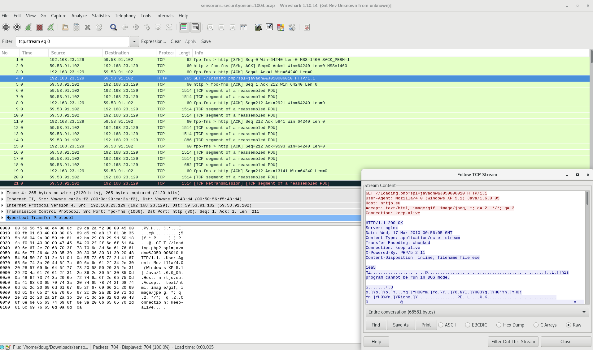
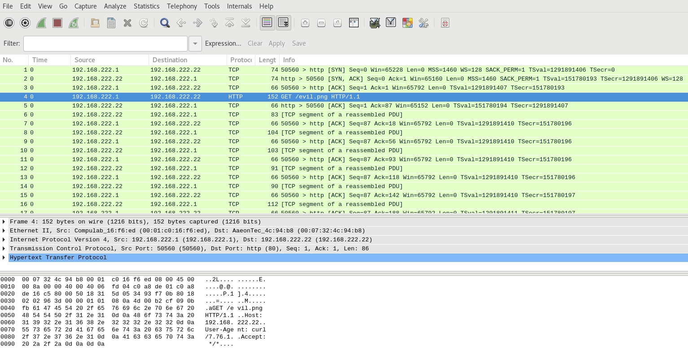
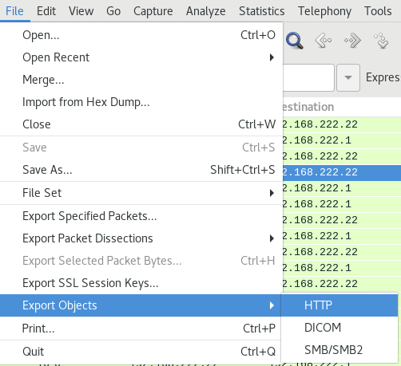
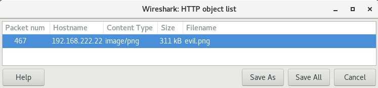
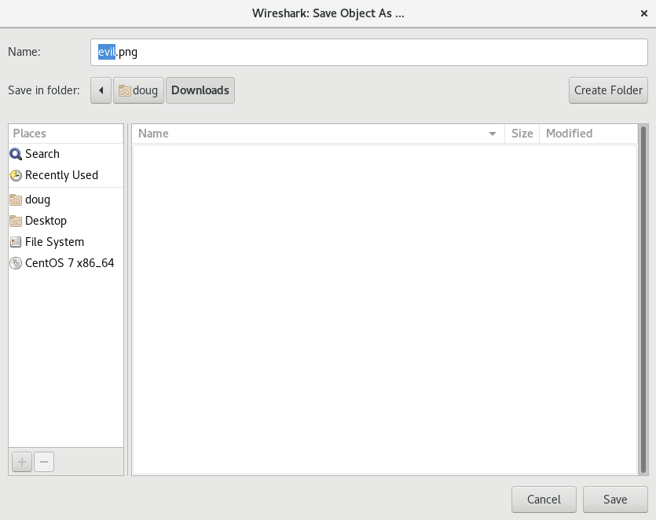
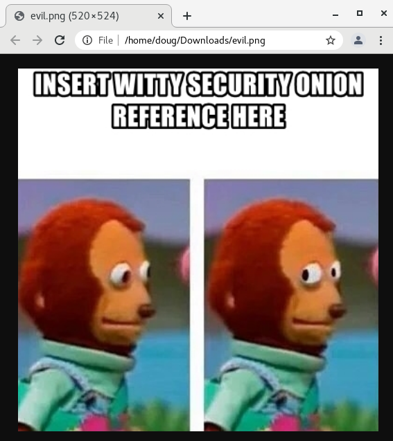

.. _wireshark:

Wireshark
=========

From https://www.wireshark.org/:

    Wireshark is the world’s foremost and widely-used network protocol analyzer. It lets you see what’s happening on your network at a microscopic level and is the de facto (and often de jure) standard across many commercial and non-profit enterprises, government agencies, and educational institutions. Wireshark development thrives thanks to the volunteer contributions of networking experts around the globe and is the continuation of a project started by Gerald Combs in 1998.
    
Usage
-----
Wireshark is a part of our :ref:`analyst-vm` installation.

Screenshot
----------

Example
-------

Suppose you are looking at an interesting HTTP file download in :ref:`PCAP` and want to extract the file. Click the PCAP download button and then open the pcap file with Wireshark.

To extract files from HTTP traffic, click File - Export Objects - HTTP.

Select the file(s) to save.

Specify where to save them.

Review the extracted file(s).

More Information
----------------

.. seealso::

    For more information about Wireshark, please see https://www.wireshark.org/.
