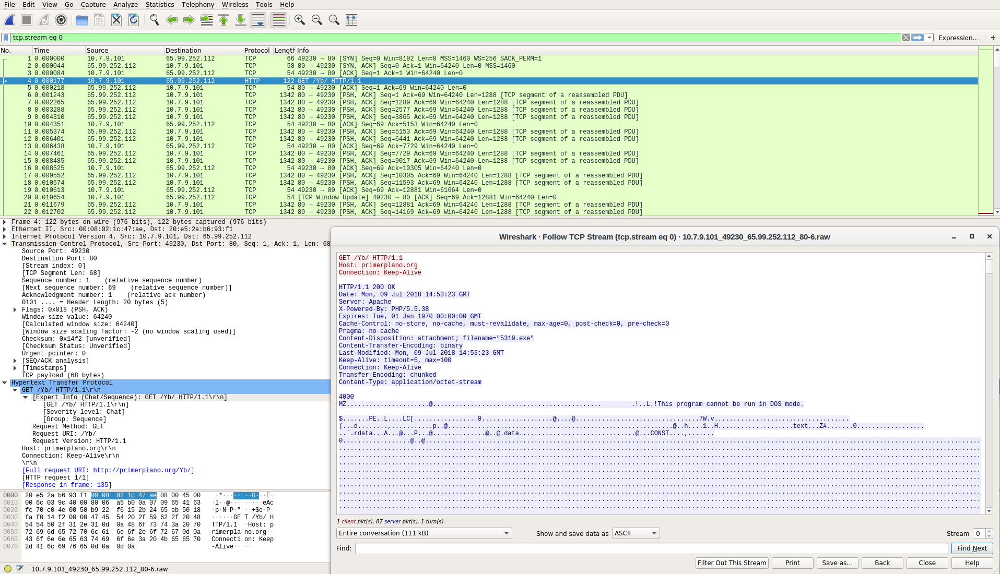

Wireshark
=========

From https://www.wireshark.org/:

    Wireshark is the world’s foremost and widely-used network protocol analyzer. It lets you see what’s happening on your network at a microscopic level and is the de facto (and often de jure) standard across many commercial and non-profit enterprises, government agencies, and educational institutions. Wireshark development thrives thanks to the volunteer contributions of networking experts around the globe and is the continuation of a project started by Gerald Combs in 1998.
    
Screenshot
----------

Usage
-----

You can launch Wireshark from the Applications menu and then open a pcap.  

Alternatively, if you're using the Sguil client, you can pivot directly from an event in Sguil and send the pcap directly to Wireshark.

More Information
----------------

For more information about Wireshark, please see https://www.wireshark.org/.
