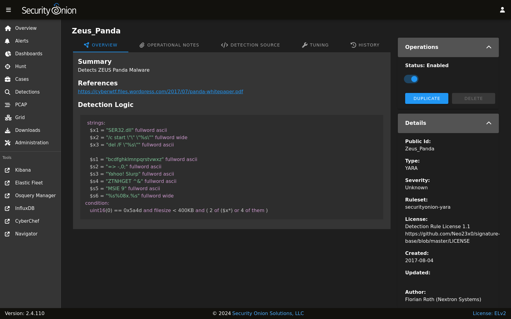

.. _yara:

YARA
====

YARA rules are loaded into :ref:`strelka` to monitor files for suspicious or noteworthy characteristics. Active YARA rules generate alerts that can be found in :ref:`alerts`.

From https://virustotal.github.io/yara/:

    YARA is a tool aimed at (but not limited to) helping malware researchers to identify and classify malware samples. With YARA you can create descriptions of malware families (or whatever you want to describe) based on textual or binary patterns. Each description, a.k.a rule, consists of a set of strings and a boolean expression which determine its logic.

Managing Existing YARA Rules
----------------------------

You can enable or disable existing YARA rules using :ref:`detections`. From the main :ref:`detections` interface, search for the desired detection and click the binoculars icon. You can then use the Status slider in the upper-right corner to enable or disable the detection.

Adding New YARA Rules
---------------------

To add a new YARA rule, go to the main :ref:`detections` page and click the blue + button between Options and the query bar. A form will appear where you will:

- click the Language drop-down and select ``YARA``
- optionally specify a license
- add the signature
- click the ``CREATE`` button and the detection should deploy to your grid at the next 15-minute cycle

.. image:: images/58_detection_create.png
  :target: _images/58_detection_create.png

YARA Rules Options
------------------

You can configure YARA rules options as follows:

- Navigate to :ref:`administration` --> Configuration.
- At the top of the page, click the ``Options`` menu and then enable the ``Show all configurable settings, including advanced settings.`` option.
- Navigate to soc --> config --> server --> modules --> strelkaengine.

Once you've reached this location, here are some common settings.

YARA Update Frequency
~~~~~~~~~~~~~~~~~~~~~

By default, Security Onion checks for new YARA rules every 24 hours. You can change this via the strelkaengine --> communityRulesImportFrequencySeconds setting.

Custom YARA Repositories
~~~~~~~~~~~~~~~~~~~~~~~~

You can configure Security Onion to pull YARA rules from custom git repos via strelkaengine --> rulesRepos --> default. 

Repos can be accessed via https or from the local filesystem. For example:

::

        file:///nsm/rules/detect-yara/repos/my-custom-rep

